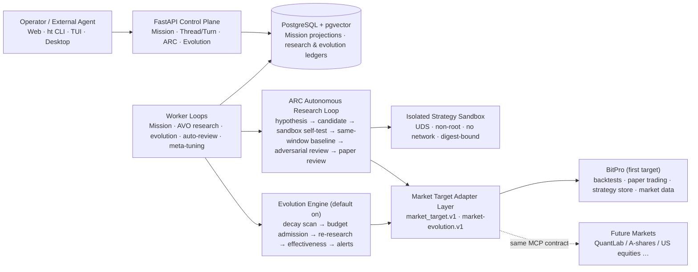

# HyperTrade & ARC (Autonomous Research Core)

<p align="center">
  <strong>Self-Hosted, Governed Strategy-Research Agent Runtime · Autonomous Research & Evolution Loop</strong>
</p>

<p align="center">
  <a href="LICENSE"></a>
  <a href="#"></a>
  <a href="#"></a>
  <a href="#"></a>
  <a href="#"></a>
  <a href="#"></a>
  <a href="#"></a>
  <a href="docs/architecture/63-evolution-effectiveness-alerts-and-benchmark.md"></a>
</p>

<p align="center">
  <a href="README.md">🇨🇳 中文主文档</a> ·
  🌐 <strong>English Documentation</strong> ·
  <a href="docs/architecture/00-overview.md">Architecture Overview</a> ·
  <a href="docs/architecture/33-system-architecture.md">System Architecture</a> ·
  <a href="docs/architecture/62-pluggable-market-targets.md">Pluggable Market Targets</a> ·
  <a href="docs/architecture/63-evolution-effectiveness-alerts-and-benchmark.md">Evolution Hardening</a> ·
  <a href="docs/spec.md">Product Spec</a>
</p>

---

## 🌟 Overview

**HyperTrade** is a self-hosted, governed Agent runtime for quantitative strategy research. It turns natural-language research objectives into **Missions** bounded by permissions, budgets, evidence and human review; the ARC autonomous research loop proposes candidates, validates them through an isolated sandbox backtest, a same-window baseline comparison and adversarial review, and incubates survivors into BitPro paper trading. In production it also runs an **always-on, default-enabled evolution engine**: an hourly scan detects performance decay of paper strategies against a benchmark-relative baseline and re-opens research inside budget and evidence gates.

Three facts that define the system:

- **Governed, never self-authorizing.** The model can only propose schema-bounded plans or inputs; permissions, approvals, budgets and risk gates are verified independently before and after every call. Mainnet live execution is blocked by governance (`live_allowed=false`); the only write path today is BitPro paper trading.
- **Pluggable markets.** The evolution core is decoupled from any trading platform: a `market_target.v1` profile describes the universe, timeframe and capabilities; the `market-evolution.v1` MCP contract defines 7 canonical tools. BitPro is the first target; new markets (e.g. QuantLab for A-shares / US equities) plug in through the same contract.
- **Traceable conclusions, no hidden gaps.** Unavailable data, fallback bases and invalid comparisons are always annotated explicitly (e.g. when the benchmark series cannot be built, the decision falls back to an absolute basis and the payload records why). The system never fabricates facts.

It is not a money printer, does not promise profitability, and is not investment advice.

---

## 🏗️ System at a Glance



External data sources and the trading platform remain the source of truth in their own domains; HyperTrade stores only bounded references, digests, metrics and audit projections — it does not copy BitPro business logic or read its database directly.

---

## 🔁 Core Capabilities

### 1. Governed Agent Runtime (Mission Runtime V2)

The source of truth for a research task is the **Mission** (Plan / Step / Event / budgets / approvals / completion proof); the interaction source of truth for Remote CLI and Web is the server-owned **Thread / Turn / Item** protocol with resumable cursor SSE. Capability calls can only target reviewed entries of the Capability Catalog; external writes require one-shot parameter-bound approvals, write-ahead DispatchIntent records and reconciliation. A deterministic reducer replayed offline must reproduce the online projection hash; version gaps quarantine the aggregate instead of fabricating history.

Design docs: [30 Roadmap](docs/architecture/30-professional-agent-runtime-v2-roadmap.md) · [31 Technical Design](docs/architecture/31-professional-agent-runtime-v2-technical-design.md) · [34 Audit & Target Design](docs/architecture/34-next-generation-agent-runtime-audit-and-target-design.md)

### 2. ARC Autonomous Research Loop (AVO)

Starting from the goal contract: evidence preflight (an unavailable window stops in front of the operator instead of burning candidate budget) → candidate generation (LLM provider hypothesis channel plus deterministic strategy-family codegen) → adversarial review (red-team attacks and genetic mutation) → **isolated sandbox self-test** (validate → create → backtest, digest-bound, UDS, non-root, no network) → **same-window baseline comparison** (candidate vs. baseline on identical windows; invalid comparisons are counted separately, never silently scored as losses) → reflexion constraints and distilled skills feed later rounds → paper review (human mode waits for explicit approval; agent mode applies system policy automatically) → approved candidates derive a candidate-bound paper authorization from the operator's pre-authorization and start an independent paper instance in BitPro.

Design docs: [35 North Star](docs/architecture/35-autonomous-quant-trader-north-star.md) · [36 Goal-Driven Research Loop M0](docs/architecture/36-goal-driven-autonomous-research-loop-m0.md) · [61 Research-Loop Rationalization](docs/architecture/61-research-loop-architecture-rationalization.md) · [ARC core designs 37–41](docs/architecture/37-arc-autonomous-research-core-architecture.md)

### 3. Evolution Engine (Default On)

A production worker scans every incubating paper strategy hourly, answering three questions — **is it useful, is it stuck, is it judging correctly**:

- **Benchmark-relative decay detection.** The two-week window (previous 7 days vs. recent 7 days) compares the strategy's change against the buy-and-hold change of its own symbols; a market-wide selloff cannot masquerade as strategy decay. Portfolio strategies use an equal-weight composite benchmark.
- **Budget and continuation.** Evolution research is admitted through `research_budget.v1`; per-strategy continuation records track blockers and the next eligible evaluation time, classifying each blocker as `time` (self-healing) or `operator` (needs intervention).
- **Auto-review and meta-tuning.** The review mode (human/agent) is configurable; offline meta-tuning applies a bounded step to the decay threshold using a p90 rule (records recommendations only by default; auto-apply requires explicit opt-in).
- **Effectiveness ledger and alerts.** `evolution_effectiveness.v1` aggregates cycles, missions, evidence, decisions, costs and per-strategy outcomes (invalid comparisons counted separately; small samples are declared insufficient for conclusions). Silent data-gap stalls, persistent error streaks and operator-blocked strategies raise alerts that auto-resolve when the condition clears, delivered to a Feishu webhook when configured.
- **Portfolios are first-class.** A basket strategy keeps its full symbol set through scan, research, self-test, paper incubation and benchmarking; evolution can never quietly shrink it to a single symbol.

Design docs: [42 Paper-Feedback Loop](docs/architecture/42-arc-dynamic-paper-observation-feedback.md) · [63 Evolution Hardening](docs/architecture/63-evolution-effectiveness-alerts-and-benchmark.md)

### 4. Pluggable Market Targets

The evolution core is bound to no trading platform. A market target is defined by a `market_target.v1` profile (identity, symbol universe, timeframes, calendar, capability declarations) and the `market-evolution.v1` MCP contract (7 canonical tools: read paper snapshots, market data, backtests, strategy validate/create, paper configure/start/stop). The `MARKET_TARGET` environment variable selects the active target; BitPro is the first implementation. Adding a market only requires implementing the same contract — the evolution engine, ledgers, alerts and effectiveness reporting are inherited automatically.

Design docs: [62 Pluggable Market Targets](docs/architecture/62-pluggable-market-targets.md) · Contract: [User-Directed Contract — Pluggable Market Targets](docs/contracts/user-directed-pluggable-market-targets.md)

### 5. Research Assets and Memory

Research settles into long-lived, reviewable assets: StrategyCards, ExperimentManifests, same-window baseline evidence, robustness validation, settled `StrategyOutcome`s, pending Lessons (conflicting and opposing evidence preserved), research memory and the skill library. These are research facts and review material, not execution authorization; only reviewed Lessons may enter bounded context.

---

## 💻 Quick Start

### Backend

```bash
uv sync
docker compose up -d postgres
uv run alembic upgrade head
uv run uvicorn hypertrade.main:app --app-dir backend/src --reload --host 0.0.0.0 --port 3334
```

The API and worker loops start within the same process lifecycle; the worker can also run standalone:

```bash
uv run python -m hypertrade.worker
```

### Frontend

```bash
cd frontend && pnpm install && pnpm dev
```

### Trigger an Autonomous Research Mission

```bash
curl -X POST http://localhost:3334/api/v1/arc/missions \
  -H "Content-Type: application/json" \
  -H "Idempotency-Key: demo-1" \
  -d '{
    "objective": "Research a trend strategy suited to BTC high volatility; incubate into paper trading once validated",
    "symbol": "BTC-USDT-SWAP",
    "timeframe": "1H",
    "max_candidates": 5
  }'
```

For portfolio research, pass `"symbols": ["NVDA-USDT-SWAP", "AMD-USDT-SWAP"]`. Inspect mission state and evidence:

```bash
curl http://localhost:3334/api/v1/arc/missions/{mission_id}
curl http://localhost:3334/api/v1/arc/missions/{mission_id}/progress
```

Inspect the evolution effectiveness ledger and alerts:

```bash
curl http://localhost:3334/api/v1/arc/evolution/effectiveness
curl http://localhost:3334/api/v1/arc/evolution/alerts
```

---

## 🧪 Verification

```bash
./scripts/check.sh
```

One command runs every quality gate: frontend (lint / vitest / build) + ruff + mypy + pytest (currently 1592 tests passing).

---

## 🛠️ Technology Stack

| Layer | Technologies |
|-------|-------------|
| **Control plane** | FastAPI 0.122+ / Uvicorn, auth + scoped tokens + idempotency keys, resumable cursor SSE |
| **Domain & runtime** | Python 3.12+, strict Pydantic v2 contracts, modular monolith with ports-and-adapters |
| **Storage** | SQLAlchemy 2.0 + Alembic, PostgreSQL 14+ with `pgvector` |
| **Workers** | asyncio loops with PostgreSQL SQL leases (Mission, AVO research, evolution scan, auto-review, meta-tuning and 8 more loops) |
| **LLM providers** | ProviderRuntime (OpenAI, DeepSeek, Claude, Codex, OpenRouter, Qwen, … enabled by configuration) |
| **Quant & backtesting** | BitPro (MCP/API contract): market data, backtests, paper trading, strategy store |
| **Strategy sandbox** | UDS-isolated process, non-root, no network, read-only root, resource limits, digest-bound |
| **Frontend & terminals** | React 19 + TypeScript 5.9 + Vite 7 + Tailwind CSS; Tauri desktop; Textual TUI; `ht` CLI |
| **Evaluation** | Physically isolated evaluation target (separate network, database and synthetic facts) |
| **Deployment** | Docker Compose + Nginx + GitHub Actions (auto-deploy on `main`) |

---

## 📚 Documentation Map

| Entry | Content |
|---------|-----------------------------|
| [Architecture Overview](docs/architecture/00-overview.md) | Reading order and system boundary |
| [33 System Architecture](docs/architecture/33-system-architecture.md) | Current implementation snapshot: runtime layers, research loop, evolution engine, market targets, security boundaries |
| [62 Pluggable Market Targets](docs/architecture/62-pluggable-market-targets.md) | `market_target.v1` / `market-evolution.v1` contracts and onboarding |
| [63 Evolution Hardening](docs/architecture/63-evolution-effectiveness-alerts-and-benchmark.md) | Effectiveness ledger, data-gap alerts, benchmark-relative decay |
| [Product Spec](docs/spec.md) | Scope, user journeys, acceptance and non-goals |
| [Progress Log](docs/progress.md) | Current verified state and production evidence |
| [Contracts](docs/contracts/) | Per-sprint delivery scope and technical specs |
| [Runbooks](docs/runbooks/) | Deployment, monitoring, incident response |
| [Developer Guide](docs/developer-guide.md) | Local development and extension entry points |

---

## 🖥️ Streaming Research & Terminal Interaction

`ht research start "<objective>"` follows the whole research process by default: an interactive terminal shows the workflow, activity and detailed logs; piped output is a line-by-line event stream. `--detach` submits only; `--plain` forces line output.

Reattach to an existing task with `ht research watch <task-id>`. In the interactive view, arrow keys select logs, E shows evidence, R opens per-version review, C explicitly appends budget, F reconnects, and Q or Ctrl+C exits the watch — exiting never stops the server-side task. The review mode can be configured as human (explicit approval required) or agent (system policy reviews automatically and starts an independent paper instance); the terminal keeps streaming through the auto-review phase. Paper-observation status still requires real operating evidence to judge.

---

## 📄 License & Disclaimer

Distributed under the MIT License. See `LICENSE` for details.

> **Disclaimer**: Nothing in this repository constitutes investment advice or financial guidance. Mainnet live trading execution remains strictly blocked by governance (`live_allowed=false`).
