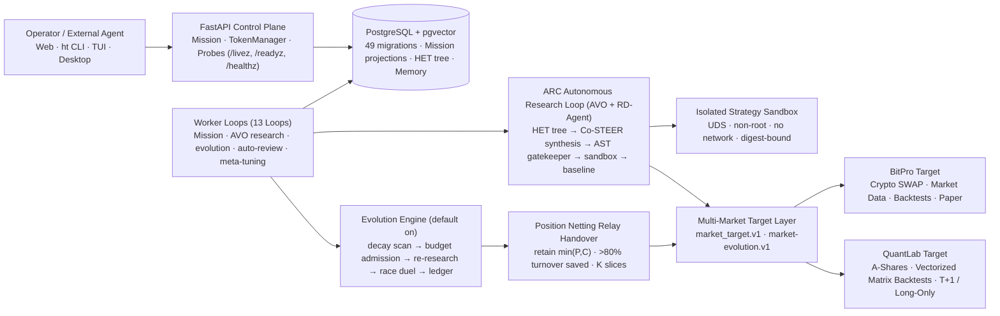

# HyperTrade & ARC (Autonomous Research Core)

<p align="center">
  <strong>Self-Hosted, Governed Multi-Market Strategy-Research Agent Runtime · Autonomous Research & Evolution Loop</strong>
</p>

<p align="center">
  <a href="LICENSE"></a>
  <a href="#"></a>
  <a href="#"></a>
  <a href="#"></a>
  <a href="#"></a>
  <a href="#"></a>
  <a href="#"></a>
  <a href="docs/architecture/63-evolution-effectiveness-alerts-and-benchmark.md"></a>
  <a href="docs/architecture/66-quantlab-adapter-a-share-microstructure-and-relay-handover.md"></a>
</p>

<p align="center">
  <a href="README.md">🇨🇳 中文主文档</a> ·
  🌐 <strong>English Documentation</strong> ·
  <a href="docs/architecture/00-overview.md">Architecture Overview</a> ·
  <a href="docs/architecture/33-system-architecture.md">System Architecture</a> ·
  <a href="docs/architecture/62-pluggable-market-targets.md">Pluggable Market Targets</a> ·
  <a href="docs/architecture/65-rd-agent-evolution-and-finmem-layered-memory.md">RD-Agent Evolution</a> ·
  <a href="docs/architecture/66-quantlab-adapter-a-share-microstructure-and-relay-handover.md">QuantLab & A-Share Rules</a> ·
  <a href="docs/architecture/67-production-observability-probes-and-token-rotation.md">Production Probes & Tokens</a> ·
  <a href="docs/spec.md">Product Spec</a>
</p>

---

## 🌟 Overview

**HyperTrade** is a self-hosted, governed Agent runtime for quantitative strategy research and autonomous evolution. It transforms natural-language research goals into verifiable **Missions** constrained by permissions, budgets, evidence, and human review. The ARC autonomous research loop (powered by Microsoft RD-Agent Hypothesis Evolution Trees and Co-STEER structured synthesis) proposes candidate strategies, tests them via isolated sandboxes and same-window baselines, and deploys them to target paper trading environments (**BitPro for Crypto SWAP** and **QuantLab for A-Shares / multi-asset equities**). In production, an **always-on evolution engine** continuously scans for benchmark-relative performance decay, triggers targeted re-research, and performs **position netting smooth relay handovers** during strategy promotion, saving >80% in turnover friction.

Four core principles:

- **Governed, never self-authorizing.** The model only produces schema-bounded plans and code; permissions, approvals, budgets, and risk gates are validated independently before and after execution. Mainnet live trading is hard-blocked (`live_allowed=false`); external writes target only authorized paper trading instances.
- **Pluggable markets with native microstructure enforcement.** The core evolution engine is completely decoupled from underlying trading platforms via `market_target.v1` profiles and `market-evolution.v1` MCP contracts. For Chinese A-shares, hard institutional rules are strictly enforced across Prompt and ASTGatekeeper levels: T+1 settlement state machine, spot long-only enforcement (no naked shorting), price limit band liquidity cutoffs, 100-share lot size constraints, and institutional friction models (0.05% stamp duty, transfer fees, commissions, and slippage).
- **Hypothesis-driven scientific evolution with minimal friction.** Integrates RD-Agent's Hypothesis Evolution Tree (HET) for genealogical tracking and explicit hypothesis pruning. During champion-challenger promotions, two-leg position netting ($\Delta = C - P$) preserves common holdings $\min(P_i, C_i)$, cutting turnover costs by over 80%.
- **Zero-trust credential governance and cloud-native observability.** Production container health probes (`/livez`, `/readyz`, `/healthz`) provide granular diagnostics for Kubernetes and load balancers. `TokenRotationService` provides SHA-256 hashed credentials, zero plaintext persistence, granular scopes, and zero-downtime 24-hour grace period hot rotation.

It is not an automated money maker, promises no profitability, and does not provide investment advice.

---

## 🏗️ System Topology


```mermaid
flowchart LR
  Op["Operator / External Agent<br/>Web · ht CLI · TUI · Desktop"] --> API["FastAPI Control Plane<br/>Mission · TokenManager · Probes (/livez, /readyz, /healthz)"]
  API --> DB[("PostgreSQL + pgvector<br/>49 migrations · Mission projections · HET tree · Memory")]
  Worker["Worker Loops (13 Loops)<br/>Mission · AVO research · evolution · auto-review · meta-tuning"] --> DB
  Worker --> Research["ARC Autonomous Research Loop (AVO + RD-Agent)<br/>HET tree → Co-STEER synthesis → AST gatekeeper → sandbox → baseline"]
  Worker --> Evolution["Evolution Engine (default on)<br/>decay scan → budget admission → re-research → race duel → ledger"]
  Research --> Sandbox["Isolated Strategy Sandbox<br/>UDS · non-root · no network · digest-bound"]
  Research --> Targets["Multi-Market Target Layer<br/>market_target.v1 · market-evolution.v1"]
  Evolution --> Relay["Position Netting Relay Handover<br/>retain min(P,C) · >80% turnover saved · K slices"]
  Relay --> Targets
  Targets --> BitPro["BitPro Target<br/>Crypto SWAP · Market Data · Backtests · Paper"]
  Targets --> QuantLab["QuantLab Target<br/>A-Shares · Vectorized Matrix Backtests · T+1 / Long-Only"]
```

External trading platforms remain the source of truth for their own domains. HyperTrade maintains only bounded references, digests, hashes, metrics, and audit projections, never replicating private platform logic or directly accessing private databases.

---

## 🔁 Core Capabilities

### 1. Governed Agent Runtime & Zero-Trust Token Rotation
The source of truth for research tasks is the **Mission** (Plan / Step / Event / budgets / approvals / completion proof); interaction is driven by the server-owned **Thread / Turn / Item** protocol with resumable cursor SSE. External writes require one-shot parameter-bound approvals and write-ahead DispatchIntent records. The platform integrates **`TokenRotationService`**: credentials store only SHA-256 hashes, support granular scopes (`arc:read`, `arc:start`, etc.), seamless 24-hour grace periods during hot rotation, and proactive 7-day expiration audits.

Design docs: [30 Roadmap](docs/architecture/30-professional-agent-runtime-v2-roadmap.md) · [31 Technical Design](docs/architecture/31-professional-agent-runtime-v2-technical-design.md) · [67 Probes & Token Rotation](docs/architecture/67-production-observability-probes-and-token-rotation.md)

### 2. ARC Research Core & RD-Agent Hypothesis Evolution (HET + Co-STEER)
Extracts key methodologies from Microsoft RD-Agent:
- **Hypothesis Evolution Tree (HET)**: Maintains complete hypothesis lineages from root to mutant branches, explicitly pruning underperforming or overfitted hypotheses.
- **Co-STEER Structured Code Synthesis**: Guides LLMs to generate modular features, signals, and sizing logic.
- **ASTGatekeeper Syntax & Anti-Lookahead Gate**: Statically scans AST nodes at compile time to block lookahead bias, future data leakage, and unauthorized system calls.
- **Isolated Sandbox & Same-Window Baselines**: Bounded UDS sandboxing with byte-identical time window comparisons.

Design docs: [65 RD-Agent Evolution & Layered Memory](docs/architecture/65-rd-agent-evolution-and-finmem-layered-memory.md) · [37 ARC Architecture](docs/architecture/37-arc-autonomous-research-core-architecture.md) · [61 Research Loop Rationalization](docs/architecture/61-research-loop-architecture-rationalization.md)

### 3. Multi-Market Targets & A-Share Microstructure Rules
The evolution core decouples from execution platforms via `market_target.v1` and `market-evolution.v1`:
- **BitPro Target**: 24/7 perpetual cryptocurrency swaps, dual-direction long/short.
- **QuantLab Target**: A-share equities; `QuantLabStrategyTranspiler` translates standard strategies into native vectorized `MatrixStrategy` modules with isolated `_BASE_EVO_SCAFFOLD`.
- **Institutional Hard Rules**: Prompt contexts and ASTGatekeeper strictly enforce T+1 settlement state machines, spot long-only enforcement (blocking `-1` short signals), price limit bands, 100-share integer lot sizes, and exact institutional friction models (0.05% stamp duty, transfer fees, commissions).

Design docs: [62 Pluggable Market Targets](docs/architecture/62-pluggable-market-targets.md) · [66 QuantLab & A-Share Microstructure](docs/architecture/66-quantlab-adapter-a-share-microstructure-and-relay-handover.md)

### 4. Evolution Engine & Position Netting Smooth Relay Handover
Scans active incubating paper strategies hourly:
- **Benchmark-Relative Decay Detection**: Strategy performance change over 14 days minus benchmark buy-and-hold change prevents broader market drops from falsely flagging strategy decay.
- **Position Netting Relay Service**: During strategy turnover, intersecting holdings $\min(P_i, C_i)$ are preserved in place. Only net differences $\Delta = C - P$ are sliced and executed over $K$ periods with 100-share constraints, slashing turnover friction by >80%.
- **Effectiveness Ledger & Feishu Alerts**: Full ledger accounting with automatic Feishu webhook card alerts for stalled data gaps and error streaks.

Design docs: [63 Evolution Hardening](docs/architecture/63-evolution-effectiveness-alerts-and-benchmark.md) · [66 Smooth Relay Handover](docs/architecture/66-quantlab-adapter-a-share-microstructure-and-relay-handover.md)

### 5. Production Probe Matrix & Quantum Portfolio Console
- **Probe Matrix**: `/livez` (liveness), `/readyz` (readiness with `SELECT 1` DB probe), `/healthz` (comprehensive diagnostics with DB latency, adapter heartbeats, paper session counts, and token status), fully aligned with Kubernetes standards.
- **Quantum Portfolio Dashboard**: React 19 UI with BitPro / QuantLab target switcher, dynamic A-share rule badges, interactive HET evolution tree visualization, and real-time relay handover slice stepping monitor.

Design docs: [67 Production Probes & Token Rotation](docs/architecture/67-production-observability-probes-and-token-rotation.md)

---

## 💻 Quick Start

### Backend & Database

```bash
uv sync
docker compose up -d postgres
uv run alembic upgrade head
uv run uvicorn hypertrade.main:app --app-dir backend/src --reload --host 0.0.0.0 --port 3334
```

API and 13 background worker loops start in the same process; workers can also run standalone:

```bash
uv run python -m hypertrade.worker
```

### Frontend

```bash
cd frontend && pnpm install && pnpm dev
```

### Health Probes

```bash
curl http://localhost:3334/livez
curl http://localhost:3334/readyz
curl http://localhost:3334/healthz
```

### Query Targets and Trigger Research

Query registered market targets:
```bash
curl http://localhost:3334/api/portfolio/targets
```

Trigger an autonomous cryptocurrency trend strategy research mission:
```bash
curl -X POST http://localhost:3334/api/v1/arc/missions \
  -H "Content-Type: application/json" \
  -H "Idempotency-Key: demo-crypto-1" \
  -d '{
    "objective": "Research a trend strategy adapted to BTC high volatility, incubate to paper after validation",
    "symbol": "BTC-USDT-SWAP",
    "timeframe": "1H",
    "max_candidates": 5
  }'
```

Inspect HET tree and relay handover plans:
```bash
curl http://localhost:3334/api/research/hypothesis-tree
curl http://localhost:3334/api/portfolio/relay/handovers
```

---

## 🧪 Verification & Quality Gates

```bash
./scripts/check.sh
```

Single command executes all quality gates: Frontend lint, Vitest, and production build + Backend Ruff linting/formatting, strict Mypy type-checking, and full Pytest suite (currently 2100+ tests passing 100%).

---

## 🛠️ Tech Stack

| Layer | Technologies |
|-------|-------------|
| **Control Plane** | FastAPI 0.122+ / Uvicorn, scoped security tokens, `/livez`, `/readyz`, `/healthz` container probes, cursor SSE |
| **Credential Security**| `TokenRotationService` (SHA-256 single-way hashing, zero plaintext storage, 24h grace period hot rotation, 7-day expiration audit) |
| **Domain & Runtime** | Python 3.12+, Pydantic v2 strict models, modular monolith + ports-and-adapters |
| **Storage** | SQLAlchemy 2.0 + Alembic (49 migrations), PostgreSQL 14+ with `pgvector` |
| **Workers** | asyncio + PostgreSQL SQL lease locking (13 concurrent background loops) |
| **Research Core** | ARC + RD-Agent Hypothesis Evolution Tree (HET) + Co-STEER synthesizer + `ASTGatekeeper` |
| **Target Adapters** | `market_target.v1` and `market-evolution.v1` MCP contracts; BitPro (Crypto) + QuantLab (A-Shares) |
| **A-Share Rules** | `AShareMarketRules` / `AShareRuleValidator` (T+1 state machine, spot long-only, 100-share lot size, exact fees) |
| **Relay Handover** | `PositionNettingRelayService` (retain $\min(P,C)$, net orders $\Delta = C-P$, >80% turnover saved) |
| **Sandbox** | UDS isolated processes, non-root, no network, read-only root, resource caps, digest-bound |
| **Frontend & UI** | React 19 + TypeScript 5.9 + Vite 7 + Tailwind CSS; Tauri desktop; Textual TUI; `ht` CLI |
| **Deployment** | Docker Compose + Nginx + GitHub Actions (auto-deploy on push to `main`) |

---

## 📚 Documentation Map

| Entrypoint | Contents |
|------------|----------|
| [Architecture Overview](docs/architecture/00-overview.md) | Reading guide and **mandatory architecture synchronization rule** |
| [33 System Architecture](docs/architecture/33-system-architecture.md) | Canonical system architecture snapshot: multi-market targets, runtime layers, safety & probes |
| [66 QuantLab & A-Share Rules](docs/architecture/66-quantlab-adapter-a-share-microstructure-and-relay-handover.md) | QuantLab adapter, strategy transpiler, A-share hard rules, position netting relay |
| [67 Production Probes & Tokens](docs/architecture/67-production-observability-probes-and-token-rotation.md) | `/livez`, `/readyz`, `/healthz` probes, `TokenRotationService`, quantum portfolio console |
| [65 RD-Agent Evolution & Memory](docs/architecture/65-rd-agent-evolution-and-finmem-layered-memory.md) | Hypothesis Evolution Tree (HET), Co-STEER synthesis, FinMem 3-tier cognitive memory |
| [64 Autonomous Trading Agent](docs/architecture/64-autonomous-trading-agent-system-architecture.md) | Perception bus, tri-speed decision cycles, and bounded autonomous execution |
| [62 Pluggable Market Targets](docs/architecture/62-pluggable-market-targets.md) | `market_target.v1` / `market-evolution.v1` contracts and integration |
| [63 Evolution Hardening](docs/architecture/63-evolution-effectiveness-alerts-and-benchmark.md) | Effectiveness ledgers, data-gap alerts, benchmark-relative decay |
| [Product Spec](docs/spec.md) | Product scope, user journeys, acceptance criteria, non-goals |
| [Progress Log](docs/progress.md) | Current verified state and production evidence |
| [Delivery Contracts](docs/contracts/) | Sprint-by-sprint scope and technical contracts |
| [Runbooks](docs/runbooks/) | Deployment, monitoring, and incident response |
| [Developer Guide](docs/developer-guide.md) | Local development and extension guide |

---

## 🖥️ Terminal Research Stream

`ht research start "research goal"` follows the research process with live events and activity panes. Use `--detach` to submit in background. Use `ht research watch <mission-id>` to reconnect.

---

## 📄 License & Disclaimer

Open-source under MIT License. See `LICENSE`.

> **Disclaimer**: Nothing in this repository constitutes investment advice. Mainnet live trading is strictly forbidden by risk governance (`live_allowed=false`).

## 自愈证据边界（2026-10-11）

旧自愈参数建议不代表已验证候选。缺少不可变候选回测回执时验证失败，不借用母策略结果，不发送成功通知或启动 Paper；正常 ARC 来源变体、同窗验证与审核流程仍负责自动研发。7 维归因复用执行证据合同，汇总回测指标不能推出交易路径或因果结论；数据缺口扫描保持 unavailable，不生成伪候选。
