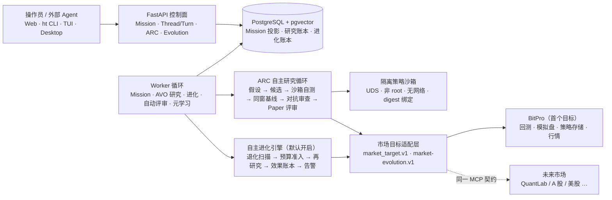

# HyperTrade & ARC (Autonomous Research Core)

<p align="center">
  <strong>自托管、受治理的策略研究 Agent Runtime · 自主研究与自主进化闭环</strong>
</p>

<p align="center">
  <a href="LICENSE"></a>
  <a href="#"></a>
  <a href="#"></a>
  <a href="#"></a>
  <a href="#"></a>
  <a href="#"></a>
  <a href="#"></a>
  <a href="docs/architecture/63-evolution-effectiveness-alerts-and-benchmark.md"></a>
</p>

<p align="center">
  🌐 <strong>中文主文档</strong> ·
  <a href="README.en.md">🇬🇧 English</a> ·
  <a href="docs/architecture/00-overview.md">架构总览</a> ·
  <a href="docs/architecture/33-system-architecture.md">系统架构</a> ·
  <a href="docs/architecture/62-pluggable-market-targets.md">可插拔市场目标</a> ·
  <a href="docs/architecture/63-evolution-effectiveness-alerts-and-benchmark.md">进化加固</a> ·
  <a href="docs/spec.md">产品规格</a>
</p>

---

## 🌟 概要

**HyperTrade** 是一个自托管、受治理的量化策略研究 Agent Runtime。它把自然语言研究目标转成受权限、预算、证据与人工复核约束的 **Mission**，由 ARC 自主研究循环产出候选策略——经隔离沙箱回测、同窗基线对比与对抗审查后，进入 BitPro 模拟盘孵化；并在生产上持续运行**默认开启的自主进化引擎**：小时级扫描模拟盘策略的表现退化，按基准相对口径判定，在预算与证据门禁内自动发起再研究。

三个关键事实：

- **受治理，不越权。** 模型只能提出受 schema 限制的计划或输入；权限、审批、预算和风险门禁在调用前后独立验证。主网实盘执行被治理禁用（`live_allowed=false`），当前唯一的写路径是 BitPro 模拟盘。
- **市场可插拔。** 自进化核心与交易平台解耦：`market_target.v1` 描述标的宇宙、周期与能力；`market-evolution.v1` MCP 契约定义 7 个标准工具。BitPro 是第一个接入目标；A 股、美股等新市场（如 QuantLab）通过同一契约接入，随时插拔。
- **结论可追溯，缺口不掩盖。** 数据不可用、回退口径、无效对比都会显式标注（例如基准序列构建失败会回退绝对口径并在载荷中标注原因），绝不静默补造事实。

它不是"自动赚钱机器"，不承诺盈利，也不构成投资建议。

---

## 🏗️ 系统全景



外部数据与交易平台仍是各自领域的事实源；HyperTrade 只保存受界限的引用、摘要、哈希、指标与审计投影，不复制 BitPro 的业务逻辑，也不直接读取它的数据库。

---

## 🔁 核心能力

### 1. 受治理的 Agent 运行时（Mission Runtime V2）

研究任务的目标真相源是 **Mission**（Plan / Step / Event / 预算 / 审批 / 完成证明），Remote CLI 与 Web 的交互真相源是服务端 **Thread / Turn / Item** + 可续传 SSE。能力调用只能来自已审核的 Capability Catalog；外部写操作需要一次性绑定参数的审批、write-ahead DispatchIntent 与对账。确定性 reducer 离线重放产生的投影哈希必须与线上一致，版本缺口会使 aggregate 隔离而不会伪造历史。

设计文档：[30 路线图](docs/architecture/30-professional-agent-runtime-v2-roadmap.md) · [31 技术设计](docs/architecture/31-professional-agent-runtime-v2-technical-design.md) · [34 目标设计与审计](docs/architecture/34-next-generation-agent-runtime-audit-and-target-design.md)

### 2. ARC 自主研究循环（AVO）

从目标合同出发：证据预检（窗口不可用则停在 operator 面前，不消耗候选预算）→ 候选生成（LLM provider 假设通道 + 确定性策略族代码生成）→ 对抗审查（红队攻击 + 遗传变异）→ **隔离沙箱自测**（validate → create → backtest 全程 digest 绑定、UDS、非 root、无网络）→ **同窗基线对比**（候选与基线在完全相同的时间窗上比较，无效对比单独计数不静默算负）→ 反思约束与技能库注入后续轮次 → Paper 评审（human 模式等待人工批准；agent 模式按系统政策自动评审）→ 通过后从预授权派生候选绑定的模拟盘授权，在 BitPro 中启动独立模拟盘实例孵化。

设计文档：[35 North Star](docs/architecture/35-autonomous-quant-trader-north-star.md) · [36 目标驱动研究循环 M0](docs/architecture/36-goal-driven-autonomous-research-loop-m0.md) · [61 研究闭环架构梳理](docs/architecture/61-research-loop-architecture-rationalization.md) · [ARC 核心设计 37–41](docs/architecture/37-arc-autonomous-research-core-architecture.md)

### 3. 自主进化引擎（默认开启）

生产 worker 小时级扫描全部孵化中的模拟盘策略，回答三个问题——**有没有用、有没有卡住、判断得对不对**：

- **退化判定（基准相对）**：策略两周窗口（前 7 天 vs 后 7 天）的变化减去其标的同期买入持有的变化；大盘普跌不会冒充策略退化。组合策略取成员等权合成基准。
- **预算与连续性**：进化研究经 `research_budget.v1` 准入；每个策略的延续记录（continuation ledger）跟踪阻塞与下次可评估时间，阻塞分为 `time`（等待自愈）与 `operator`（需人工/上游修复）。
- **自动评审与元学习**：评审模式 human/agent 可配；离线元学习按 p90 规则对退化阈值做有界步进调整（默认只记录建议，auto-apply 需显式开启）。
- **效果账本与告警**：`evolution_effectiveness.v1` 汇总周期、任务、证据、决策、成本与逐策略战果（无效对比单独计数，样本不足时明确声明不足以支撑结论）；数据缺口静默停摆、持续报错、需要人工介入这三类事件产生告警并在条件消失时自动解除，可投递到飞书 webhook。
- **组合是一等公民**：组合策略（篮子）从扫描、研究、自测、模拟盘到基准全程保持完整标的集合，不允许在进化过程中被悄悄缩成单标的。

设计文档：[42 模拟盘反馈闭环](docs/architecture/42-arc-dynamic-paper-observation-feedback.md) · [63 进化加固](docs/architecture/63-evolution-effectiveness-alerts-and-benchmark.md)

### 4. 可插拔市场目标

自进化核心不绑定任何交易平台。一个市场目标由 `market_target.v1` 档案（标识、标的宇宙、周期、日历、能力声明）与 `market-evolution.v1` MCP 契约（7 个标准工具：读取模拟盘快照、行情、回测、策略校验/创建、模拟盘配置/启停等）共同定义。`MARKET_TARGET` 环境变量选择当前目标；BitPro 是第一个实现。接入新市场只需实现同一契约，进化引擎、账本、告警与效果评估全部自动继承。

设计文档：[62 可插拔市场目标](docs/architecture/62-pluggable-market-targets.md) · 合同：[用户定向合同 — 可插拔市场目标](docs/contracts/user-directed-pluggable-market-targets.md)

### 5. 研究资产与记忆

策略研究沉淀为可复核的长期资产：StrategyCard、ExperimentManifest、同窗基线对比证据、稳健性验证、已结算 `StrategyOutcome`、待审核 Lesson（冲突与反对证据必须保留）、研究记忆与技能库。这些是研究事实与复核材料，不构成执行授权；只有经过审核的 Lesson 才能作为有界上下文来源。

---

## 💻 快速开始

### 后端

```bash
uv sync
docker compose up -d postgres
uv run alembic upgrade head
uv run uvicorn hypertrade.main:app --app-dir backend/src --reload --host 0.0.0.0 --port 3334
```

API 与 worker 循环在同一进程生命周期内启动；也可以单独运行 worker：

```bash
uv run python -m hypertrade.worker
```

### 前端

```bash
cd frontend && pnpm install && pnpm dev
```

### 触发一次自主研究

```bash
curl -X POST http://localhost:3334/api/v1/arc/missions \
  -H "Content-Type: application/json" \
  -H "Idempotency-Key: demo-1" \
  -d '{
    "objective": "研究一个适应 BTC 高波动的趋势策略，过检后进入模拟盘孵化",
    "symbol": "BTC-USDT-SWAP",
    "timeframe": "1H",
    "max_candidates": 5
  }'
```

组合研究传入 `"symbols": ["NVDA-USDT-SWAP", "AMD-USDT-SWAP"]` 即可。查询 Mission 状态与证据：

```bash
curl http://localhost:3334/api/v1/arc/missions/{mission_id}
curl http://localhost:3334/api/v1/arc/missions/{mission_id}/progress
```

查看进化引擎的效果账本与告警：

```bash
curl http://localhost:3334/api/v1/arc/evolution/effectiveness
curl http://localhost:3334/api/v1/arc/evolution/alerts
```

---

## 🧪 验证

```bash
./scripts/check.sh
```

一条命令跑完全部质量门禁：前端（lint / vitest / 构建）+ ruff + mypy + pytest（当前 1592 项测试通过）。

---

## 🛠️ 技术栈

| 图层 | 技术选择 |
|-------|-------------|
| **控制面** | FastAPI 0.122+ / Uvicorn，认证 + 作用域令牌 + 幂等键，可续传游标 SSE |
| **领域与运行时** | Python 3.12+、Pydantic v2 严格合同，模块化单体 + ports-and-adapters |
| **存储** | SQLAlchemy 2.0 + Alembic，PostgreSQL 14+ 带 `pgvector` |
| **Worker** | asyncio 循环 + PostgreSQL SQL lease（Mission、AVO 研究、进化扫描、自动评审、元学习等 13 个循环） |
| **LLM Provider** | ProviderRuntime（OpenAI、DeepSeek、Claude、Codex、OpenRouter、Qwen 等，按配置启用） |
| **量化与回测** | BitPro（MCP/API 契约）：行情、回测、模拟盘、策略存储 |
| **策略沙箱** | UDS 隔离进程、非 root、无网络、只读根、资源限制、digest 绑定 |
| **前端与终端** | React 19 + TypeScript 5.9 + Vite 7 + Tailwind CSS；Tauri 桌面端；Textual TUI；`ht` CLI |
| **评测** | 物理隔离的评测目标（独立网络、数据库与合成事实） |
| **部署** | Docker Compose + Nginx + GitHub Actions（`main` 分支自动部署） |

---

## 📚 文档地图

| 入口 | 内容 |
|---------|-----------------------------|
| [架构总览](docs/architecture/00-overview.md) | 阅读顺序与系统边界的起点 |
| [33 系统架构](docs/architecture/33-system-architecture.md) | 当前实现快照：运行时分层、研究循环、进化引擎、市场目标、安全边界 |
| [62 可插拔市场目标](docs/architecture/62-pluggable-market-targets.md) | `market_target.v1` / `market-evolution.v1` 契约与接入方式 |
| [63 进化加固](docs/architecture/63-evolution-effectiveness-alerts-and-benchmark.md) | 效果账本、数据缺口告警、基准相对退化判定 |
| [产品规格](docs/spec.md) | 产品范围、用户旅程、验收与非目标 |
| [进度日志](docs/progress.md) | 当前已验证状态与生产证据 |
| [交付合同](docs/contracts/) | 逐 Sprint 的交付范围与技术规格 |
| [运行手册](docs/runbooks/) | 部署、监控、故障排查 |
| [开发者指南](docs/developer-guide.md) | 本地开发与扩展入口 |

---

## 🖥️ 流式研究与终端交互

`ht research start "研究目标"` 默认跟进整个研究过程：交互终端显示工作流、活动和详细日志，管道输出为逐行事件流。`--detach` 仅提交，`--plain` 强制逐行输出。

已有任务使用 `ht research watch <任务ID>` 重新连接。交互界面中，方向键选择日志，E 查看证据，R 打开逐版本审核，C 明确追加预算，F 重新连接，Q 或 Ctrl+C 退出观看；退出不停止服务器任务。评审模式可配置为 human（需要明确批准）或 agent（由系统政策自动评审并启动独立模拟盘）；终端在自动评审阶段保持流式跟进。模拟观察状态仍须结合实际运行证据判断。

---

## 📄 开源许可与免责声明

基于 MIT 许可证开源。详见 `LICENSE` 文件。

> **免责声明**：本仓库中的任何内容均不构成投资建议。主网实盘交易执行由风控硬性禁用（`live_allowed=false`）。
