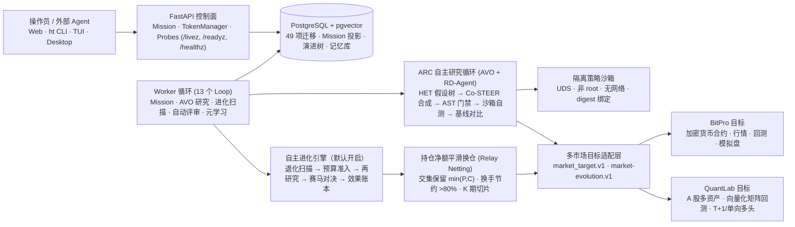

# HyperTrade & ARC (Autonomous Research Core)

<p align="center">
  <strong>自托管、受治理的多市场策略研究 Agent Runtime · 自主研究与自主进化闭环</strong>
</p>

<p align="center">
  <a href="LICENSE"></a>
  <a href="#"></a>
  <a href="#"></a>
  <a href="#"></a>
  <a href="#"></a>
  <a href="#"></a>
  <a href="#"></a>
  <a href="docs/architecture/63-evolution-effectiveness-alerts-and-benchmark.md"></a>
  <a href="docs/architecture/66-quantlab-adapter-a-share-microstructure-and-relay-handover.md"></a>
</p>

<p align="center">
  🌐 <strong>中文主文档</strong> ·
  <a href="README.en.md">🇬🇧 English</a> ·
  <a href="docs/architecture/00-overview.md">架构总览</a> ·
  <a href="docs/architecture/33-system-architecture.md">系统架构</a> ·
  <a href="docs/architecture/62-pluggable-market-targets.md">可插拔市场目标</a> ·
  <a href="docs/architecture/65-rd-agent-evolution-and-finmem-layered-memory.md">RD-Agent演进</a> ·
  <a href="docs/architecture/66-quantlab-adapter-a-share-microstructure-and-relay-handover.md">QuantLab与A股微观</a> ·
  <a href="docs/architecture/67-production-observability-probes-and-token-rotation.md">生产探活与令牌</a> ·
  <a href="docs/spec.md">产品规格</a>
</p>

---

## 🌟 概要

**HyperTrade** 是一个自托管、受治理的量化策略研究与自主进化 Agent Runtime。它把自然语言研究目标转成受权限、预算、证据与人工复核约束的 **Mission**，由 ARC 自主研究循环（集成 RD-Agent 假设演进树与 Co-STEER 结构化代码生成）产出候选策略——经隔离沙箱回测、同窗基线对比与对抗审查后，进入目标市场（BitPro 加密货币合约 / QuantLab A 股多资产）模拟盘孵化；并在生产上持续运行**默认开启的自主进化引擎**：小时级扫描模拟盘策略的表现退化，按基准相对口径判定，在预算与证据门禁内自动发起再研究；并在赛马淘汰换仓阶段通过**持仓净额对冲平滑接力**节约换手摩擦超 80%。

四个关键事实：

- **受治理，不越权。** 模型只能提出受 schema 限制的计划或输入；权限、审批、预算和风险门禁在调用前后独立验证。主网实盘执行被治理禁用（`live_allowed=false`），外部写路径严格受限于已授权的模拟盘。
- **多市场可插拔与制度硬约束内嵌。** 自进化核心与底层交易平台完全解耦（`market_target.v1` 档案与 `market-evolution.v1` MCP 契约）。系统原生支持 **BitPro（加密货币合约）** 与 **QuantLab（A 股多资产）** 双目标。针对 A 股现货市场，在 Prompt 与 ASTGatekeeper 双端内嵌 T+1 状态机、现货单向多头（禁止做空）、涨跌停截断、一手 100 股及精准印花税/佣金模型。
- **科学演进与摩擦最小化。** 引入 RD-Agent 假设演进树（HET），实现假设系谱追踪与显式剪枝；在赛马晋升阶段采用两腿持仓交集对冲（$\Delta = C - P$），原地保留共有份额 $\min(P_i, C_i)$，消除重复换手摩擦。
- **结论可追溯，企业级安全与探活。** 容器级分级探活矩阵（`/livez`, `/readyz`, `/healthz`）支持云原生编排；`TokenRotationService` 实现基于 SHA-256 单向散列的零信任令牌管理与 24 小时宽限期无缝热轮换。

它不是"自动赚钱机器"，不承诺盈利，也不构成投资建议。

---

## 🏗️ 系统全景


```mermaid
flowchart LR
  Op["操作员 / 外部 Agent<br/>Web · ht CLI · TUI · Desktop"] --> API["FastAPI 控制面<br/>Mission · TokenManager · Probes (/livez, /readyz, /healthz)"]
  API --> DB[("PostgreSQL + pgvector<br/>49 项迁移 · Mission 投影 · 演进树 · 记忆库")]
  Worker["Worker 循环 (13 个 Loop)<br/>Mission · AVO 研究 · 进化扫描 · 自动评审 · 元学习"] --> DB
  Worker --> Research["ARC 自主研究循环 (AVO + RD-Agent)<br/>HET 假设树 → Co-STEER 合成 → AST 门禁 → 沙箱自测 → 基线对比"]
  Worker --> Evolution["自主进化引擎（默认开启）<br/>退化扫描 → 预算准入 → 再研究 → 赛马对决 → 效果账本"]
  Research --> Sandbox["隔离策略沙箱<br/>UDS · 非 root · 无网络 · digest 绑定"]
  Research --> Targets["多市场目标适配层<br/>market_target.v1 · market-evolution.v1"]
  Evolution --> Relay["持仓净额平滑换仓 (Relay Netting)<br/>交集保留 min(P,C) · 换手节约 >80% · K 期切片"]
  Relay --> Targets
  Targets --> BitPro["BitPro 目标<br/>加密货币合约 · 行情 · 回测 · 模拟盘"]
  Targets --> QuantLab["QuantLab 目标<br/>A 股多资产 · 向量化矩阵回测 · T+1/单向多头"]
```

外部数据与交易平台仍是各自领域的事实源；HyperTrade 只保存受界限的引用、摘要、哈希、指标与审计投影，不复制 BitPro 或 QuantLab 的内部业务逻辑，也不直接读取其内部数据库。

---

## 🔁 核心能力

### 1. 受治理的 Agent 运行时与动态安全令牌轮换
研究任务的目标真相源是 **Mission**（Plan / Step / Event / 预算 / 审批 / 完成证明），交互真相源是服务端 **Thread / Turn / Item** + 可续传 SSE。外部写操作需要一次性绑定参数的审批、write-ahead DispatchIntent 与对账。系统集成 **`TokenRotationService`**：凭据仅存储 SHA-256 哈希，支持按最小权限细粒度配置 Scope（如 `arc:read`, `arc:start`），支持无停机 24 小时宽限期热轮换与 7 天临期主动审计预警。

设计文档：[30 路线图](docs/architecture/30-professional-agent-runtime-v2-roadmap.md) · [31 技术设计](docs/architecture/31-professional-agent-runtime-v2-technical-design.md) · [67 生产探活与令牌轮换](docs/architecture/67-production-observability-probes-and-token-rotation.md)

### 2. ARC 自主研究中枢与 RD-Agent 假设演进 (HET + Co-STEER)
集成微软 RD-Agent 核心思想，构建假设演进树（Hypothesis Evolution Tree, HET）：
- **假设血缘与剪枝**：记录从根假设到变异分支的完整演化系谱，对跑输基准或过拟合的假说进行显式剪枝；
- **Co-STEER 结构化代码合成**：基于领域脚手架引导大模型合成特征计算、信号生成与仓位管理三段式逻辑；
- **AST 语法与时序穿越门禁**：`ASTGatekeeper` 在编译期静态扫描并拦截未来函数穿越与未授权外部调用；
- **隔离沙箱自测与同窗对比**：UDS 隔离、非 root、无网络；候选与基线在完全相同的时间窗上比对，无效对比显式计数。

设计文档：[65 RD-Agent 演进与分层认知记忆](docs/architecture/65-rd-agent-evolution-and-finmem-layered-memory.md) · [37 ARC 架构](docs/architecture/37-arc-autonomous-research-core-architecture.md) · [61 研究闭环梳理](docs/architecture/61-research-loop-architecture-rationalization.md)

### 3. 多市场目标适配与 A 股微观结构硬规则
自进化核心与交易平台解耦：通过 `market_target.v1` 档案与 `market-evolution.v1` MCP 契约支持即插即用：
- **BitPro 目标**：支持全天候加密货币永续合约，双向多空；
- **QuantLab 目标**：支持 A 股现货多资产，通过 `QuantLabStrategyTranspiler` 自动将三段式策略转译为 QuantLab 原生向量化 `MatrixStrategy` 并注入独立脚手架 `_BASE_EVO_SCAFFOLD`；
- **A 股微观规则注入**：Prompt 与 ASTGatekeeper 双端强制内嵌 T+1 交收时序状态机、现货单向多头（静态拦截 `-1` 做空信号）、涨跌停板流动性截断、一手 100 股向下取整以及精准印花税（0.05%）、过户费与佣金摩擦模型。

设计文档：[62 可插拔市场目标](docs/architecture/62-pluggable-market-targets.md) · [66 QuantLab 适配器与 A 股微观结构](docs/architecture/66-quantlab-adapter-a-share-microstructure-and-relay-handover.md)

### 4. 自主进化引擎与赛马接力净额平滑换仓
生产 worker 小时级扫描全部孵化中的模拟盘策略，回答**“有没有用、有没有卡住、判断得对不对”**：
- **基准相对退化判定**：前后各 7 天策略表现扣除标的同期买入持有变化，大盘普跌不冒充策略退化；
- **持仓净额对冲平滑接力 (Position Netting Relay)**：赛马优胜换仓时，`PositionNettingRelayService` 计算母子策略持仓交集并原地保留共有份额 $\min(P_i, C_i)$，仅对净额差量 $\Delta = C - P$ 切分为 $K$ 期平滑切片执行，重合资产换手节约率超 80%，极大减少摩擦滑点；
- **效果账本与告警**：汇总周期、任务、证据与胜出率；数据缺口停摆与严重报错自动触发告警，直连飞书 Webhook 交互卡片。

设计文档：[63 进化加固](docs/architecture/63-evolution-effectiveness-alerts-and-benchmark.md) · [66 赛马平滑换仓](docs/architecture/66-quantlab-adapter-a-share-microstructure-and-relay-handover.md)

### 5. 容器级分级探活矩阵与量子量化指挥台
- **探活矩阵**：`/livez`（进程存活）、`/readyz`（`SELECT 1` 数据库就绪）、`/healthz`（包含 DB 延迟、QuantLab/BitPro 适配器心跳、Paper 会话与令牌审计全景诊断），原生适配 K8s 探针；
- **量子指挥台 (QuantumPortfolioDashboard)**：React 19 现代化界面，支持 BitPro / QuantLab 一键切换、动态 A 股微观规则警示徽章、HET 假设演进树可视化渲染与净额换仓切片步进监视器。

设计文档：[67 生产级探活与令牌轮换](docs/architecture/67-production-observability-probes-and-token-rotation.md)

---

## 💻 快速开始

### 后端与数据库

```bash
uv sync
docker compose up -d postgres
uv run alembic upgrade head
uv run uvicorn hypertrade.main:app --app-dir backend/src --reload --host 0.0.0.0 --port 3334
```

API 与 13 个 worker 循环在同一生命周期内启动；也可单独启动独立 worker：

```bash
uv run python -m hypertrade.worker
```

### 前端开发

```bash
cd frontend && pnpm install && pnpm dev
```

### 探活与健康检查

```bash
curl http://localhost:3334/livez
curl http://localhost:3334/readyz
curl http://localhost:3334/healthz
```

### 目标与研究触发

查询当前已注册的市场目标（BitPro / QuantLab）：
```bash
curl http://localhost:3334/api/portfolio/targets
```

触发一次加密货币趋势策略自主研究：
```bash
curl -X POST http://localhost:3334/api/v1/arc/missions \
  -H "Content-Type: application/json" \
  -H "Idempotency-Key: demo-crypto-1" \
  -d '{
    "objective": "研究一个适应 BTC 高波动的趋势策略，过检后进入模拟盘孵化",
    "symbol": "BTC-USDT-SWAP",
    "timeframe": "1H",
    "max_candidates": 5
  }'
```

查看 HET 假设演进树与净额换仓计划：
```bash
curl http://localhost:3334/api/research/hypothesis-tree
curl http://localhost:3334/api/portfolio/relay/handovers
```

---

## 🧪 质量与门禁验证

```bash
./scripts/check.sh
```

一条命令跑完全部门禁：前端（lint / vitest / 生产构建）+ 后端（Ruff 代码检查与格式化 + Mypy 严格类型检查 + Pytest 全量测试，当前 2100+ 项测试 100% 绿灯）。

---

## 🛠️ 技术栈

| 图层 | 技术选择 |
|-------|-------------|
| **控制面** | FastAPI 0.122+ / Uvicorn，作用域安全令牌，`/livez`, `/readyz`, `/healthz` 容器探活矩阵，游标可续传 SSE |
| **凭据安全** | `TokenRotationService`（SHA-256 单向散列，零明文存储，24h 宽限期热轮换，7天临期审计） |
| **运行时与领域** | Python 3.12+、Pydantic v2 严格合同，模块化单体 + ports-and-adapters |
| **存储** | SQLAlchemy 2.0 + Alembic（49 个迁移），PostgreSQL 14+ 带 `pgvector` |
| **Worker 集群** | asyncio + PostgreSQL SQL lease 租约（13 个并发后台循环） |
| **研究与演进中枢** | ARC + RD-Agent 假设演进树 (HET) + Co-STEER 代码合成器 + `ASTGatekeeper` 语法守卫 |
| **多市场目标适配** | `market_target.v1` 与 `market-evolution.v1` MCP 契约；BitPro (Crypto) + QuantLab (A股) |
| **A 股微观规则** | `AShareMarketRules` / `AShareRuleValidator`（T+1 状态机、现货单向多头、一手100股、万2.5/5bps） |
| **平滑换仓接力** | `PositionNettingRelayService`（持仓交集保留 $\min(P,C)$，净额差量 $\Delta = C-P$ 分批平滑切片，换手节约 >80%） |
| **策略沙箱** | UDS 隔离进程、非 root、无网络、只读根、资源限制、digest 绑定 |
| **前端与终端** | React 19 + TypeScript 5.9 + Vite 7 + Tailwind CSS（量子量化指挥台）；Tauri 桌面端；Textual TUI；`ht` CLI |
| **部署** | Docker Compose + Nginx + GitHub Actions（`main` 分支自动部署） |

---

## 📚 文档地图

| 入口 | 内容 |
|---------|-----------------------------|
| [架构总览](docs/architecture/00-overview.md) | 架构阅读引导与**架构变更同步强准则** |
| [33 系统架构](docs/architecture/33-system-architecture.md) | 生产实现全景快照：多市场目标、运行时分层、安全与探活矩阵 |
| [66 QuantLab 与 A 股微观结构](docs/architecture/66-quantlab-adapter-a-share-microstructure-and-relay-handover.md) | QuantLab 适配器、向量化策略转译器、A 股微观规则与持仓净额平滑换仓 |
| [67 生产级探活与令牌轮换](docs/architecture/67-production-observability-probes-and-token-rotation.md) | `/livez`, `/readyz`, `/healthz` 探活矩阵、`TokenRotationService` 与多目标指挥台 |
| [65 RD-Agent 演进与分层记忆](docs/architecture/65-rd-agent-evolution-and-finmem-layered-memory.md) | 假设演进树（HET）、Co-STEER 代码合成与 FinMem 三层认知记忆 |
| [64 全自主交易 Agent 架构](docs/architecture/64-autonomous-trading-agent-system-architecture.md) | 统一感知总线、三速协同决策与受控自主边界 |
| [62 可插拔市场目标](docs/architecture/62-pluggable-market-targets.md) | `market_target.v1` / `market-evolution.v1` 契约与接入方式 |
| [63 进化加固](docs/architecture/63-evolution-effectiveness-alerts-and-benchmark.md) | 效果账本、数据缺口告警、基准相对退化判定 |
| [产品规格](docs/spec.md) | 产品范围、用户旅程、验收与非目标 |
| [进度日志](docs/progress.md) | 当前已验证状态与生产证据 |
| [交付合同](docs/contracts/) | 逐 Sprint 的交付范围与技术规格 |
| [运行手册](docs/runbooks/) | 部署、监控、故障排查 |
| [开发者指南](docs/developer-guide.md) | 本地开发与扩展入口 |

---

## 🖥️ 终端流式研究与交互

`ht research start "研究目标"` 默认跟进整个研究过程：交互终端显示工作流、活动和详细日志，管道输出为逐行事件流。`--detach` 仅提交，`--plain` 强制逐行输出。已有任务使用 `ht research watch <任务ID>` 重新连接。

---

## 📄 开源许可与免责声明

基于 MIT 许可证开源。详见 `LICENSE` 文件。

> **免责声明**：本仓库中的任何内容均不构成投资建议。主网实盘交易执行由风控硬性禁用（`live_allowed=false`）。
