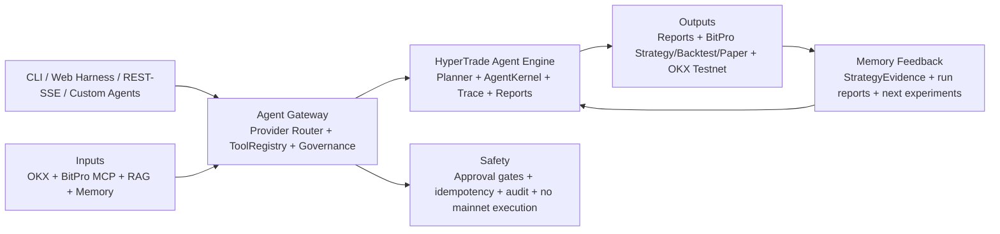

# 19 HyperTrade Architecture Diagram / 架构图

## Purpose

This document provides a poster-style HyperTrade architecture map for product
discussion, Agent handoff, and implementation planning.

The diagram is inspired by AI-native trading-system maps, but the content is
specific to HyperTrade:

- HyperTrade owns Agent planning, tool calling, trace, Memory, report rendering,
  strategy evidence, and risk governance.
- BitPro remains an external trading-system platform reached only through stable
  MCP/API contracts.
- OKX and future providers are connector inputs with explicit evidence
  boundaries.
- Live execution remains risk-gated. Mainnet execution is out of V1 scope.

## Layer Responsibilities

| # | Layer | Responsibility |
| --- | --- | --- |
| 1 | Agent / Client Access | CLI `hypertrade`/`ht`, `/harness`, REST/SSE API, Codex, custom Agents, and future MCP clients. |
| 2 | Data and Inputs | OKX market data, BitPro MCP/API surfaces, RAG documents, audited Memory, and operator prompts. |
| 3 | Agent Gateway | Provider routing, ToolRegistry metadata, approval checks, idempotency gates, trace, and audit policy. |
| 4 | HyperTrade Agent Engine | AgentKernel graph runtime, planner/tool-calling loop, market intelligence, strategy research, backtest/paper evidence, reports, and Memory feedback. |
| 5 | Execution and Output | Operator reports, BitPro strategy lifecycle calls, BitPro-owned backtest/paper flows, and OKX Testnet execution after approval. |
| 6 | Multi-Agent Workflow | Research, strategy, and monitor Agents share the same evidence contracts and tool-policy boundaries. |
| 7 | Foundation / Infrastructure | LLM providers, PostgreSQL/pgvector, worker loops, connector adapters, server-only secrets, CI/CD, and evals. |
| 8 | Closed-Loop Workflow | Market research -> strategy code -> validation -> BitPro backtest -> paper monitoring -> risk-gated execution -> Memory feedback. |
| 9 | Safety and Compliance | Audited runs, scoped tools, RBAC, idempotency, paper-first validation, and explicit live-risk approval. |

## Logical Flow

## BitPro Boundary

HyperTrade may call BitPro through stable MCP/API tools for capability
discovery, health, K-line reads, strategy search/generate/create/update,
validation, backtest jobs/results, paper evidence, paper lifecycle actions, and
live diagnostics. HyperTrade must not copy BitPro business logic, query BitPro
databases directly, or bypass BitPro's risk boundaries.

## Design Notes

- Default reports should be concise and source-backed.
- Audit details should be available through trace/debug modes without cluttering
  normal operator output.
- Missing data must be rendered explicitly instead of silently inferred.
- Strategy memory is evidence, not investment advice.
- New connectors should enter through a capability/health/evidence contract
  before the planner can rely on them.
