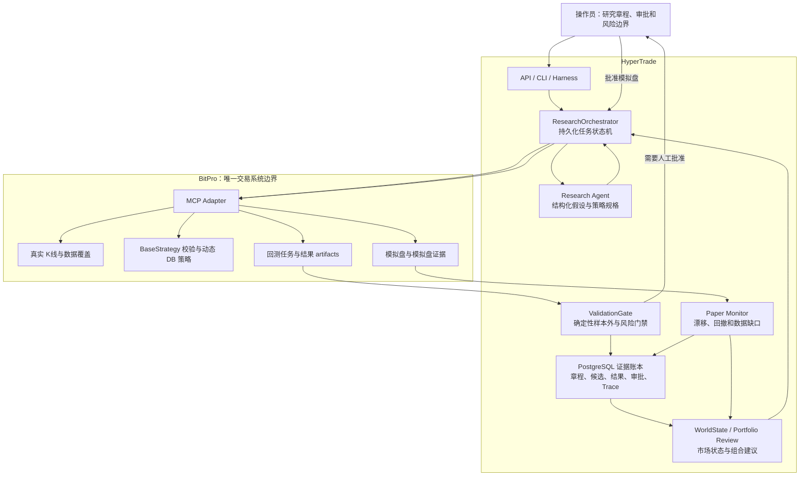

# 23 自主策略研究机构与 BitPro 集成设计

## 目的

HyperTrade 后续要承接的不是「让模型寻找一条永远盈利的策略」，而是一套可持续运行的研究流程：在明确的研究范围和风险约束内，提出候选、用真实数据验证、保留失败证据、把通过验证的候选送往 BitPro 模拟盘观察，并在策略失效时提出降级或退役建议。

市场状态会变化，任何单一策略都可能失效。本设计把目标限定为：在多个市场状态下筛选具有样本外证据的低相关候选，并通过风险预算和生命周期管理控制组合风险。所有研究输出都是研究记录，不构成投资建议，也不保证收益。

## 当前基础与缺口

| 现有能力 | 现有实现 | 本设计补充的部分 |
| --- | --- | --- |
| Agent 运行时 | `AgentKernel`、工具策略、Trace、Provider Router | 一个可恢复的研究任务状态机，而不是一次性对话运行 |
| 策略实验 | 本地 `StrategyExperimentService`、`StrategyEvidence`、策略库 | 研究章程、BitPro 回测矩阵和跨实验统一门禁 |
| BitPro 生命周期 | MCP 策略校验、动态 DB 策略、回测、模拟盘和只读监控 | 把多个 MCP 调用组织为可审计的候选策略生命周期 |
| 市场/组合观察 | WorldState、组合建议、监控与告警 | 策略适配状态、挑战者/冠军关系和研究优先级 |
| 治理 | `ToolRegistry`、`RiskGovernancePolicy`、幂等与 Trace | 对研究预算、模拟盘晋级和人工审批的专用约束 |

本设计不替换 BitPro 的策略运行、数据存储、回测计算或模拟盘运行。HyperTrade 保存研究元数据和证据引用；策略代码、真实数据覆盖和执行状态始终以 BitPro MCP 返回结果为准。

## 架构



架构有两条节奏不同的循环：

1. 研究慢循环按小时或天运行。它读取策略库和研究章程，创建有限候选，完成 BitPro 回测与验证，再写入证据账本。
2. 运行快循环按监控周期读取 BitPro 模拟盘和 WorldState。它只给出继续观察、降权、暂停请求或新研究建议；不自动执行实盘交易。

## 责任边界

| 组件 | 责任 | 不承担的责任 |
| --- | --- | --- |
| Research Agent | 检索已有证据、提出可证伪假设、生成 `StrategySpec`、解释实验结论 | 不判定策略通过，不直接写 BitPro，不决定仓位 |
| ResearchOrchestrator | 创建任务、限制预算、编排 MCP 调用、保存状态、恢复可重试步骤 | 不计算 Alpha，不绕过门禁 |
| ValidationGate | 检查数据完整性、样本外结果、交易数、成本、回撤和稳定性 | 不使用 LLM 文本替代指标 |
| WorldState / Portfolio Review | 给出市场状态、策略适配度、相关性和风险预算建议 | 不修改实盘或自动提高风险预算 |
| BitPro MCP Adapter | 按受控工具调用 BitPro、返回真实结果及缺口 | 不读取 BitPro 数据库、不复制 BitPro 业务逻辑 |
| Paper Monitor | 读取模拟盘状态、事件、权益和漂移 | 不因单次异常自动开始、停止或晋级策略 |

LLM 只能调用其阶段允许的工具。`ResearchOrchestrator` 和 `ValidationGate` 由确定性 Python 服务实现；它们的状态转换、预算和拒绝理由必须在 Trace 中可见。

## 核心数据合同

### ResearchMandate

`ResearchMandate` 是操作员建立的研究章程，也是所有后续任务的根约束。至少包含：

- 允许的 BitPro 标的、市场类型、K 线周期和策略类别。
- 单日候选数、单候选变体数、并发回测数和总回测预算。
- 数据最小覆盖、费用/滑点/资金费假设、最小交易数和最大回撤等门禁配置。
- 样本内、验证和锁定样本外的时间窗口规则；锁定样本外在候选选择前不可读取结果。
- 模拟盘晋级模式：`manual_approval` 为首个版本的唯一允许值。
- 实盘模式：固定为 `disabled`，不在本路线图内开放。

### StrategySpec 与 StrategyCard

`StrategySpec` 是 LLM 生成但必须经 schema 校验的策略说明，包含假设、适用状态、入/出场逻辑、风险条件、数据需求、参数边界与失效条件。它不是自由文本代码。

`StrategyCard` 是经过验证后可被组合层读取的策略档案，至少关联：

- BitPro `strategy_id`、策略名称、动态 DB 脚本版本和 `StrategySpec` 版本。
- 策略类别、标的、周期、适用的市场状态、容量/流动性假设和风险预算上限。
- 最新验证报告、最新模拟盘证据、状态和退役原因。
- 关联的 `ResearchMandate`、实验和 BitPro result id。

### ResearchJob 与 ExperimentEvidence

`ResearchJob` 是可恢复的持久化任务，保存输入、当前阶段、尝试次数、幂等键、关联 MCP job id 和结构化错误。它不把任务进度只留在 Agent 对话历史中。

`ExperimentEvidence` 记录每个变体的真实数据窗口、BitPro result id、指标、门禁结果、拒绝理由和可复现参数。HyperTrade 只保存有界 artifact 摘要与 BitPro 引用，不复制 BitPro 的完整交易或 K 线数据。

### PaperPromotion

`PaperPromotion` 只在所有验证门禁通过后创建，状态为 `pending_approval`。操作员批准时必须产生独立的审批记录和幂等键，随后才允许调用 `paper_configure` 与 `paper_start`。它永远不能转化为实盘晋级动作。

## 生命周期状态机

`ResearchMandate` 与 `ResearchJob` 是不同实体，不能共用一个状态字段：

```text
ResearchMandate: draft -> active <-> paused -> archived

ResearchJob: queued -> planning -> data_preflight -> strategy_validation
  -> backtesting -> validation -> rejected | evidence_recorded

StrategyCard: evidence_recorded -> pending_paper_approval -> paper_observing
  -> qualified | degraded | retired
```

- 任何数据覆盖不足、BitPro 不健康、策略代码校验失败、MCP 超时或指标缺失都进入 `rejected`、`failed` 或 `needs_data`，并保留结构化原因。
- `validation` 只在固定的输入和已保存的 BitPro artifacts 上运行；它不能以模型解释覆盖缺失指标。
- `paper_observing` 的表现不会改写历史回测结论。回测、模拟盘和未来实盘状态必须在报告中分层显示。

## BitPro MCP 调用合同

| 阶段 | MCP 调用 | 必须满足的条件 |
| --- | --- | --- |
| 预检 | `bitpro_capabilities`、`bitpro_health` | 研究和模拟盘 scope 可用；上游健康且数据缺口可见 |
| 数据覆盖 | `market_symbols`、`market_klines`、`sync_status` | 使用真实 OHLCV；不足时同步历史数据或缩短窗口，禁止合成数据 |
| 策略校验 | `strategy_search`、`strategy_validate_code` | 策略名符合约定；单个 `BaseStrategy` 子类通过校验 |
| 持久化 | `strategy_create`、`strategy_update` | 只使用动态 DB 策略，保存 `script_content` 与来源配置；不改 BitPro 文件或 registry |
| 回测矩阵 | `backtest_start_job`、`backtest_get_job`、`backtest_get_result` | 每个任务有幂等键；只读取 BitPro 结果和有界 artifacts |
| 模拟盘 | `paper_configure`、`paper_start`、`paper_dashboard`、`paper_events`、`paper_equity_curve` | 有审批记录；持续使用只读证据监控 |

实盘诊断可以保持只读。`live_promote`、下单、撤单、划转和任何实盘写工具不属于本设计的允许动作，即使底层 MCP 在未来暴露了这些能力。

## 验证与门禁

第一个版本使用透明、可配置的门禁，至少包括：

1. 数据覆盖与时间顺序正确；不使用未来数据、合成 OHLCV 或未声明成本。
2. 每个候选有锁定样本外结果；样本内最佳参数不能直接被视为通过。
3. 交易数、收益、最大回撤、成本后结果和缺失 artifacts 满足 `ResearchMandate`。
4. 变体数量受预算限制；相同候选、数据窗口和参数不重复运行。
5. 策略与既有 `StrategyCard` 的市场状态和暴露相关性足够清楚；信息不足时只进入观察或新研究，不增加风险建议。

更复杂的统计检验、组合优化和自动风险预算调整必须另立合约。首版优先让门禁、输入和拒绝原因可审计。

## 操作员流程

1. 操作员创建或更新 `ResearchMandate`，定义研究范围、预算、验证阈值和模拟盘审批模式。
2. 操作员启动一次研究，或让已启用的计划任务在预算内创建 `ResearchJob`。
3. 系统生成 `StrategySpec`，执行 BitPro 预检、数据检查、代码校验和回测矩阵。
4. 操作员在候选收件箱读取结论、样本外指标、失败原因、数据缺口和 BitPro 证据链接。
5. 只有 `pending_paper_approval` 候选可以被人工批准进入模拟盘。
6. 模拟盘监控持续生成 evidence；组合审阅只给出观察、降权、暂停请求或后续研究建议。

## 可观测性与评测

每个研究任务应关联 Agent run、Trace、ResearchJob、BitPro job/result、策略 id、模拟盘 id 和审批记录。默认报告展示结论、关键指标、数据缺口和下一步；审计模式可展开工具调用、门禁输入和有界证据。

每个新增 Agent 可见工具或状态转换都需要确定性评测，至少覆盖：

- 缺少 BitPro 健康、数据覆盖或 artifacts 时拒绝晋级。
- 不能通过 Memory、策略描述或 LLM 文本伪造 BitPro 回测/模拟盘指标。
- 没有样本外结果、审批记录或幂等键时不调用模拟盘写工具。
- 未通过门禁的候选不能出现在可批准列表。
- 无论 planner 输出什么，都不能调用实盘写工具。

## 分期实施

| Sprint | 交付 | 依赖 | 自动化边界 |
| --- | --- | --- | --- |
| 81 | 研究章程、持久化研究任务和候选收件箱 API/CLI | 现有 Agent/治理/数据库 | 不调用 BitPro 写工具 |
| 82 | BitPro 回测矩阵编排和确定性验证报告 | Sprint 81、BitPro MCP | 固定样本内/验证/锁定样本外窗口；缺指标失败关闭；自动回测但不进入模拟盘 |
| 83 | 模拟盘晋级审批、观察期和证据关联 | Sprint 82、已有 Paper Monitor | 人工批准后才写模拟盘；无实盘 |
| 84 | 市场状态感知的策略卡与组合研究审阅 | Sprint 83、WorldState/Portfolio | 只读建议，不修改风险预算或实盘 |

## 不在本设计范围内

- 收益保证、自动实盘交易、自动实盘策略晋级或自动增加风险预算。
- 绕过 BitPro MCP 读取数据库、修改 `backend/app/strategies/*.py`、修改策略 registry 或重启 BitPro。
- 无边界的大型参数搜索、未计成本的结果比较或用模型记忆替代数据证据。
- 将新闻、社交文本或 RAG 结论直接视作交易信号。
