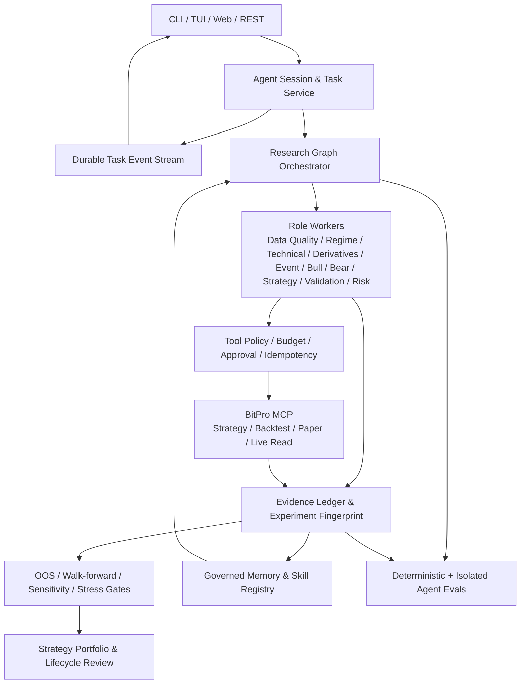

# 27 Agent Research OS 规划路线图

> 状态：Approved；Sprint 96 已于 2026-07-14 开始实施。

## 1. 规划目的

HyperTrade 下一阶段的目标不是复制 Hermes Agent、TradingAgents 或 Claude Code，
而是把三类能力组合成一个受控的加密策略研究系统：

- 从 Hermes Agent 吸收持久会话、后台任务、恢复、中断、技能与终端工作台能力。
- 从 TradingAgents 吸收专业角色分工、对立论证、研究图和节点级 checkpoint 能力。
- 保留 HyperTrade 已有的证据门禁、BitPro MCP 边界、幂等、人工审批、模拟盘观察、
  组合审阅和隔离评测能力。

最终产品定位是：

> 一个面向加密市场、可审计、可恢复、受预算和权限约束的自主策略研发机构。

该定位不包含收益保证，也不以“Agent 数量”作为成熟度指标。成熟度由任务可恢复性、
证据完整性、实验可复现性、风险边界、失败恢复和持续评测共同决定。

## 2. 当前基础

Sprint 81–94 已提供本路线图的关键底座：

| 已有能力 | 当前事实入口 | 后续复用方式 |
| --- | --- | --- |
| 研究章程和持久任务 | `ResearchMandate`、`ResearchJob` | 升级为统一 Agent Task，而不是重建另一套研究队列 |
| BitPro 回测与真实证据 | `ResearchOrchestrator`、`ResearchExperimentEvidence` | 继续由 BitPro 持有完整行情、策略和回测 artifacts |
| 模拟盘晋升与观察 | `PaperPromotion`、Paper Snapshot、人工复核队列 | 保持人工审批，禁止 Agent 直接推进模拟盘/实盘 |
| Agent Run 与 Trace | `AgentRun`、`TraceEvent`、Flight Recorder | 关联 Session、Task、Graph Node 与 Checkpoint |
| 工具治理 | `ToolRegistry`、`RiskGovernancePolicy`、MCP scope、幂等键 | 为每个研究角色生成更窄的工具权限上下文 |
| 评测 | 确定性 `/evals`、24 条 golden baseline、隔离 eval 环境 | 扩展到任务恢复、多 Agent 协作和证据真实性 |
| 操作界面 | Web Harness、Rich CLI、独立路由工作台 | 在同一 API/event contract 上增加可选 TUI |
| Memory 与策略库 | audited Memory、`StrategyEvidence`、Strategy Library | 增加来源、有效期、冲突、评审和技能提案治理 |

## 3. 核心差距

### 3.1 Agent OS 差距

当前 `AgentRun` 是一次执行记录，`/run <id>` 可以回看结果，但还不是可恢复完整上下文的
长期 Session。缺少统一的 Task、Checkpoint、Pause/Resume/Retry/Branch 和事件游标。

### 3.2 研究团队差距

当前 Research Agent 可以规划工具和生成策略规格，但没有显式、受约束的专业角色图。
市场状态、数据质量、技术结构、衍生品、事件、多空论证、策略工程和风险审阅尚未成为
独立、可评测、可替换的节点。

### 3.3 证据与复现差距

现有 BitPro evidence 已保存窗口、参数、指标和结果引用，但跨 Agent 角色的事实、推断、
反例、数据缺口和新鲜度还没有统一 schema；模型、prompt、toolset、数据 snapshot 和成本
假设也没有统一形成完整实验指纹。

### 3.4 运营体验差距

CLI 能展示进度和最终报告，但运行时不能在同一界面中持续查看任务图、后台任务、节点失败、
证据、审批和预算，也不能在任务执行期间安全地暂停、重定向或从 checkpoint 继续。

### 3.5 学习治理差距

Memory 有审计字段，但还没有声明级冲突、过期、复核和淘汰机制；Agent 也没有“提出 Skill
变更 -> 沙箱测试 -> Eval -> 人工批准 -> 发布/回滚”的闭环。

## 4. 设计原则

1. PostgreSQL 是 Agent Session、Task、Node 与审批状态的唯一事实源。
2. BitPro 是策略、完整行情、回测、模拟盘和未来执行状态的唯一交易系统事实源。
3. LLM 生成假设和解释；确定性服务控制状态机、预算、门禁和权限。
4. 多 Agent 节点默认只读；写入 BitPro 的动作只能由受控 Orchestrator 执行。
5. 任何缺数据、缺证据、超预算、schema 失败或上游不健康都必须 fail closed。
6. 后台自动化可以创建研究任务，但不能自动批准模拟盘、实盘或提高风险预算。
7. CLI、TUI、Web 和 API 共享同一任务/事件合同，不复制业务状态机。
8. 每个 Sprint 都必须增加确定性评测，并保持 Sprint 92–94 的隔离评测边界。
9. 新架构必须兼容现有 `ht ask`、`ht chat`、slash commands 和 Harness。
10. 不把 LLM 辩论、Memory 文本或单次回测收益当作策略真实性或稳定性的证明。

## 5. 目标架构

## 6. 分期路线

本路线在当前 Sprint 95 生产就绪评测完成后从 Sprint 96 开始。证据合同安排在多 Agent 图
之前，是为了让每个角色在第一次上线时
就只能输出可校验数据，而不是先产生自由文本再补治理。

| Sprint | 主题 | 核心交付 | 阶段门禁 |
| --- | --- | --- | --- |
| 96 | Agent Session 与 Task Control | Session、Task、Checkpoint、事件游标、pause/resume/cancel/retry | 现有 one-shot CLI/API 无回归；重启可恢复 |
| 97 | Research Evidence Contract | 事实/推断/反例/缺口 schema、来源引用、内容哈希、有效期 | 无来源或过期 evidence 不能进入策略节点 |
| 98 | Multi-Agent Research Graph V1 | 固定 DAG、角色权限、预算、有限并发、多空审阅 | 角色不能绕过 ToolRegistry 或调用 paper/live writes |
| 99 | Reproducible Experiment Ledger | 实验指纹、策略/模型/prompt/tool/data/成本版本、artifact manifest | 同一 fingerprint 幂等复用；差异可解释 |
| 100 | Robustness Validation Suite | OOS、walk-forward、参数敏感性、成本/滑点和市场状态压力门禁 | 单次高收益不能通过；缺窗口失败关闭 |
| 101 | Agent Research Evaluation | 恢复、角色路由、证据真实性、预算、安全和失败注入评测 | 新 graph/evidence 行为进入确定性与隔离基线 |
| 102 | TUI Research Workbench | 可选 Textual TUI、任务图、证据、审批、预算、控制操作 | TUI 不持有业务状态；断线后按事件游标恢复 |
| 103 | Background Research Triggers | 定时、市场状态、漂移、数据异常触发；配额和去重 | 只能创建 bounded task；不能自动晋升或交易 |
| 104 | Governed Memory & Skill Lifecycle | 声明级 Memory、冲突/过期、Skill proposal/test/approve/rollback | Agent 不能直接发布 Skill 或静默改写 Memory |
| 105 | Portfolio Strategy Lifecycle | 相关性、状态适配、容量、风险贡献、衰减、退役审阅 | 只给出研究/复核建议；不自动改资金或实盘 |

截至 2026-07-15，Sprint 96–103 已完成并通过生产验收；当前进入 Sprint 104。

## 7. 阶段验收门

### Gate A：Agent OS Foundation（Sprint 96–97）

- Session、Task、Node、Checkpoint 与 Event 均有稳定 id 和状态机。
- CLI/API 中断后可以从最后成功 checkpoint 继续。
- Evidence 能区分事实、推断和未知状态，且所有事实具有来源引用。
- 不迁移或伪造旧 Run 的完整对话；旧 Run 保持只读兼容。

### Gate B：Institutional Research（Sprint 98–101）

- 多 Agent 图的节点、依赖、预算和工具权限可审计。
- 实验拥有可复现 fingerprint 和 BitPro artifact 引用。
- 样本外、walk-forward、敏感性和压力结果进入确定性门禁。
- 隔离评测可以验证错误恢复、危险工具拒绝和证据真实性。

### Gate C：Operator Experience & Automation（Sprint 102–104）

- TUI、CLI 和 Web 读取同一 Task/Event API。
- 后台触发器有预算、冷却时间、幂等键和人工停用开关。
- Memory/Skill 变更有提案、diff、评测、审批和回滚记录。

### Gate D：Portfolio Lifecycle（Sprint 105）

- 策略组合审阅能区分相关性、共同暴露、容量、状态适配和数据未知。
- 建议只能进入人工复核或新研究，不能产生自动资金/实盘写动作。
- 退役与降权理由具有证据链，不修改历史回测结论。

## 8. 成功指标

### 产品指标

- 任务恢复成功率、后台任务完成率和人工接管成功率。
- 从研究命题到结构化证据、可复现实验和纸面候选的转化漏斗。
- 操作员识别失败节点、证据缺口和审批等待的平均时间。
- 任务取消、暂停、重试和分支是否都能保持审计链完整。

### 研究质量指标

- Evidence 来源覆盖率、过期率、冲突率和 unknown 正确表达率。
- OOS、walk-forward、成本压力和参数敏感性覆盖率。
- 被拒绝候选的拒绝原因完整度，而不是只统计通过率。
- 策略跨市场状态、跨窗口和跨标的稳定性分布。

### Agent 质量指标

- 角色路由准确率、工具选择 F1、schema 有效率和预算遵守率。
- Provider 故障、BitPro 超时、事件断线和进程重启下的恢复率。
- 危险工具选择被拒绝率必须为 100%，实际危险工具 dispatch 必须为 0。
- 每个成功/失败任务的 Token、模型调用、工具调用、回测数和总耗时。

## 9. 明确不做

- 不承诺稳定盈利或将某个回测指标设为产品成功证明。
- 不开放自动实盘、自动模拟盘晋升或自动提高风险预算。
- 不复制 BitPro 数据库、行情存储、策略执行或订单逻辑。
- 不让每个研究角色拥有通用 shell、文件系统或未审查网络访问。
- 不通过增加 Agent 数量制造“专业机构”外观。
- 不让 TUI、Web 或 CLI 自己实现状态转换和审批规则。
- 不在本路线内引入无预算的大规模参数优化或模型自我修改。

## 10. 文档与实施入口

- 总技术设计：`docs/architecture/28-agent-research-os-technical-design.md`
- Sprint 96–105 开发计划：`docs/contracts/sprint-96-*` 至
  `docs/contracts/sprint-105-*`
- 既有研究机构设计：`docs/architecture/23-autonomous-strategy-research-institution.md`
- 既有评测边界：`docs/architecture/26-agent-evaluation-foundation.md`

任何 Sprint 开始前，必须重新确认前一阶段门禁、当前 BitPro MCP 合同和生产禁区。
