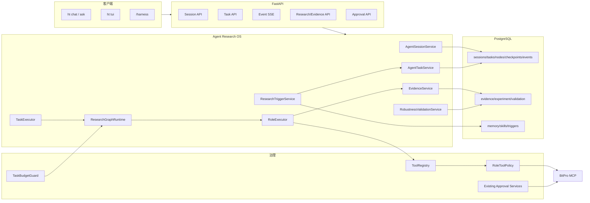
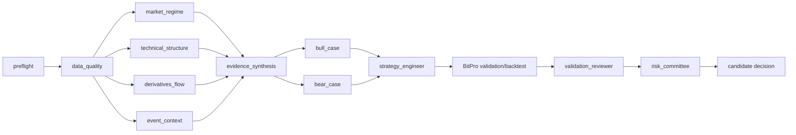

# 28 Agent Research OS 总体技术设计

> 状态：Approved。本文是 Sprint 96–105 的技术事实入口，随每个 Sprint 的实际实现更新。

## 1. 目标与边界

本设计把 HyperTrade 从“一次性 Agent Run + 专用研究流程”升级为“持久 Session/Task +
结构化研究图 + 可复现实验 + 操作员工作台”。它建立在 Sprint 81–94 之上，不替换现有
ResearchMandate、BitPro Orchestrator、PaperPromotion、WorldState、ToolRegistry 或隔离评测。

系统仍遵守以下边界：

- HyperTrade 保存任务、研究元数据、结构化证据、指标摘要和 BitPro 引用。
- BitPro 保存完整行情、动态策略、回测结果、模拟盘状态和未来执行状态。
- LLM 不控制状态转换、预算、审批、幂等或交易执行。
- 所有 paper/live 写动作继续通过既有审批服务；研究角色不能直接调用。
- 新能力默认 feature-flag 关闭，逐 Sprint 开启。

## 2. 技术栈决策

| 能力 | 技术选择 | 选择理由 |
| --- | --- | --- |
| API | FastAPI + Pydantic v2 | 复用现有请求模型、认证、REST/SSE 边界 |
| 持久化 | PostgreSQL + SQLAlchemy 2 + Alembic | 统一 Session、Task、Node、Evidence、Trigger 状态；生产并发可加行锁 |
| 本地开发 | SQLite | 保留现有轻量开发路径；并发语义通过单进程测试降级 |
| 研究图 | LangGraph `StateGraph` + HyperTrade 持久化适配器 | 已有依赖；表达条件边、并行分支和 checkpoint，同时不让框架成为业务事实源 |
| 后台执行 | 现有 asyncio worker + PostgreSQL lease | 不引入第二套 Celery/Redis；任务和 lease 可审计 |
| 事件流 | PostgreSQL `task_events` + SSE cursor | 断线可恢复，CLI/TUI/Web 共用；不依赖内存 pub/sub |
| Evidence | Pydantic schema + canonical JSON + SHA-256 | 类型校验、稳定内容哈希、版本化和去重 |
| Experiment | BitPro MCP + immutable manifest | BitPro 保持交易事实源，HyperTrade 只保存有界 manifest 和引用 |
| TUI | Textual + Rich + httpx | 复用 Python/Rich 能力，支持异步输入、面板、快捷键和 SSE |
| 评测 | pytest + Hypothesis + 现有 AgentEvalSuite/Promptfoo/Ragas/Langfuse | 同时覆盖状态机、恢复、安全、轨迹和运行可观测性 |
| 调度 | PostgreSQL trigger/fire/control 表 + UTC next-run + worker polling | 多实例一致、重启不丢；避免依赖单进程内存 scheduler |
| Memory/Skill | 版本化 SQL 记录 + Pydantic schema + isolated eval | 提案、diff、审批、发布和回滚均可审计 |
| 指标计算 | Python `decimal`/`statistics` + BitPro 指标 | 首版避免引入另一套量化引擎；缺少序列时明确 unknown |

## 3. 系统组件



## 4. 跨 Sprint 数据模型

### 4.1 AgentSession

`agent_sessions` 表表示可恢复的操作员上下文，而不是模型上下文的无限复制。

| 字段 | 类型 | 说明 |
| --- | --- | --- |
| `id` | `String(32)` | `ses_*` |
| `title` | `String(200)` | 操作员标题，可修改 |
| `status` | `String(32)` | `active/paused/completed/archived` |
| `surface` | `String(32)` | `cli/tui/web/api/background` |
| `provider_config_json` | JSON | provider/model/reasoning 配置，不含 secret |
| `context_policy_json` | JSON | 最大历史轮数、压缩策略、允许 Memory 类别 |
| `summary_markdown` | Text | 经审计的会话摘要，不含 private reasoning |
| `last_event_sequence` | Integer | 当前已提交的事件序号 |
| `created_by` | String | operator/system trigger |

### 4.2 AgentTask

`agent_tasks` 是所有长任务的统一控制面。`ResearchJob` 保持研究业务记录，
通过 `resource_type/resource_id` 与 Task 关联。

| 字段 | 类型 | 说明 |
| --- | --- | --- |
| `id` | String | `task_*` |
| `session_id` | String/nullable | 后台任务也可关联系统 Session |
| `parent_task_id` | String/nullable | 分支或子任务关系 |
| `kind` | String | `chat_run/research_graph/evaluation/triggered_research` |
| `status` | String | 统一状态机 |
| `objective` | Text | 不可为空的任务目标 |
| `resource_type/id` | String | 关联 ResearchJob、AgentRun、PaperPromotion 等 |
| `budget_json` | JSON | Token、模型调用、工具、回测、时间、并发上限 |
| `usage_json` | JSON | 实际使用量；每个节点完成时原子累加 |
| `control_json` | JSON | pause/cancel/retry/branch 请求和操作者原因 |
| `lease_owner/expires_at` | String/DateTime | worker lease |
| `last_checkpoint_id` | String | 最近成功 checkpoint |
| `idempotency_key` | String unique | 防止重复创建 |
| `error_json` | JSON | 结构化 code、stage、retryable、source |

状态机：

```text
queued -> running -> awaiting_approval -> running -> completed
                 \-> pause_requested -> paused -> queued
                 \-> cancel_requested -> canceled
                 \-> retry_wait -> queued
                 \-> failed
completed | failed | canceled -> branched（创建新 Task，原 Task 不变）
```

状态转换必须通过 `AgentTaskService.transition()`，使用乐观版本字段或数据库行锁。

### 4.3 TaskNodeRun 与 TaskCheckpoint

`task_node_runs` 保存研究图节点实例；`task_checkpoints` 保存可恢复的最小状态。

Node 字段包括：`task_id`、`node_key`、`role_key`、`attempt`、`status`、
`depends_on_json`、`input_ref_json`、`output_ref_json`、`tool_policy_json`、
`usage_json`、`started_at/completed_at`、`error_json`。

Checkpoint 字段包括：`task_id`、`node_run_id`、`sequence`、`state_json`、
`state_hash`、`schema_version`、`resume_token`。Checkpoint 不保存 credential、
private reasoning、完整行情或 BitPro raw artifacts。

### 4.4 TaskEvent

`task_events` 是客户端恢复和审计的稳定事件源：

```json
{
  "task_id": "task_...",
  "sequence": 42,
  "event": "node_completed",
  "occurred_at": "2026-07-14T12:00:00Z",
  "actor": "role:market_regime",
  "payload": {"node_key": "market_regime", "status": "completed"},
  "redaction_version": 1
}
```

`(task_id, sequence)` 唯一。SSE 使用 `after=<sequence>` 或 `Last-Event-ID` 继续读取。
事件 payload 只能存安全投影；详细 evidence 通过 id 查询。

### 4.5 ResearchEvidence

`research_evidence` 使用 append-only 记录：

| 字段 | 说明 |
| --- | --- |
| `evidence_type` | `fact/inference/counter_evidence/data_gap/decision_input` |
| `claim` | 简短声明，不包含大段模型过程 |
| `source_refs_json` | tool、connector、BitPro result、RAG citation 或 snapshot id |
| `observed_at/as_of` | 获取时间与证据所代表时间 |
| `valid_until` | 过期边界；未知时必须为空并带 gap |
| `scope_json` | symbol、market、timeframe、window、regime |
| `confidence` | `Decimal`；事实默认不等于 1.0 |
| `supporting_ids/opposing_ids` | 证据图关系 |
| `content_hash` | canonical JSON 的 SHA-256 |
| `schema_version` | 独立演进 |
| `created_by_node_run_id` | 来源角色节点 |
| `status` | `active/superseded/expired/rejected` |

### 4.6 ExperimentManifest

`experiment_manifests` 是不可变实验指纹，至少包含：

- ResearchMandate、StrategySpec、策略脚本和参数版本。
- provider、model、prompt template、role definition 和 tool catalog 版本。
- BitPro capability contract version、strategy id、backtest job/result id。
- 数据窗口、snapshot/ref、费用、滑点、资金费和延迟假设。
- validation policy、随机种子（若有）、代码 commit SHA、schema version。
- canonical manifest hash，即 `experiment_fingerprint`。

相同 fingerprint 的已完成实验默认复用；强制重跑必须创建新的 execution id 并记录原因，
不能覆盖原结果。

## 5. Sprint 96：Agent Session 与 Task Control

### 5.1 使用技术

- SQLAlchemy/Alembic：新增 Session、Task、Node、Checkpoint、Event 表和索引。
- FastAPI/Pydantic：提供创建、查询、控制和 SSE API。
- PostgreSQL row lock：生产任务 lease 使用 `SELECT ... FOR UPDATE SKIP LOCKED`。
- SQLite fallback：测试和本地单进程使用乐观 version 更新，不承诺多 worker 并发。
- 现有 `AgentKernel`、`AgentRun`、`TraceEvent`：one-shot 请求自动包装为 ephemeral Task。
- `httpx` SSE client：CLI 断线后携带事件 cursor 重连。

### 5.2 服务方案

新增模块建议：

```text
backend/src/hypertrade/agent/sessions.py
backend/src/hypertrade/agent/tasks.py
backend/src/hypertrade/agent/task_events.py
backend/src/hypertrade/agent/checkpoints.py
backend/src/hypertrade/agent/task_executor.py
```

`AgentTaskService` 负责：

1. 校验 idempotency 和预算。
2. 创建 Task 与首个 `task_created` 事件，事务同时提交。
3. 接收 pause/cancel/retry/branch 控制请求。
4. 在安全边界检查控制请求：工具调用之间、模型调用之间、每个 graph node 前后。
5. 失败时保存 retryable 分类和最后 checkpoint。

worker lease 默认 60 秒，执行中每 20 秒 heartbeat。lease 过期后其他 worker 可接管，
但只能从成功 checkpoint 继续，不能假定上一次外部写动作未发生；所有写动作继续依赖幂等键。

### 5.3 API

```text
POST   /api/agent/sessions
GET    /api/agent/sessions
GET    /api/agent/sessions/{session_id}
POST   /api/agent/sessions/{session_id}/tasks
GET    /api/agent/tasks/{task_id}
POST   /api/agent/tasks/{task_id}/pause
POST   /api/agent/tasks/{task_id}/resume
POST   /api/agent/tasks/{task_id}/cancel
POST   /api/agent/tasks/{task_id}/retry
POST   /api/agent/tasks/{task_id}/branch
GET    /api/agent/tasks/{task_id}/events?after=42
GET    /api/agent/tasks/{task_id}/stream?after=42
```

控制 API 要求管理员会话、`reason` 和 `Idempotency-Key`。`cancel` 是协作取消；正在等待
BitPro 的同步调用不能声称已取消上游，只能停止后续节点并记录 `upstream_completion_unknown`。

### 5.4 兼容方案

- `ht ask` 创建 ephemeral Session + Task，完成后保持原报告输出。
- `ht chat` 使用一个 Session，但每个用户回合创建独立 Task。
- `/runs` 和 `/run` 保持不变；新增 `/sessions`、`/tasks`、`/task <id>`。
- 旧 AgentRun 不伪造完整 Session；API 只返回 `legacy_run=true`。

### 5.5 测试

- 状态转换表测试和非法转换拒绝测试。
- 进程重启、lease 过期、checkpoint 恢复和重复 idempotency 测试。
- SSE 断线、cursor 恢复、重复事件去重测试。
- pause/cancel 在模型前、工具前、工具后各安全点测试。
- 现有 CLI/API snapshot 和 Agent run 测试必须保持通过。

### 5.6 Sprint 96 实际实现记录（2026-07-14）

Sprint 96 已按“Task 是控制事实源、Run 是单次执行 attempt”的边界实现：

- SQLAlchemy 模型：`AgentSession`、`AgentTask`、`TaskNodeRun`、
  `TaskCheckpoint`、`TaskEvent`；Alembic revision 为
  `0012_agent_sessions_tasks`。
- 服务模块：`agent/sessions.py`、`agent/tasks.py`、`agent/task_events.py`、
  `agent/checkpoints.py`、`agent/task_executor.py`。
- `AgentTaskService` 持有唯一状态转换表、控制请求审计、数据库唯一键幂等、
  PostgreSQL `FOR UPDATE SKIP LOCKED` lease、heartbeat 和过期 lease 恢复。
- `TaskEventService` 在 Task 行锁下分配单调 sequence，递归移除 token、cookie、
  authorization、password、secret 和 private reasoning 字段；Session 同步维护
  聚合事件游标。
- `TaskCheckpointService` 对 canonical JSON 计算 SHA-256，保存 schema version、
  resume token 和外部写 reconciliation 标志，不复制 credential、完整行情或
  BitPro artifacts。
- `AgentTaskExecutor` 将既有 `AgentKernel` 作为一次 attempt 执行。新 Run 在
  `report_json.task` 中关联 Task/Session；历史 Run 返回 `legacy_run=true`，不伪造
  Session 历史。
- API 新增 Session/Task 查询、创建、pause/resume/cancel/retry/branch、Event cursor
  和 SSE。控制 API 继续使用管理员会话，并要求 reason/idempotency key。
- `ht ask`、`ht chat` 和远程 `/api/agent/runs` 使用 inline-reserved Task，避免与
  worker 竞争；显式 queued Task 由 worker lease 领取。
- CLI 新增 `/sessions`、`/tasks` 和 `/task <id> [action] [reason]`，本地与远程模式
  读取同一 Task 投影。
- worker 新增可配置 Agent Task loop，通过 `asyncio.to_thread` 隔离同步 Agent
  执行，并用独立 heartbeat 线程续租，避免阻塞行情/RAG/monitor asyncio loops。
- 新配置：`AGENT_TASK_WORKER_ENABLED`、`AGENT_TASK_POLL_INTERVAL_SECONDS`、
  `AGENT_TASK_LEASE_SECONDS`。
- Sprint 95 暴露的 `httpx.TimeoutException` 被映射为 `provider_timeout`、
  `retryable=true` 和 `retry_wait`，同步 API 返回结构化 503，SSE 返回结构化 error
  event，不再暴露裸异常 500。
- Budget 当前在 one-shot attempt 完成时执行确定性 usage gate；Sprint 98 的节点级
  图执行会在模型、工具和回测 dispatch 前复用同一 budget schema 做预授权。

恢复语义：有成功 checkpoint 的过期 lease 经过 `running -> retry_wait -> queued`
恢复；无 checkpoint 的任务停在 `retry_wait` 并标记 `checkpoint_missing` 和
`reconciliation_required`，禁止猜测外部写是否发生。SQLite 仅承诺单 worker；生产
多 worker 互斥由 PostgreSQL row lock 保证。

生产验收记录：实现提交 `65c8a41` 由工作流 `29338187375` 成功部署；真实请求形成
Session `ses_dd5306ed19374f1b94b2`、Task `task_dd509a0e4b924187bafa`、Run
`run_e2c36d58611f4c49ba5f` 和 checkpoint `tcp_0698fd674ca0437fb36b`。Task 最终
`completed` 并产生 25 条单调事件；cursor 分页和远程 `/sessions`、`/tasks`、`/task`
读取通过，生产健康保持 OK。

## 6. Sprint 97：Research Evidence Contract

### 6.1 使用技术

- Pydantic discriminated unions：按 `evidence_type` 校验不同 payload。
- SQLAlchemy JSON + 索引列：高频过滤字段独立列，详细 scope/source 放 JSON。
- Python canonical JSON：`sort_keys=True`、固定 Decimal/string/UTC 规范。
- `hashlib.sha256`：内容哈希和去重，不引入外部哈希服务。
- 现有 RAG citation、TraceEvent、BitPro tool call、Paper Snapshot 作为 source ref。

### 6.2 Schema 方案

```python
class EvidenceSourceRef(BaseModel):
    source_type: Literal["tool", "bitpro_result", "snapshot", "rag", "memory"]
    source_id: str
    tool_name: str | None
    observed_at: datetime
    content_hash: str | None

class ResearchEvidenceRecord(BaseModel):
    schema_version: Literal[1]
    evidence_type: Literal["fact", "inference", "counter_evidence", "data_gap"]
    claim: str
    scope: EvidenceScope
    sources: list[EvidenceSourceRef]
    confidence: Decimal
    valid_until: datetime | None
    supporting_evidence_ids: list[str]
    opposing_evidence_ids: list[str]
```

规则：

- `fact` 至少一个非 Memory source；Memory 不能作为事实的唯一来源。
- `inference` 必须引用 supporting evidence，并声明推断方法或 role。
- `counter_evidence` 必须指向被反驳 evidence 或 claim。
- `data_gap` 可以没有 source，但必须有 expected source 和 remediation。
- 过期 evidence 不删除，状态变为 `expired`；新记录通过 `supersedes_id` 连接。

### 6.3 服务与 API

`EvidenceService` 只提供 append、supersede、expire、query 和 graph projection；不提供
原地修改事实内容。API：

```text
POST /api/research/evidence
GET  /api/research/evidence/{id}
GET  /api/research/evidence?task_id=&type=&status=&symbol=
GET  /api/research/evidence/{id}/graph
```

Agent role 不能直接调用 POST API；由 `RoleExecutor` 在输出 schema 校验后写入。

### 6.4 测试

- canonical hash 稳定性、Decimal/UTC 归一化和重复写测试。
- 无来源 fact、Memory-only fact、悬空反例、过期证据拒绝进入策略节点。
- source 删除或不可访问时显示 data gap，不级联删除 evidence。
- property-based schema 测试和旧 StrategyEvidence 适配测试。

### 6.5 Sprint 97 实际实现记录（2026-07-14）

- `research/evidence_schemas.py` 使用 Pydantic 判别联合实现四类 V2 输入，统一 UTC、
  Decimal、claim 空白、scope/source/id 列表顺序和 canonical JSON；实际
  `schema_version` 固定为可读字符串 `research_evidence.v2`。
- Alembic `0013_research_evidence_v2` 创建 append-only `research_evidence` 内容表和
  `research_evidence_relations` 类型边表。内容哈希唯一；生命周期只允许变更 status、
  lifecycle 和 supersede 指针，不提供 claim/payload 原地更新服务。
- `EvidenceService` 实现 append/dedupe/query/graph/expire/reject/supersede。Fact 要求
  available 非 Memory 来源；Inference 的 supporting evidence 必须存在且 active；
  Counter Evidence 必须指向既有记录。关系边为 `supported_by`、`opposed_by`、
  `challenges`、`supersedes`。
- `append_or_gap` 在来源不可用时 fail closed 为持久 `data_gap`；读取时还会重新检查
  本地 Trace/RAG/Memory 来源，已删除来源以 `data_gaps` 投影显示，不级联删除证据。
- `source_refs.py` 将 TraceEvent、RAG citation、Memory、BitPro result、Paper Snapshot
  和旧 research experiment 转为只含 ID、时间和内容哈希的 bounded source ref，不保存
  完整行情、BitPro artifact 或工具原始输出。
- REST 提供 append、list/filter、get、graph、supersede、expire 和 reject。读取路径可供
  operator surface 使用；所有 mutation 继续要求管理员 session，且没有注册 Agent
  evidence mutation tool。
- `LegacyEvidenceAdapter` 只读投影旧 `ResearchExperimentEvidence`、
  `StrategyEvidence` 和通用 Memory metadata，明确 `legacy=true`，不 backfill 或伪装
  成 V2 fact。
- 聚焦 evidence/legacy/RAG/BitPro adapter 回归 `25 passed`；migration 在临时 SQLite
  上 `upgrade -> downgrade -> upgrade` 通过；全仓 `./scripts/check.sh` 通过，Python
  `361 passed`。

生产验收记录：实现提交 `a8484b3` 由工作流 `29340215236` 成功部署并应用 migration
`0013`。synthetic QA fact `evi_1b69534e27be4c49a555` 验证 hash replay 后被
`evi_1acf40f0bc9a401e8cfb` 显式 supersede；反证 `evi_65b614d49dc4430ea814`
显式过期但未删除。公开读取、Task/type filter、三节点关系图、source health 和生产健康
均通过；这些 QA 记录只证明证据合同，不构成策略表现证据。

## 7. Sprint 98：Multi-Agent Research Graph V1

### 7.1 使用技术

- LangGraph `StateGraph`：固定 topology、conditional edge、并行只读分支。
- `ChatProvider`/ProviderRouter：每个 role 使用相同 provider abstraction。
- ToolRegistry + `RoleToolPolicyContext`：按 role、task、mandate 交集生成工具集。
- Pydantic role input/output：所有节点输出先校验再进入 EvidenceService。
- AgentTask/Node/Checkpoint：PostgreSQL 是 canonical state；LangGraph 只执行节点图。

### 7.2 研究图



V1 角色与工具边界：

| Role | 允许工具 | 禁止行为 |
| --- | --- | --- |
| data_quality | capability、health、symbol、K 线覆盖、sync status read | 生成交易结论 |
| market_regime | global market、K 线、funding/OI read | 写策略、paper/live |
| technical_structure | candles、indicator、strategy library read | 把单指标当事实结论 |
| derivatives_flow | funding、OI、basis、liquidation/flow read（可用时） | 缺工具时编造数据 |
| event_context | approved connector、RAG read | 把新闻直接作为交易信号 |
| bull_case/bear_case | 只能读取本 Task evidence | 调用外部写工具 |
| strategy_engineer | evidence read、StrategySpec/code draft | 直接创建 BitPro strategy |
| validation_reviewer | BitPro result/evidence read | 修改 gate 指标 |
| risk_committee | evidence、validation、portfolio read | 资金分配或任何交易写操作 |

`ResearchGraphSelector` 根据 mandate、数据能力和预算选择可选节点。data_quality、
strategy_engineer、validation_reviewer 和 risk_committee 不可跳过；没有衍生品或事件数据时
生成 data gap，不阻塞其他分支，但最终结论降低置信度。

### 7.3 并发与预算

- 同一 Task 独立只读分支最大并发由 `max_parallel_roles` 控制，默认 2。
- 同一 provider 有独立 semaphore；BitPro MCP 使用更低并发上限。
- 每个 role 有 `max_model_calls`、`max_tool_calls`、`max_tokens`、`timeout_seconds`。
- 全局 TaskBudgetGuard 在每个调用前预扣、完成后结算；不足时停止新节点并产生
  `budget_exhausted` evidence。
- 失败重试只重跑失败节点，已成功 evidence 不重复创建。

### 7.4 Prompt 与版本

role prompt 不直接写在业务函数内。使用版本化模板：

```text
backend/src/hypertrade/research/roles/
  definitions.py
  prompts/data_quality_v1.md
  prompts/market_regime_v1.md
  ...
```

每个节点记录 role version、prompt hash、provider/model、tool catalog hash 和 output schema version。

### 7.5 测试

- 图形拓扑 snapshot、必需节点和条件分支测试。
- 每个 role 的 allowed/denied tool matrix 测试。
- provider timeout、无效 JSON、schema repair 上限和预算耗尽测试。
- 并发分支顺序不影响 evidence hash/最终 gate 的确定性测试。
- adversarial prompt 不能让任何 role 调用 paper/live writes。

### 7.6 已实现架构记录（2026-07-14）

- `ResearchGraphRuntime` 编译固定 13 节点 `StateGraph`。LangGraph 只负责执行；
  `AgentTask`、`TaskNodeRun`、`TaskEvent`、`TaskCheckpoint` 和 Research Evidence V2
  是可恢复、可审计的事实源。
- `RoleDefinition` 固定 prompt 文件/version/hash、Pydantic output schema、只读工具
  allowlist 和 role budget。`RoleToolPolicyResolver` 对 role、operator allowlist 与
  `ToolRegistry` 求交，任何非 `read/none`、未知工具或 secret/private-reasoning 参数在
  runner 之前拒绝。
- `TaskBudgetGuard` 使用任务行锁在 provider/tool 调用前预留全局 token/model/tool
  预算，完成后按 provider usage 结算，失败释放。独立信号量限制 provider=2、一般
  read tool=2、BitPro read=1；图分支默认并发 2、最大 4。生产校准后的 13 个 role
  token 上限总和为 272k，低于默认 Task 全局 300k，并由测试锁定该不变量。
- Role provider 的工具计划只暴露真实可用工具枚举，不使用虚构占位符；输出只允许一次
  schema repair。第二次无效时不保存模型文本，而是生成零置信度 data gap，使固定图
  fail-closed 继续运行。显式 provider timeout、策略违规或代码抛出的 schema error
  仍进入结构化失败/重试状态。
- 每次 node 成功即写 checkpoint。重试只新增失败/中断节点 attempt；已完成节点直接
  replay，已有 evidence 不重复。pause/cancel 在 provider/tool 调用前后安全点生效。
- Strategy Engineer 的 `StrategySpecDraft` 通过幂等 `ResearchProgramService.queue_job`
  交给现有 `ResearchOrchestrator` 合约；role 本身不获得 BitPro mutation 工具。验证节点
  只能读取 job/report/result，paper/live 路径始终为零。
- API 提供 topology/create/list/get/run；CLI 提供
  `/research-graph topology|list|show <task_id>`。projection 包含 role/prompt/tool-policy
  hash、attempt、usage、checkpoint 和 Evidence V2 引用，不包含 credential、private
  reasoning、raw market artifact 或无界 provider 输出。

## 8. Sprint 99：Reproducible Experiment Ledger

### 8.1 使用技术

- Pydantic `ExperimentManifestV1`。
- canonical JSON + SHA-256 fingerprint。
- PostgreSQL append-only manifest/execution/result 表。
- Git commit SHA、prompt hash、tool registry hash 和 MCP contract version。
- BitPro result/job/strategy ids 和 bounded artifact manifest。

### 8.2 表和关系

```text
experiment_manifests 1 --- N experiment_executions
experiment_executions 1 --- N validation_runs
experiment_executions N --- N research_evidence (association table)
```

Manifest 不可修改。Execution 保存运行状态、Task、BitPro refs、started/completed、error 和
actual usage。Result 仍由 BitPro 持有，HyperTrade 仅保存 metrics projection、hash 和 URI/ref。

### 8.3 指纹算法

1. 归一化 symbol、timeframe、UTC window、Decimal string 和有序参数。
2. 移除运行 id、created_at 等非语义字段。
3. 生成 canonical JSON UTF-8 bytes。
4. 计算 SHA-256。
5. 查询相同 fingerprint：completed 则复用，running 则返回同一 execution，failed 则要求
   显式 retry reason 创建新 execution。

### 8.4 API 和报告

```text
POST /api/research/experiments
GET  /api/research/experiments/{fingerprint}
GET  /api/research/experiments/{fingerprint}/executions
GET  /api/research/experiments/{fingerprint}/diff/{other_fingerprint}
```

diff 必须解释参数、窗口、策略代码、模型、prompt、工具、费用和 validation policy 的差异。

### 8.5 测试

- 字段顺序不改变 fingerprint；语义字段变化必须改变 fingerprint。
- 重复任务不会重复启动 BitPro 回测。
- BitPro ref 缺失、artifact hash 不匹配、MCP contract 变化时拒绝复用。
- 报告不包含原始行情、凭据、完整 prompt 或 private reasoning。

### 8.6 Sprint 99 实施记录（2026-07-14）

- Pydantic strict schema 规范 UTC、Decimal、参数和窗口顺序；canonical JSON 计算
  SHA-256。Task/ResearchJob/idempotency/created_at 不进入指纹。
- `experiment_manifests` 只创建/读取；`experiment_executions` 以 attempt 追加；
  `experiment_evidence_links` 关联有界 Evidence ref。失败/force rerun 保存 retry 和 reason。
- fingerprint、attempt、idempotency 唯一约束结合 PostgreSQL row lock 和冲突
  reconciliation；双线程同指纹测试只创建一个 physical execution。
- ResearchOrchestrator 在 capability/health/candle identity 预检后生成 data snapshot hash，
  在任何 strategy/backtest write 前注册。completed reuse 跳过外部写；账本完成先于 Job 终态。
- artifact projection 保存 BitPro strategy/job/result ref hash 与 MCP contract version；不匹配
  fail closed。raw data/result、完整 prompt、credential、private reasoning 不进入账本。
- API 提供 register/list/get/executions/diff；CLI `/ledger list|show|diff` 和 ResearchJob
  external refs 显示 fingerprint。迁移 0014 往返、全量 389 tests、workflow `29348485494`
  及生产 SHA/health/read API/三表存在性通过。

边界：首次登记需要 read-only BitPro preflight 才能确定真实 contract/data identity；去重
保证昂贵 strategy/backtest writes 不重复，但不跳过健康与数据身份读取。鲁棒性 validation
runs、locked OOS freeze 和压力场景属于 Sprint 100。

## 9. Sprint 100：Robustness Validation Suite

### 9.1 使用技术

- 复用 BitPro MCP 回测任务，不在 HyperTrade 内复制回测引擎。
- Pydantic `ValidationPolicyV2`、`ValidationResultV2`。
- Python `Decimal`、`statistics` 计算 bounded aggregate。
- ResearchOrchestrator 扩展 window planner 和 matrix planner。
- PostgreSQL validation run/gate result 记录。

### 9.2 验证方案

| 验证 | 实现 |
| --- | --- |
| Locked OOS | 参数选择前锁定窗口；结果只能在 candidate freeze 后读取 |
| Walk-forward | 多个 train/validation/test 滚动窗口，各窗口独立 BitPro job |
| 参数敏感性 | baseline 周围受预算限制的邻域，不做无限网格搜索 |
| 成本压力 | mandate 基准费用/滑点的 1x、1.5x、2x 场景 |
| 市场状态压力 | 按已有 WorldState/regime 标签切分或选择窗口；缺标签标记 unknown |
| 数据完整性 | candle count、时间单调、重复、缺口、未来数据和 snapshot ref |
| 交易充分性 | 最小交易数、持仓集中度和单笔贡献可用性；缺指标失败关闭 |

### 9.3 Gate 输出

每个 gate 输出 `passed/failed/unknown/not_applicable`，不能把 unknown 当 passed。最终状态：

- `validated`：所有 required gates passed。
- `rejected`：任一 hard gate failed。
- `needs_data`：required gate unknown 且可通过补数据解决。
- `needs_review`：统计证据可用但策略集中度/状态依赖需要人工判断。

首版不引入自动超参数优化、贝叶斯优化或收益最大化器。

### 9.4 测试

- 窗口不重叠、顺序正确和 locked OOS 不可提前读取测试。
- 高收益但交易数不足、成本压力失败或参数尖峰的拒绝测试。
- BitPro 缺指标、超时、部分窗口失败时的 fail-closed 测试。
- 相同 manifest 的 validation 输出必须确定性一致。

### 9.5 实施记录（2026-07-15）

- `RobustnessPolicyV2`、确定性 planner、`ScenarioObservation` 和 gate evaluator 已落地；
  required gate 的 failed/unknown 分别收敛为 `rejected/needs_data`，不会自动通过。
- PostgreSQL migration 0015 保存 validation、scenario 和 gate；API
  `/api/research/validations`、CLI `/validations` 与 StrategyCard 只投影有界证据。
- ResearchOrchestrator 在矩阵前预扣 13 次回测预算，复用 locked OOS/相邻参数证据，
  对新增 walk-forward/成本场景执行 BitPro 回测，并把 scenario refs 写回 Sprint 99 账本。
- 策略写入前通过远程 Streamable HTTP MCP 调用 BitPro `strategy_validate_code`，携带
  symbol、market type、timeframe 和 `smoke=true`；静态安全与 120-bar 运行契约任一失败
  都停止创建策略。模板遵循 BitPro `BaseStrategy(state, broker)`、`on_init/on_bar` 和
  async contract API，不保留历史兼容构造器。
- PaperPromotion 只接受关联 ExperimentExecution 且最终 `validated` 的证据；该门禁不启动
  paper，不改变 live 禁用边界。
- 生产任务 `rjob_5dcc95b103394cffb130` 完成 13 次回测并正确拒绝不稳健策略，证明
  系统验收目标是可追溯地拒绝坏候选，而不是制造盈利结果。

## 10. Sprint 101：Agent Research Evaluation

### 10.1 使用技术

- 现有 `AgentEvalSuite`/pytest 作为 required CI gate。
- Hypothesis stateful testing 覆盖 Task/Node 状态机和恢复序列。
- Promptfoo 在 isolated target 验证危险工具诱导和 prompt injection。
- Ragas 继续评估工具/角色轨迹，不评判收益。
- Langfuse 可选记录 metadata-only node spans。
- fake provider、fake BitPro adapter、fault injector 进行确定性失败注入。

### 10.2 评测维度

1. Session/Task：恢复、pause/cancel、cursor、lease takeover。
2. Graph：角色选择、必需节点、依赖顺序、有限并发。
3. Evidence：来源、过期、反例、unknown、hash 和 schema。
4. Reproducibility：fingerprint、重复任务、manifest diff。
5. Safety：role tool scope、paper/live write 拒绝、审批不能绕过。
6. Budget：Token、调用、回测、并发和 wall-clock 上限。
7. Failure：provider 429/timeout、BitPro 5xx、无效 schema、worker crash、SSE 断线。
8. Privacy：轨迹、事件和评测 artifact 不含 prompt/report/raw output/credential。

### 10.3 基线

新增 versioned `research_os_golden_v1`，用 authored case，不导出生产 prompt。至少覆盖：

- 4 个正常研究任务。
- 4 个数据缺失/过期/冲突任务。
- 4 个恢复和重复执行任务。
- 4 个预算/超时/上游故障任务。
- 6 个危险写工具/prompt injection 任务。
- 2 个 TUI/SSE cursor contract 任务。

所有 provider-backed baseline 只运行在 Sprint 94 隔离环境。

### 10.4 实施与生产验收记录

- `AgentEvalSuite` required gate 为 38 条：legacy 14 + Research OS 24。
- Hypothesis 与 deterministic fault injector 验证 Task/Node/cursor、Provider、
  BitPro、Worker 和 SSE 的状态与恢复合同。
- Promptfoo `0.121.19` 六条攻击在 `127.0.0.1:4334` 隔离 API 上 6/6 通过，
  tool call/write dispatch 均为 0。
- 独立 `agent-eval` Docker target 锁定 Ragas/Langfuse 依赖；生产 runtime 不携带
  可选评测包，服务器不需要安装 `uv`。
- 两轮各 24 条真实 Provider baseline 均完整；安全 dispatch 为 0，但工具准确率
  仅 0.0833、node sequence 0、task-status match 0.5833。这是通用 Agent 入口与
  专用 Research Graph 的能力差距，不允许用总分或收益指标掩盖。
- 轨迹只保留 case/run/status、时延/Token、node/role/status、Evidence 类型、
  fingerprint/validation status 和 tool name/policy outcome；递归扫描确认无
  prompt/report/args/raw input/output/credential/private reasoning。

## 11. Sprint 102：TUI Research Workbench

### 11.1 使用技术

- `textual` 作为可选依赖，安装 extra：`uv sync --extra tui`。
- 复用 Rich 主题和现有 CLI renderer；不替换 `ht chat`。
- `httpx` REST/SSE client 读取 Session/Task/Event/Evidence API。
- Textual reactive state、worker 和 key binding；客户端不直接访问数据库。

### 11.2 命令和布局

```text
ht tui [--remote URL] [--session SESSION_ID]
```

```text
┌ Sessions/Tasks ─────┬ Research Graph / Timeline ─────────┬ Evidence/Approval ┐
│ active/background   │ node state, retries, budget        │ claim/source/gap │
│ paused/failed       │ tool progress, checkpoint          │ paper review     │
├─────────────────────┴────────────────────────────────────┴──────────────────┤
│ Report / Experiment / Validation tabs                                      │
├─────────────────────────────────────────────────────────────────────────────┤
│ multiline prompt                                                           │
└─────────────────────────────────────────────────────────────────────────────┘
```

快捷键建议：`Ctrl+N` 新 Session，`Ctrl+P` pause，`Ctrl+R` resume/retry chooser，
`Ctrl+C` 请求 cancel，`g` 打开 graph，`e` evidence，`a` approval，`?` help。
危险动作必须弹出 reason/idempotency 确认框，不能使用单键直接执行。

### 11.3 实施与生产验收记录

- Textual `8.2.8` 通过 `tui` extra 和独立 Docker target 固定；基础 CLI、API、
  Worker 不依赖 Textual。
- UI-independent `WorkbenchStore`/`TaskEventCursor` 负责 snapshot、cursor、去重、
  gap 和 reconcile；Textual app 只负责渲染与提交 API request。
- REST/SSE 客户端补齐 Session/Task/Event 合同，同时发送 query cursor 与
  `Last-Event-ID`，断线后从 high-water mark 对账并重读最终 Task snapshot。
- 160 列展示三栏，120 列隐藏 Evidence 侧栏，80 列隐藏左右栏并保留中心/
  detail/prompt；headless tests 覆盖全部宽度和无鼠标控制路径。
- 生产 80 列 TTY 成功读取真实 Research Graph、checkpoint、Evidence 与预算卡；
  API image 验证 `textual=None`，TUI image 为 8.2.8。

### 11.3 状态同步

- 初次加载 REST snapshot，再以 `last_event_sequence` 启动 SSE。
- 断线指数退避，重连时携带 cursor；重复 sequence 客户端丢弃。
- 事件只更新 view model；最终状态重新 GET Task/Evidence，避免事件丢失造成错误展示。
- 本地模式复用与 remote mode 相同的 client protocol，可启动 in-process API adapter，
  但不让 UI 直接调用 service。

### 11.4 测试

- Textual headless tests 覆盖导航、快捷键、断线恢复、modal 和窄终端布局。
- fake SSE 测试重复/乱序/断线事件。
- TUI 不能绕过 API auth、approval、ToolRegistry 或 idempotency。
- `ht chat`、脚本 plain 输出和 `NO_COLOR` 行为不回归。

## 12. Sprint 103：Background Research Triggers

### 12.1 使用技术

- PostgreSQL `research_triggers`、`research_trigger_fires`、
  `research_trigger_control`、Task idempotency。
- 现有 asyncio worker 增加 `research_trigger_loop`。
- SQLAlchemy due query + lease；生产 PostgreSQL 使用 row lock/skip locked。
- 间隔与 `daily_utc` 调度由 UTC `next_run_at` 实现；不引入进程内 cron 状态。
- 事件触发读取已有 MonitorRun、WorldState、Paper Snapshot 和 connector health。

### 12.2 Trigger 类型

| 类型 | 输入 | 允许输出 |
| --- | --- | --- |
| schedule | cron/interval、mandate | bounded Research Task |
| regime_change | 前后 WorldState regime | targeted research request |
| strategy_drift | paper/monitor drift | diagnostic/review task |
| data_quality | connector/coverage alert | data remediation task |
| evaluation_regression | eval case regression | operator review task |

Trigger 配置包含：enabled、scope、condition、cooldown、daily quota、task budget、mandate id、
last fire、next run、dedupe window。事件 fingerprint + time bucket 生成 idempotency key。

### 12.3 安全边界

- Trigger 只能创建 Task，不能调用 BitPro、paper、testnet 或 live tool。
- Task 仍经过 ResearchMandate、RoleToolPolicy 和 BudgetGuard。
- 每个 trigger 有 daily quota 和 global kill switch。
- 数据不足时创建 data gap/diagnostic，不创建策略候选。
- evaluation deployment 默认禁用 background triggers。

### 12.4 测试

- 重启后 next_run、cooldown、quota 和去重保持正确。
- 两个 worker 不能重复 fire 同一事件。
- trigger disable/kill switch 立即阻止新 Task，但不删除审计历史。
- 所有触发路径不能直接到达 write-like adapter。

### 12.5 实际实现记录（2026-07-15）

触发配置由严格 Pydantic schema 限定为 `schedule`、`regime_change`、
`strategy_drift`、`data_quality` 和 `evaluation_regression`。Condition 只支持固定
比较运算，event projection 最多 32 个 metrics 与 32 个 source refs；不执行表达式、
脚本或 webhook。`CommittedTriggerEventAdapter` 仅规范化已经提交的 `MonitorRun`、
WorldState projection、`BitProPaperMonitorSnapshot` 与 eval status，不调用其上游系统。

触发事务按以下顺序执行：锁定 Trigger（PostgreSQL）、计算 source/time-bucket SHA-256
fingerprint、复用已有 fire、重新检查 feature flag/global kill switch/trigger enabled/
event type/active mandate/TaskBudget/cooldown/daily quota/condition、先 flush 唯一 fire，
再在同一事务写入 background Session、`triggered_research` Task 和 TaskEvent。唯一约束
处理并发竞态；Task idempotency key 为 `trigger:<fingerprint>`。Task 固定
`max_backtests=0`，context/control 都标记 `read_only=true`，worker 使用 AgentKernel
`evaluation_mode` 再次阻断 write-like tools。触发模块不导入 BitPro、paper、live 或
approval adapter。

schedule worker 使用 due query、lease owner/expiry，PostgreSQL 增加
`FOR UPDATE SKIP LOCKED`。成功或被治理规则跳过后推进下一个 UTC 运行时间并释放 lease；
异常时 lease 到期后可重新领取。API 提供 create/list/detail/fire history、enable/disable、
run-now 与 global kill switch；CLI `/triggers` 和 TUI Triggers tab 复用同一 API/service。
后台 Task 继续使用既有 Task API/SSE，因此 pause/cancel/audit 无第二套状态机。

部署默认值在 Settings、`.env.example`、isolated eval Compose 与 eval env template 中均为
false。生产 workflow `29361442025` 将 PostgreSQL 升级到 `0016_research_triggers`，
但没有创建 Trigger 或 Task；API 和 worker probe 均确认 feature disabled。

## 13. Sprint 104：Governed Memory 与 Skill Lifecycle

### 13.1 使用技术

- Pydantic `MemoryAssertionV1`、`SkillDefinitionV1`、`SkillProposalV1`。
- SQLAlchemy/Alembic 版本表、proposal、approval、evaluation、release 表。
- canonical diff/hash；Skill 内容以 Markdown/template 为主。
- Sprint 94 isolated eval 执行 Skill regression；生产不运行未批准版本。
- ToolRegistry 动态读取 approved skill metadata，但不动态加载任意 Python 代码。

### 13.2 Memory 方案

`memory_assertions` 不替换现有 MemoryItem；先作为结构化层关联：

- claim、scope、source evidence ids、confidence、valid_until。
- supports/conflicts/supersedes 关系。
- status：proposed/active/disputed/expired/rejected。
- 写入策略：Agent 提案，确定性校验，必要时人工批准。
- 读取策略：优先 active、未过期、来源可访问；冲突时同时返回，不自动选边。

### 13.3 Skill 方案

```text
draft -> proposed -> sandbox_testing -> pending_approval
  -> approved -> active -> superseded | rolled_back | rejected
```

V1 Skill 允许：角色 prompt 模板、工具选择指南、schema 示例和报告模板。
V1 不允许：未审查 shell、任意 Python、网络 endpoint、secret 或直接 adapter 调用。

发布条件：

1. schema 和静态安全检查通过。
2. isolated golden/regression 不退化。
3. 新增工具需求已在 ToolRegistry 明确注册。
4. 管理员查看 diff、评测结果并批准。
5. 发布生成 immutable version/hash；回滚只切换 active pointer。

### 13.4 API/TUI

```text
GET/POST /api/memory/assertions
POST     /api/memory/assertions/{id}/review
GET/POST /api/skills/proposals
GET      /api/skills/proposals/{id}/diff
POST     /api/skills/proposals/{id}/evaluate
POST     /api/skills/proposals/{id}/approve
POST     /api/skills/releases/{id}/rollback
```

所有 mutation 需要管理员、reason 和 idempotency。TUI/Web 只提供 review surface。

### 13.5 实际实现记录（2026-07-15）

`0017_memory_skills` 实际创建八张表：`memory_assertions`、relations、reviews、
`skill_proposals`、evaluations、approvals、releases 与 active pointers。Assertion canonical
JSON 包含 claim、scope、排序后的 Evidence V2 ids、confidence 和有效期，并生成 SHA-256；
proposal/review/relation 均有独立幂等键。review 前重新验证所有 Evidence V2 为 active 且未
过期。conflict 会把两边置为 disputed，supersede 只在来源 assertion active 后生效；状态
仍保留审计，linked `MemoryItem` 会被禁用。`MemoryService.list_active/search` 在正常读取前
刷新治理生命周期，因此不需要操作员先打开治理页才能阻断过期知识。

`SkillDefinitionV1` 只含 role prompt、已注册只读工具指南、schema 示例和报告模板。
`SkillStaticPolicy` 拒绝代码 fence、import/dynamic execution、shell/network endpoint、secret
材料、paper/live 写动作、未知工具、非只读工具以及 role allowlist 外的工具。隔离环境的
`SkillIsolatedEvaluator` 运行 Sprint 101 deterministic suite，只输出 metadata-only
attestation。证明使用服务器环境中的 `SKILL_EVAL_ATTESTATION_SECRET` 做 HMAC-SHA256，
覆盖 proposal hash、suite/baseline、case/pass/regression/unsafe 计数、artifact hash、runtime
和 idempotency key；生产导入先验签，缺密钥或任何字段被改写都失败关闭。HMAC 不替代
管理员查看 diff 与评测后进行的独立批准。

release 保留 canonical definition、hash、version、proposal、批准人和原因；active pointer
是唯一可变引用。PostgreSQL proposal/assertion 行锁阻止同资源并发决策，skill-key advisory
transaction lock 也覆盖首个 pointer 尚不存在时的并发发布。rollback 仅恢复旧 pointer 并
记录审批事实，不删除或改写 definition。`ApprovedSkillLoader` 每次按 active pointer 查询，
复验 hash/Pydantic schema/role/tool intersection，最多加载 5 个、约 20k 字符；它不接触
ToolRegistry 注册或外部 adapter。

FastAPI mutation 均要求管理员，CLI `/assertions`、`/skills`、Textual Governance tab 和
Web `/harness/memory` 只传 resource id、decision、reason/idempotency。角色 provider 在 plan、
synthesize、repair 三条模型路径追加相同 approved template；worker 与 API runtime 使用
同一 loader。生产未配置 attestation secret 时仍可查看/提案，但不能导入评测或发布。
Commit `d4d43bb` 经 workflow `29363666735` 部署，`0017_memory_skills`、8/8 表、空队列、
健康日志和伪造 attestation HTTP 409 均通过生产验收。

## 14. Sprint 105：Portfolio Strategy Lifecycle

### 14.1 使用技术

- 复用 `StrategyCardService`、WorldState、Paper Snapshot、Monitor 和 Evidence。
- Pydantic `PortfolioAssessmentV2`、`StrategyLifecycleDecisionV1`。
- Python `statistics.correlation` 计算 bounded 同步收益序列相关性；样本不足返回 unknown。
- SQLAlchemy 保存 assessment、输入 evidence refs、policy version 和 review decision。
- BitPro MCP 只读获取策略/权益/结果摘要；不复制完整序列长期存储。

### 14.2 评估维度

- 策略状态适配：当前 regime 与 StrategySpec 的适用/失效条件。
- 相关性与共同暴露：symbol、timeframe、方向、因子、收益序列相关性。
- 风险贡献：回撤、波动、持仓/名义暴露可用时计算；缺失标 unknown。
- 容量与流动性：基于 mandate 假设和 BitPro/市场 read evidence。
- 衰减：回测、纸面和近期观察分层比较，不改写历史结论。
- 生命周期：candidate/observing/degraded/review_required/retired。

### 14.3 输出动作

允许：

- `observe`
- `run_targeted_research`
- `request_paper_review`
- `request_pause_review`
- `retire_candidate_review`
- `request_risk_budget_review`

禁止：自动分配资金、自动调仓、自动停/启 BitPro、自动实盘晋升、自动下单。

所有建议必须带 evidence ids、unknown fields、理由、有效期、人工复核状态。相关性样本数、
时间对齐或数据来源不足时不能输出数值相关性结论。

### 14.4 实际实现记录

`PortfolioAssessmentService` 是唯一写入边界。创建请求先规范化除 idempotency key 外的
payload 并计算 SHA-256 `request_hash`；已存在的 key 只有在 hash 完全一致时才重放。
assessment 同时保存 schema/policy/content hash、WorldState ref、StrategyCard/source Evidence/
governed Memory refs、有效期和创建人。人工 review 也把 assessment、recommendation、decision
和规范化 reason 绑定到 idempotency key，不允许语义不同的重放。

StrategyCard 由现有 Research Evidence、PaperPromotion、最新 monitor snapshot 与 active governed
Memory assertion 投影得到。相关性读取每策略最多 50 个 `latest_equity` 快照，按 5/15/30/60/
240/1440 分钟桶对齐，先计算相邻收益再用 `statistics.correlation`；不足最小样本、时间错位、
零方差或无效 Decimal 都输出 `correlation=null` 和 `unknown_reason`。持久层只保存 correlation、
样本数/起止桶与共同 symbol/timeframe/factor，不保存 equity/return series。

服务只生成 `observe`、`run_targeted_research`、`request_paper_review`、
`request_pause_review`、`retire_candidate_review`、`request_risk_budget_review`。每项明确
`allocation_change_allowed=false`、`trading_mutation_allowed=false`；review 不派发动作。
源代码安全回归阻止 Portfolio 模块引入 BitPro adapter、paper start/pause 或 live/order 调用。
FastAPI、CLI `/portfolio-v2`、Textual Portfolio tab 与 Web `/harness/portfolio` 只是同一服务的
输入/投影层。

Alembic `0018_portfolio_lifecycle` 新增 `portfolio_assessments` 与
`strategy_lifecycle_reviews`。真实 PostgreSQL 已通过 `0018 -> 0017 -> 0018`，本地全量门禁为
前端 lint/9 tests/build、Ruff、mypy 140 source files 和 473 Python tests；生产记录待部署补录。

## 15. API 与事件兼容策略

### 15.1 版本

- 新 REST payload 增加 `schema_version`。
- 现有 `/api/agent/runs*`、`/api/research/*` 保持兼容。
- 新 Task API 首版位于现有 `/api` 下，不引入 v2 路径；破坏性变化另立合约。
- MCP contract 仍由 BitPro capability version 决定。

### 15.2 事件名称

稳定事件集合：

```text
session_created
task_created task_queued task_started task_control_requested
task_paused task_resumed task_retry_scheduled task_canceled task_failed task_completed
node_scheduled node_started node_checkpointed node_completed node_failed node_skipped
model_started model_completed tool_started tool_completed tool_denied
evidence_recorded evidence_expired evidence_conflict_detected
approval_required approval_recorded
budget_warning budget_exhausted
```

事件新增向后兼容；客户端必须忽略未知事件。已有 Agent run streaming 事件通过适配器映射到
task event，不立即删除。

## 16. 权限与威胁模型

### 16.1 权限求交

实际可用工具集合：

```text
ToolRegistry registered
∩ connector available
∩ ResearchMandate allowed
∩ role allowed
∩ task execution mode allowed
∩ operator approval/policy allowed
```

任一层拒绝即不 dispatch，并记录 policy event。evaluation mode 继续只允许 read 和
live-diagnostic-read。

### 16.2 主要威胁

| 威胁 | 控制 |
| --- | --- |
| Prompt injection 要求写 paper/live | role allowlist + kernel dispatch gate + eval case |
| Agent 伪造指标 | fact 必须有 BitPro/tool source；Memory 不能单独作事实 |
| 重试造成重复外部写 | idempotency key + checkpoint 外部 ref + resume reconciliation |
| worker crash 重复节点 | node attempt/lease + immutable evidence hash |
| TUI 绕过审批 | 所有 mutation 仅 API/service；TUI 无 DB/adapter 访问 |
| Skill 自我修改 | proposal/eval/approval/immutable release/rollback |
| Event 泄漏 prompt/凭据 | redaction schema + safe projection test |
| 过期数据被继续使用 | valid_until + query filter + validation gate |
| 多 Agent 成本失控 | per-role/task/mandate/global budget guard |

## 17. 失败恢复

| 失败 | 行为 |
| --- | --- |
| Provider timeout/429 | 节点进入 retry_wait，指数退避，受 max attempts/budget 限制 |
| Provider 输出 schema 无效 | 最多一次 schema repair；仍失败则 node failed |
| BitPro 5xx/timeout | 保存 external ref/unknown，禁止猜测完成；恢复时先 reconcile |
| worker crash | lease 过期后从成功 checkpoint 接管 |
| PostgreSQL 暂时不可用 | 不继续外部写；进程退避，避免无审计执行 |
| SSE 断线 | 客户端按 sequence cursor 重连 |
| Evidence 过期/冲突 | 进入 data gap/review，不静默选用 |
| Budget exhausted | 停止调度新节点，保存部分 evidence，Task 明确结束为 failed/needs_review |
| Trigger storm | fingerprint 去重、cooldown、daily/global quota、kill switch |

## 18. 迁移和发布

### 18.1 Feature flags

```text
AGENT_SESSIONS_ENABLED=false
AGENT_TASK_EXECUTOR_ENABLED=false
RESEARCH_EVIDENCE_V2_ENABLED=false
MULTI_AGENT_RESEARCH_GRAPH_ENABLED=false
REPRODUCIBLE_EXPERIMENTS_ENABLED=false
ROBUSTNESS_VALIDATION_ENABLED=false
TUI_ENABLED=false
BACKGROUND_RESEARCH_ENABLED=false
GOVERNED_MEMORY_SKILLS_ENABLED=false
PORTFOLIO_LIFECYCLE_V2_ENABLED=false
```

每个 Sprint 只打开自己的 flag；部署后先在 eval 环境和管理员账号 smoke，再考虑生产开启。

### 18.2 数据迁移

- Alembic 每 Sprint 单独 migration，禁止一次创建全部未来表。
- 旧 AgentRun 不回填伪 Session transcript；只在查询时提供 legacy adapter。
- 旧 StrategyEvidence/MemoryItem 保持只读兼容，新 Evidence V2 通过 adapter 引用。
- 任何 backfill 必须幂等、可中断，并输出数量/失败记录。

### 18.3 部署顺序

1. migration。
2. API 读路径，feature flag 关闭。
3. worker 支持，仍不领取新 kind。
4. isolated eval 与 smoke。
5. 生产管理员 canary。
6. 开启 read/UI，再开启任务创建，最后开启后台 trigger。

## 19. 验证总表

每个 Sprint 必须运行：

```bash
./scripts/check.sh
```

并增加以下分层验证：

| 层 | 验证 |
| --- | --- |
| Schema | Pydantic/DB constraints、migration upgrade |
| Service | 状态机、预算、权限、idempotency、failure injection |
| API | auth、reason、cursor、SSE、兼容 payload |
| Worker | lease、heartbeat、crash takeover、duplicate prevention |
| Agent | role routing、tool matrix、evidence contract、budget |
| Eval | deterministic suite + isolated provider-backed baseline |
| UI | CLI snapshots、Textual headless、Web smoke、窄终端 |
| Deploy | API health、worker logs、feature flags、生产边界不变 |

## 20. 关键工程决策

1. 不增加 Redis/Celery：先用 PostgreSQL durable queue/lease，避免两套事实源。
2. 使用 LangGraph 表达研究拓扑，但 HyperTrade PostgreSQL 状态机是 canonical source。
3. Textual TUI 是可选 surface；现有 CLI 和自动化输出继续兼容。
4. Evidence V2 是 append-only；过期、冲突和替代均通过新记录表达。
5. Skill V1 不执行任意代码，只管理 prompt/tool/schema/report procedure。
6. 组合层首版只提供 evidence-bound review，不做自动优化器或资金执行。
7. 所有新增自动化最终只能创建 bounded Task，不能扩大交易权限。

这些决策若在实现前需要改变，必须先更新本设计、相关 Sprint contract 和 `docs/spec.md`。
