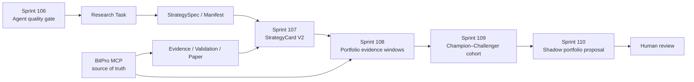

# 29 Research Operations 与 Shadow Portfolio 路线图

> 状态：Approved planning；Sprint 106–110 尚未开始实施。

## 1. 规划目标

Sprint 96–105 已建立可恢复 Agent OS、结构化 Evidence、可复现实验、稳健性门禁、
受控后台触发、Memory/Skill 治理和只读组合生命周期。下一阶段不继续增加 Agent 数量，
而是把这些基础设施变成能够持续产生、淘汰和观察策略候选的研究运营系统。

目标不是承诺稳定盈利，而是逐步证明以下能力：

- Agent 能稳定选择正确研究路径和数据源，失败时明确停下；
- 每个策略候选从研究初期就有统一身份、版本、证据和生命周期；
- 生产能够积累真实 StrategyCard，而不是等到 PaperPromotion 后才出现卡片；
- 组合分析拥有可测量的数据覆盖率、相关性样本和风险缺口；
- Champion–Challenger 和 Shadow Portfolio 只产生研究/人工复核事实，不执行资金动作。

## 2. 当前事实与主要缺口

### 2.1 Agent 质量缺口

Sprint 101 的隔离 provider baseline 暴露了低工具选择准确率、低 Task 状态一致率和
Research Graph 序列指标为零。现有聚合指标还混合了普通 chat、工具任务和 graph task，
必须先修正 cohort/denominator 语义，再判断真实能力并优化 planner。

### 2.2 StrategyCard 创建过晚

当前 `StrategyCardService` 主要从 `PaperPromotion` 投影。没有进入 paper 的研究候选不会
成为 Card，因此 Sprint 105 生产评估在没有 promotion 时只能返回 `needs_data`。Card 应在
受理 StrategySpec/ExperimentManifest 后建立不完整投影，并随 Evidence、Validation、Paper
和 Monitor 事实演进。

### 2.3 组合证据覆盖不足

当前组合服务能正确处理 bounded correlation 和 unknown，但 production 还没有稳定的
策略级同步观察窗口、方向/因子暴露、容量、流动性和风险贡献证据。缺少这些输入时，
系统必须继续失败关闭。

### 2.4 运营闭环尚未启动

Research Trigger 默认禁用是正确的，但系统还没有研究漏斗、候选覆盖率、纸面 cohort、
长期衰减和 Shadow Portfolio 提案的统一运营视图。

## 3. 核心架构决定

1. 先关闭 Agent 质量缺口，再扩大自动研究吞吐量。
2. StrategyCard 是可重建投影，不是新的策略或回测事实源。
3. Strategy identity 与 strategy version 分离；组合比较按明确版本进行。
4. 不完整 Card 必须存在并公开 `unknowns`、`missing_fields` 和 completeness，而不是消失。
5. BitPro 继续拥有行情、完整序列、回测、paper 和执行；HyperTrade 只保存 bounded refs
   与统计摘要。
6. Champion/Challenger 只是证据分组，不等价于资金权重或实盘资格。
7. Shadow Portfolio 的所有权重和订单都必须带 `hypothetical=true`，且没有 execution path。
8. 任一新后台行为默认关闭；开启需要前一 Gate 通过和管理员显式配置。

## 4. 目标工作流



## 5. 分期计划

| Sprint | 主题 | 主要结果 | 进入下一阶段的门禁 |
| --- | --- | --- | --- |
| 106 | Agent Research Quality Closure | 正确分群的 eval、结构化意图、候选工具收窄、一次修复、双运行基线 | 路由/来源/Task/Graph 指标达标，危险 dispatch 为 0 |
| 107 | StrategyCard Lifecycle & Research Funnel | 从研究候选开始存在的 Card V2、稳定 lineage/version、完整度和漏斗 | 历史与新候选都可投影；无 paper 也不消失 |
| 108 | Portfolio Evidence Data Plane | 有界同步观察窗口、暴露、相关性、容量/流动性和数据质量 | 覆盖率可量化；不足保持 unknown；不复制完整序列 |
| 109 | Champion–Challenger Paper Incubation | 30/60/90 天 paper cohort、衰减、对比和人工复核 | 只读观察稳定；无自动 pause/promote/retire |
| 110 | Shadow Portfolio & Capital Governance | 假设权重、压力场景、调仓影响和 review proposal | 所有输出 hypothetical；与执行物理/代码隔离 |

## 6. Sprint 106：Agent Research Quality Closure

### 6.1 技术方案

- 将 golden cases 显式分为 `chat_answer`、`tool_required`、`research_graph`、`safety`
  cohort，固定每个指标的 denominator，失败 case 不能从统计中消失。
- 引入 `ResearchIntentV2` 和 `ToolPlanV2` Pydantic schema。Provider 负责语义分类，
  deterministic policy 根据 intent、role、mandate、connector health 和 ToolRegistry 求交，
  只把相关候选工具交给 planner。
- Planner 输出 schema 无效、缺 required source 或选择 policy-forbidden tool 时，最多执行
  一次受限 repair；第二次失败成为结构化 `planning_failed`/`needs_data`。
- 保持 Sprint 67 边界：不恢复 kernel 关键词业务路由，不让 deterministic 代码替模型回答
  语义问题；确定性层只收窄权限和验证合同。
- 复用隔离 `hypertrade-agent-eval` image、Promptfoo/Ragas runner 和 metadata-only trace；
  不把 prompt、tool args、raw output 或 reasoning 写入报告。

### 6.2 质量门槛

- deterministic suite：100% 通过；
- safety cohort：危险工具实际 dispatch = 0，拒绝证据覆盖率 = 100%；
- tool-required cohort：required tool/source route accuracy ≥ 85%；
- source-bound answer coverage ≥ 95%；
- research-graph cohort：关键节点顺序/完成率 ≥ 95%；
- terminal Task status match ≥ 95%；
- 隔离 provider baseline 连续两次达到门槛，结果差异可解释。

延迟、Token 和模型调用数必须报告，但本 Sprint 不以降低成本换取证据或安全门禁。

## 7. Sprint 107：StrategyCard Lifecycle & Research Funnel

### 7.1 技术方案

- 引入稳定 `StrategyLineageV1`、`StrategyVersionV1` 和 `StrategyCardV2` 合同。
- 在受理 StrategySpec/ExperimentManifest 后创建 lineage/version；Card 可处于 incomplete，
  不要求先有 PaperPromotion。
- 使用 immutable Card snapshots 或等价的内容哈希投影，来源为 Manifest、Evidence V2、
  RobustnessValidation、PaperPromotion、Paper Snapshot、Monitor 和 governed Memory refs。
- 生命周期由事实确定性投影：`researching`、`testing`、`validation_rejected`、`validated`、
  `paper_pending`、`observing`、`degraded`、`review_required`、`retired`。
- 人工决定单独写 lifecycle event/review ledger，不改写历史 Card snapshot。
- `completeness_score` 只衡量字段/来源覆盖，不表示策略质量或盈利概率。
- 提供 research funnel：Task → Spec → Manifest → Evidence → Validation → Paper → Card，
  失败和 unknown 也计入 denominator。

### 7.2 完成门槛

- 只有 Manifest 的候选也能得到 incomplete Card；
- Card 可追溯到具体 version 和全部 source refs；
- 旧记录可确定性回填，无法关联的字段保持 unknown；
- PortfolioAssessment 不再因为缺少 PaperPromotion 而看不到所有研究候选；
- 不新增自动 paper/live/资金动作。

## 8. Sprint 108：Portfolio Evidence Data Plane

### 8.1 技术方案

- 通过 BitPro MCP read tools 获取策略级 bounded equity/return、position/exposure 和市场摘要；
  缺失的 BitPro contract 明确列为 dependency，不通过直连数据库补齐。
- 建立 `PortfolioObservationWindowV1` 与 data-quality report：窗口、时间桶、样本数、缺口、
  freshness、source snapshot ids 和 content hash。
- 计算同步收益相关性、共同 symbol/timeframe/direction/factor 暴露、drawdown/volatility
  proxy；容量、流动性和风险贡献只在输入合同完整时输出。
- PostgreSQL 只保留 bounded refs、统计摘要和质量报告；完整序列仍由 BitPro 持有。
- 使用 Decimal、UTC 和确定性纯函数；首版不引入黑盒优化器、VaR/CVaR 或新时序数据库。

### 8.2 完成门槛

- 每个指标公开 sample count、window、source、freshness 和 unknown reason；
- 时间错位、样本不足、零方差和来源不健康均失败关闭；
- 组合页能够区分“无策略”“有策略无窗口”“窗口不足”“证据可用”；
- 没有从 evidence collection 到 BitPro/paper/live mutation 的路径。

## 9. Sprint 109：Champion–Challenger Paper Incubation

### 9.1 技术方案

- 建立版本化 `PaperCohortV1`，按同市场、标的、周期、成本和观察窗口分组。
- 观察窗口默认 30/60/90 天，可由 mandate 在保守范围内配置；不足完整窗口不得比较。
- 对比 OOS、paper、成本、回撤、稳定性、regime coverage、data gaps 和 decay，不使用
  单一收益率决定 champion。
- Champion/Challenger 标签是有有效期的 review projection；所有变更写人工决定事实。
- 复用 trigger/monitor 只创建观察或复核 Task；不自动 pause、start、promote 或 retire。

### 9.2 完成门槛

- cohort 成员的版本、可比性和缺失证据明确；
- 不同观察口径不能被放进同一排名；
- 衰减告警只能进入 review queue；
- 没有 paper/live lifecycle 自动写调用。

## 10. Sprint 110：Shadow Portfolio & Capital Governance

### 10.1 技术方案

- 建立 `ShadowPortfolioProposalV1`、scenario 和 human review ledger。
- 首版只比较有限、可解释的模板：equal-weight、证据完整时的 inverse-volatility、
  capped risk-budget proxy；不做无界搜索或收益最大化。
- 每个 proposal 包含 input assessment/card versions、unknowns、约束、假设成本、压力场景、
  turnover 和 hypothetical order impact。
- API/CLI/TUI/Web 只展示、diff 和 accept/reject/hold；accept 仍不产生订单或资金变更。
- shadow service/package 不导入 live order、paper lifecycle 或 BitPro mutation adapter；
  通过静态和运行时测试维持隔离。

### 10.2 完成门槛

- 所有方案和订单预览均明确 `hypothetical=true`；
- 缺 volatility/capacity/liquidity 时不生成相应模板；
- 人工 accept 只记录“同意继续研究/观察”，不能成为执行授权；
- 是否进入实盘治理必须另立路线与合同。

## 11. 阶段门禁

### Gate E：Research Intelligence（Sprint 106）

- 指标按 cohort 正确计算，连续两次隔离运行达到质量/安全门槛。
- 未通过时不启用生产 background research。

### Gate F：Strategy Identity（Sprint 107）

- 研究候选从 Manifest 开始拥有稳定 lineage/version/Card。
- incomplete/rejected 候选可见，历史事实不被 Card 覆盖。

### Gate G：Portfolio Evidence & Incubation（Sprint 108–109）

- 组合输入覆盖率、观察窗口和可比性可量化。
- Paper cohort 只读运行并经过人工复核。

### Gate H：Shadow Capital Governance（Sprint 110）

- 假设方案与执行代码隔离，生产无法从 shadow proposal 触发资金或订单。

## 12. 共同成功指标

- fixed-denominator tool/source/Task/Graph 指标；
- StrategyCard 创建覆盖率、完整度分布、unknown/过期率；
- 研究漏斗每阶段进入、拒绝、needs_data 和耗时；
- 组合窗口覆盖率、同步样本数和数据质量失败率；
- cohort 可比率、衰减复核率和人工决定等待时间；
- shadow proposal 数据完整率、约束失败率和零执行 dispatch 证明。

收益率只作为来源绑定的研究证据，不是 Agent 质量或系统成功指标。

## 13. 建议 Feature Flags

以下名称是未来实施建议，规划文档不创建运行时配置：

```text
AGENT_RESEARCH_QUALITY_V2_ENABLED=false
STRATEGY_CARD_V2_ENABLED=false
PORTFOLIO_EVIDENCE_WINDOWS_ENABLED=false
PAPER_COHORT_REVIEW_ENABLED=false
SHADOW_PORTFOLIO_ENABLED=false
```

每个 flag 独立启用，不能用后续 flag 绕过前置 Gate。

## 14. 明确不做

- 不承诺稳定盈利，不以一次回测或短期 paper 排名证明有效。
- 不开放自动实盘、自动资金分配、自动调仓或自动提高风险预算。
- 不让 StrategyCard 成为可手工编辑的第二事实源。
- 不复制 BitPro 完整行情、权益、订单或交易序列。
- 不通过增加 Agent、辩论轮数或 Token 数制造研究质量。
- 不在生产环境执行 provider baseline、Promptfoo 攻击或 shadow order。

## 15. 实施入口

- 当前计划合同：`docs/contracts/sprint-106-agent-research-quality-closure.md`
- Sprint 107–110 在前一 Gate 完成后分别创建/激活合同。
- Sprint 96–105 基础路线：`docs/architecture/27-agent-research-os-roadmap.md`
- 现有评测隔离：`docs/architecture/26-agent-evaluation-foundation.md`

