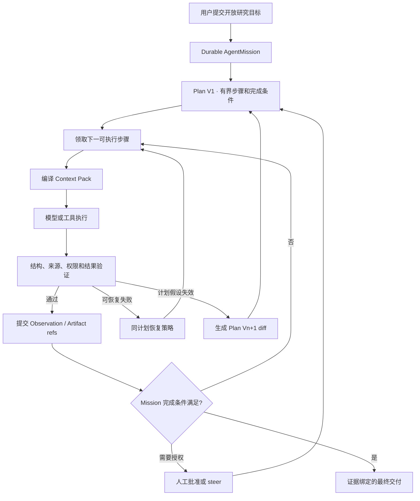
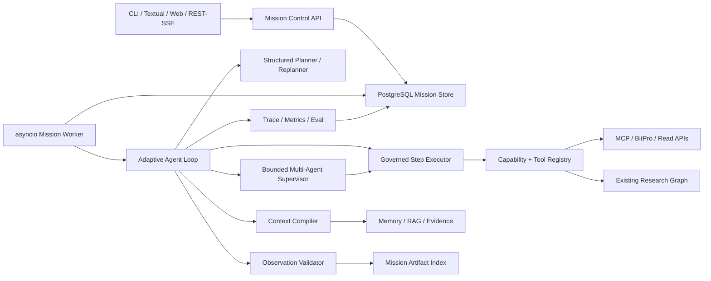

# 30 Professional Agent Runtime V2 路线图

> 状态：Proposed；等待用户确认后再激活 Sprint 111，当前生产行为和权限不变。

## 1. 目标

把 HyperTrade 已有的 AgentKernel、Session/Task OS、LangGraph、ToolRegistry、MCP、Memory、
Evidence、Experiment、评测和操作界面，统一为一个能够长期完成开放式交易研究目标的专业
Agent Runtime。

目标用户只需要描述研究任务，例如：

> 研究 BTC 在不同市场状态下更稳健的策略，使用 BitPro 完成实验与验证；证据不足时继续
> 补充研究，需要写操作时等待人工批准。

系统应能够持续完成：目标澄清、计划版本化、步骤执行、证据验证、失败分类、有界重规划、
多角色协作、上下文压缩、产物交付和人工介入。专业能力指可控、可恢复、可评测和可审计，
不等于承诺稳定盈利，也不允许绕过 paper/live/capital 权限边界。

## 2. 当前能力与真实缺口

| 能力 | 当前事实 | V2 缺口 |
|---|---|---|
| Graph Runtime | LangGraph 固定研究 DAG、条件边、并行只读角色 | 不能为开放目标动态形成版本化步骤计划 |
| Task OS | Session、Task、lease、checkpoint、pause/retry/cancel | checkpoint 主要保存运行位置，不保存完整 Mission/Plan 演进 |
| Planner | 结构化 Intent、候选工具约束、一次 schema/route repair | 没有基于 observation 的多轮有界 replan |
| Reflection | AgentKernel 有 `reflect` trace | 主要是结果摘要，不是可验证的继续/重规划/终止决策 |
| Tools | ToolRegistry、MCP/BitPro adapter、权限策略 | 能力目录偏静态，错误语义和恢复策略未统一 |
| Context | Session context policy、Memory、RAG、Evidence | 缺少按步骤编译、可追溯、受 Token 预算约束的 Context Pack |
| Multi-Agent | 固定角色目录、并发预算、角色级工具白名单 | 缺少 Supervisor 动态分工、handoff、合并和冲突裁决 |
| Artifacts | Evidence/Manifest/Experiment/BitPro refs | 缺少面向一个 Mission 的统一产物索引、版本和 diff |
| UX | CLI、Textual、Web、SSE、控制事件 | 缺少 Mission 计划树、steer、replan diff 和恢复解释 |
| Evaluation | Golden V2、provider baseline、Ragas、安全门禁 | 缺少跨长任务的目标完成、恢复、上下文和协作基准 |
| Sandbox | Skill 隔离评测、工具审批、执行风险门禁 | 缺少策略代码研发专用的短生命周期隔离工作区 |

结论：当前 HT 是治理良好的领域工作流系统，专业 Agent V2 的重点不是再增加一个模型或
重写所有服务，而是增加统一的 Mission/Plan/Observation/Replan 控制层。

## 3. 目标用户工作流



用户可随时查看计划、当前步骤、预算、证据和阻塞原因；pause/cancel 立即记录控制意图，
运行时在安全点停止。用户 steer 生成新事件和新 Plan version，不覆盖历史计划。

## 4. 核心架构原则

1. PostgreSQL 是 Mission、Plan、Step、Event、Checkpoint 的 canonical source；LangGraph 只
   负责执行状态图，不成为业务事实源。
2. 不保存模型 private chain-of-thought。只保存结构化 reason code、短 decision summary、
   source refs、tool observations 和状态转换依据。
3. 每次模型/工具调用前原子预留 Token、时间、工具调用和并发预算；失败也计入用量。
4. Replan 不是无限重试：默认最多 3 个 Plan versions、每版最多 12 步、每步最多 2 次
   attempt；合同可收紧但不能由模型扩大。
5. 写工具、外部副作用、paper/live/capital 操作继续由既有 ToolPolicy/Approval/Risk gate 决定；
   Planner 和 Supervisor 不能授予权限。
6. Tool、Memory、RAG、Evidence 和 Artifact 输入均使用版本/内容哈希；不可复现或过期来源
   显式变成 unknown。
7. 只读、独立且预算允许的步骤可并行；写步骤、共享状态步骤和人审步骤串行。
8. 结束必须基于结构化完成条件和验证结果，不以模型声称“完成”为准。
9. 当前固定 Research Graph 保留为受治理的子工作流；V2 调度它，而不是复制其业务逻辑。
10. 不引入 Celery/Redis/Temporal 第二套任务真相源；继续使用现有 asyncio worker、PostgreSQL
    lease、heartbeat 和 outbox/event 模式。达到跨服务规模瓶颈后再单独评估 Temporal。

## 5. 目标组件



### 5.1 Mission Control

新增 `AgentMissionV1`：

- `mission_id`、`session_id`、`objective`、`success_criteria`、`constraints`；
- `status`、`active_plan_version`、`current_step_id`；
- `budget`/`usage`、deadline、max plan versions/steps/attempts；
- `permission_profile_ref`、`context_policy_ref`、`created_by`；
- terminal result、unknowns、artifact manifest ref。

Mission 状态机建议为：

```text
draft -> planning -> running -> waiting_approval | waiting_input | retry_wait
running -> replanning -> running
* -> paused | canceled
running -> completed | failed | budget_exhausted
```

所有状态转换写 append-only event，并使用 optimistic version 防止 worker/control 并发覆盖。

### 5.2 Plan 与 Step

`AgentPlanV2` 为不可变版本：

- plan version、parent version、trigger observation/event；
- goal interpretation、assumptions、completion checks；
- 有向无环 step graph、依赖、read/write classification；
- 每步输入 contract、allowed capabilities、expected output、validation、budget；
- plan diff：kept/added/removed/replaced steps 和原因码。

`AgentStepV2` 不允许模型直接写任意工具名，只引用当前 Capability Catalog 中的稳定
capability id。Step attempt 单独记录，retry 不覆盖前一次 observation。

### 5.3 Adaptive Agent Loop

使用 LangGraph `StateGraph` 表达以下稳定控制拓扑：

```text
load_mission -> compile_context -> select_next_step -> approval_check
-> execute_step -> validate_observation -> progress_check
-> continue | recover | replan | wait_human | finalize
```

动态性来自数据库中的 Plan graph，不通过运行时生成新的 Python/LangGraph 节点。这样可继续
使用固定安全点、Task control、checkpoint 和评测，同时让步骤计划动态变化。

### 5.4 Replan 策略

只有以下事件允许触发 replan：

- capability/source 在 pre-dispatch 后确认不可用；
- observation 违反 expected schema/source/quality；
- 实验否定关键假设；
- 用户 steer 改变目标、约束或优先级；
- 剩余预算不足以执行当前计划但仍可形成降级交付；
- 依赖 step 失败且存在合同允许的替代路径。

同参数 transport retry、schema repair 和 replan 分开计数。Replanner 输出完整新 Plan 与 diff，
Validator 检查 DAG、预算、工具权限、循环依赖和完成条件后才可激活。

### 5.5 Context Compiler

不把完整聊天、工具原始输出和全部 Memory 拼进 prompt。每个 Step 编译
`AgentContextPackV1`：

- mission objective/constraints/success checks；
- active plan 和当前 step contract；
- dependency observations 的 bounded summary/ref/hash；
- 相关 Evidence、Memory、RAG citation 和 Artifact refs；
- 当前 capability schema/policy hash；
- remaining budget、已知 unknowns、用户最新 steer；
- context manifest、token estimate 和截断记录。

选择顺序：安全/权限约束 > 当前 Step 必需事实 > 依赖结果 > 已批准 Evidence > Memory/RAG
补充背景。超预算时先删除低相关背景，再压缩依赖摘要；不能删除权限、success criteria、
source refs 或 unknowns。

### 5.6 Capability 与 Tool Runtime

Capability Catalog 在静态 ToolRegistry 之上增加版本化投影：

- capability id/version、provider/connector、input/output JSON Schema；
- read/write/destructive 分类、approval、idempotency、timeout、rate/budget policy；
- health/freshness、contract hash、last verified；
- error taxonomy：invalid_input、permission_denied、source_unavailable、timeout、rate_limited、
  contract_mismatch、partial_result、unsafe_request、unknown_failure。

MCP/OpenAPI discovery 只创建待审核 capability proposal；不能自动把新工具加入生产 allowlist。
Executor 对 output 再做 Pydantic validation 和 provenance binding，模型不能把文本当成功结果。

### 5.7 Multi-Agent Supervisor

角色来自受版本控制的 Role Catalog，不允许模型创建无限角色。首版角色：

- mission_planner；
- market/data researcher；
- strategy researcher；
- experiment operator；
- risk/robustness critic；
- evidence reviewer；
- synthesis editor。

Supervisor 输出 `AgentAssignmentV1`，明确 step、role、allowed capabilities、context pack、预算和
expected artifact。只读独立分支使用 `asyncio.TaskGroup` 并受现有原子预算 reservation 控制；
handoff 只传结构化 result/ref，不传 private reasoning。合并时 Critic 检查矛盾、证据覆盖和
未解决 unknown，不以多数投票替代证据。

### 5.8 Mission Artifact Index

统一索引已有外部/内部产物，不复制 BitPro 完整 artifact：

- artifact id/kind/schema/content hash/source owner；
- mission/plan/step/attempt refs；
- immutable URI 或外部 stable id；
- bounded preview/metrics、citation/provenance；
- supersedes/diff relation、retention/sensitivity；
- `materialized=false` 表示仅保存外部引用。

最终报告只能引用 Artifact Index、Evidence 或已验证 Observation。无法读取的 artifact 保持
unavailable，不由模型补造。

### 5.9 Sandboxed Research Development

当 Mission 需要生成或修改策略代码时，使用独立 sandbox service：

- 每次 Mission/Step 创建短生命周期 Docker 容器或受限 worktree；
- 只挂载临时 workspace、只读 SDK/fixtures，不挂载生产 `.env`、Docker socket 或主机密钥；
- CPU、内存、进程、网络域名、运行时间和输出大小限制；
- patch、测试命令、退出码和 artifact hash 写审计；
- 只有人工批准的 patch/StrategySpec 可以进入 BitPro 导入流程；
- sandbox 永远不能访问 live/testnet/mainnet order 工具。

首版不实现通用 shell Agent；只支持策略模板、受限文件类型和白名单 test/build 命令。

## 6. 技术选型

| 层 | 选择 | 原因 |
|---|---|---|
| Runtime | Python、LangGraph `StateGraph`、现有 AgentKernel | 复用固定安全拓扑与领域服务 |
| Contracts | Pydantic v2、JSON Schema、Decimal/UTC | 严格输入输出和跨界面一致性 |
| Canonical State | PostgreSQL、SQLAlchemy、Alembic | 现有任务/审计事实源，支持事务和租约 |
| Worker | asyncio、`TaskGroup`、现有 DB lease/heartbeat | 不引入第二套队列；支持有界并行 |
| Tools | MCP + ToolRegistry + reviewed Capability Catalog | 动态发现与生产 allowlist 分离 |
| Context | 自定义 Context Compiler + Memory/RAG/Evidence | 领域来源和审计要求不能交给通用框架猜测 |
| Vector Search | pgvector | 复用现有 RAG/Memory 存储 |
| Artifacts | PostgreSQL metadata + external stable refs；后续可接 S3/MinIO | 不复制 BitPro raw artifacts |
| Sandbox | Rootless Docker/受限容器 + ephemeral workspace | 隔离生成代码和测试副作用 |
| Streaming | FastAPI SSE + cursor events | 复用现有 CLI/Web/TUI 进度协议 |
| UX | Rich CLI、Textual、React/TypeScript | 现有三种 operator surfaces |
| Telemetry | 现有 trace events 先统一 semantic schema；再导出 OpenTelemetry | 避免第一阶段同时替换观测系统 |
| Evaluation | pytest golden suites、isolated provider baseline、Ragas/Promptfoo | 覆盖确定性门禁和模型波动 |

明确不在首阶段引入 AutoGen/CrewAI。它们会形成第二套 Agent/Memory/Tool 状态；HT 已有领域
Task OS 和治理层。Temporal、Kafka、Redis/Celery、Kubernetes 只在现有 PostgreSQL lease 和
Docker Compose 出现有证据的规模瓶颈后另行决策。

## 7. Sprint 路线

| Sprint | 主题 | 核心交付 | 门禁 |
|---|---|---|---|
| 111 | Mission Control & Adaptive Loop | Mission、Plan versions、Step attempts、bounded replan、steer | Gate I |
| 112 | Capability & Tool Runtime V2 | reviewed capability catalog、typed observation、恢复策略 | Gate J1 |
| 113 | Context & Artifact Engine | context pack、token ledger、compaction、mission artifact index | Gate J2 |
| 114 | Bounded Multi-Agent Supervisor | 动态分工、并行、handoff、critic merge | Gate K |
| 115 | Sandboxed Strategy Development | 受限工作区、patch/test artifact、人工导入门禁 | Gate L |
| 116 | Professional UX & Readiness Benchmark | Mission UI、steer/replay、长任务基准和发布门禁 | Gate M |

### 7.1 Sprint 111：Mission Control & Adaptive Loop

具体技术：Pydantic Mission/Plan/Replan contracts、PostgreSQL event/version tables、LangGraph
固定 adaptive topology、optimistic locking、现有 Task checkpoint/lease、SSE cursor events。

范围：单 Mission、现有工具和固定 Research Graph 作为 Step executor；最多 3 个 Plan versions、
12 steps/version、2 attempts/step。实现用户 steer、plan diff、完成条件 Validator、预算耗尽和
失败关闭。不做动态 tool discovery、Context Pack、动态多 Agent 或 sandbox。

### 7.2 Sprint 112：Capability & Tool Runtime V2

具体技术：Capability Catalog Pydantic/JSON Schema、MCP capability snapshot、contract hash、
ToolObservationV2、error taxonomy、preflight、circuit state、idempotency binding、policy validator。

范围：把现有 ToolRegistry 和 BitPro MCP 投影为 reviewed catalog；Planner 只引用 capability id；
对 timeout/rate/source/contract 错误使用确定性恢复矩阵。发现的新工具默认 pending，不自动启用。

### 7.3 Sprint 113：Context & Artifact Engine

具体技术：ContextPack manifest、token estimator/ledger、deterministic relevance tiers、bounded
summarizer、pgvector retrieval、Artifact Index、content hash、source/supersede relation。

范围：每 Step 独立编译 context；记录保留/丢弃原因；完整聊天和 raw artifacts 不入 prompt。
最终报告强制引用 mission artifacts。评测 token 降幅、关键约束保留率和 citation coverage。

### 7.4 Sprint 114：Bounded Multi-Agent Supervisor

具体技术：Role Catalog、Assignment/Handoff/Merge contracts、`asyncio.TaskGroup`、现有 atomic
budget reservations、PostgreSQL node/attempt events、Critic schema 和 conflict ledger。

范围：Supervisor 可在白名单角色中选择最多 4 个并行只读 assignments；写步骤串行。合并保留
冲突和少数证据，不做自由对话群、无限辩论或角色自我复制。

### 7.5 Sprint 115：Sandboxed Strategy Development

具体技术：rootless Docker、ephemeral workspace/worktree、resource/network policy、命令白名单、
unified diff、pytest/SDK contract tests、artifact hash、approval-bound import manifest。

范围：只允许策略模板与测试文件；生成 patch 后运行 lint/test/limited backtest，展示 diff，人工
批准后才能交给 BitPro 的稳定导入接口。无 shell 出网、无秘密、无 Docker socket、无交易权限。

### 7.6 Sprint 116：Professional UX & Readiness Benchmark

具体技术：FastAPI REST/SSE cursor、Textual tree/timeline、React Mission workspace、event replay、
golden long-horizon scenarios、fault injection、isolated provider matrix、OpenTelemetry exporter。

范围：统一展示 Mission/Plan/Step/Artifact/Budget；用户可 pause/resume/cancel/steer/approve；构建
与 Hermes/TradingAgents/Claude Code 工作方式相对应但面向 HT 领域的自有任务集，不复制其实现。

## 8. 发布门禁

### Gate I：Adaptive Mission Safety（Sprint 111）

- 计划和每次 replan 可验证、可 diff、不可覆盖历史；
- pause/cancel/steer 在安全点生效，重启从 checkpoint 恢复；
- 循环、预算、步骤和 attempt 上限不能被模型扩大；
- 至少 20 个确定性 scenario 中无越权 dispatch、无无限循环、无虚假 completed。

### Gate J：Tool + Context Integrity（Sprint 112–113）

- 100% tool call 绑定 catalog version、policy hash、validated observation；
- error taxonomy 覆盖率、恢复分支和 circuit 行为可重复；
- Context Pack 关键约束保留率 100%，引用/来源覆盖达到合同门槛；
- prompt/context/artifact 不保存 credential、private reasoning 或 raw BitPro series。

### Gate K：Team Coordination（Sprint 114）

- 并行分支原子预算不超限，handoff 有 schema/source refs；
- 冲突不被多数投票或 final writer 覆盖；
- 单 Agent fallback 与多 Agent 路径均可完成相同安全门禁；
- 增加 Agent 数量必须在固定基准上证明质量或延迟收益。

### Gate L：Sandbox Isolation（Sprint 115）

- sandbox 无生产 secrets、Docker socket、非白名单网络和交易工具；
- timeout/resource/output limits 可强制终止；
- 所有 patch、命令、退出码和 artifacts 可审计；
- 未经人工批准不能导入 BitPro 或修改主仓库。

### Gate M：Professional Readiness（Sprint 116）

- 两次隔离长任务基准均达到 goal completion、tool correctness、evidence、recovery、Task state、
  budget 和 safety 门槛；
- fault injection 覆盖 provider、MCP、DB lease、schema、source stale 和用户 steer；
- CLI/TUI/Web 对同一 Mission 投影一致，运行可 replay；
- 生产 feature flag 默认关闭，通过 canary 后才按管理员明确动作启用。

## 9. 核心评测指标

- goal completion correctness，不以模型自报完成计分；
- plan validity、replan precision、无效 plan churn；
- tool/capability selection、argument/schema correctness；
- source/citation coverage、unknown preservation、artifact reproducibility；
- retry/recovery success、false recovery、loop/budget violations；
- checkpoint resume、steer incorporation、Task/Event consistency；
- context constraint retention、token efficiency、stale-context rate；
- handoff completeness、conflict preservation、多 Agent 增益；
- unsafe dispatch、approval bypass、secret/raw artifact leakage 必须为 0。

收益、Sharpe 或短期 paper 表现不是 Agent Runtime 发布指标。

## 10. 数据模型与 API 方向

建议按 Sprint 逐步新增而不是一次创建所有表：

```text
0023: agent_missions, agent_plan_versions, agent_step_attempts, agent_steering_events
0024: agent_capability_snapshots, agent_tool_observations
0025: agent_context_packs, mission_artifacts
0026: agent_assignments, agent_handoffs, agent_conflicts
0027: sandbox_runs, sandbox_artifacts, sandbox_import_reviews
```

API 前缀建议统一为 `/api/agent/missions`：create/list/get、plan/diff、events/stream、control、steer、
artifacts、assignments。现有 `/api/agent/tasks` 保持兼容；Mission 是长期目标聚合，Task 继续作为
具体执行单元，避免迁移期间双写含义不清。

## 11. Feature Flags 与部署

```text
AGENT_MISSION_V2_ENABLED=false
AGENT_ADAPTIVE_REPLAN_ENABLED=false
AGENT_CAPABILITY_CATALOG_V2_ENABLED=false
AGENT_CONTEXT_PACK_V1_ENABLED=false
AGENT_DYNAMIC_TEAM_ENABLED=false
AGENT_STRATEGY_SANDBOX_ENABLED=false
```

每个 flag 独立，后续 flag 不能绕过前置 Gate。生产 canary 先使用只读研究 Mission、零 paper/
live/capital 权限、严格预算和单并发；provider benchmark 继续在隔离环境执行。

## 12. 明确不做

- 不构建无限自主、无限 Token、无限 Agent 或无终止条件的循环；
- 不保存或展示模型 private chain-of-thought；
- 不让模型动态扩大 tool/role/permission/budget；
- 不以 AutoGen/CrewAI 替换现有 canonical Task OS；
- 不允许生成代码直接进入生产或 BitPro；
- 不因为专业 Agent Runtime 而开放 mainnet、自动 paper promotion 或自动资本配置；
- 不宣称完成此路线即可稳定盈利。

## 13. 实施入口

- 第一份拟议合同：`docs/contracts/sprint-111-professional-agent-loop-v2.md`。
- 用户确认路线后，将 Sprint 111 从 Draft 改为 Active；其他 Sprint 在前一 Gate 关闭后逐一创建
  focused contract，不提前并行开发。
- Sprints 96–105 基础：`docs/architecture/27-agent-research-os-roadmap.md`。
- Sprints 106–110 研究运营：`docs/architecture/29-research-operations-shadow-portfolio-roadmap.md`。
- 当前详细技术基础：`docs/architecture/28-agent-research-os-technical-design.md`。
