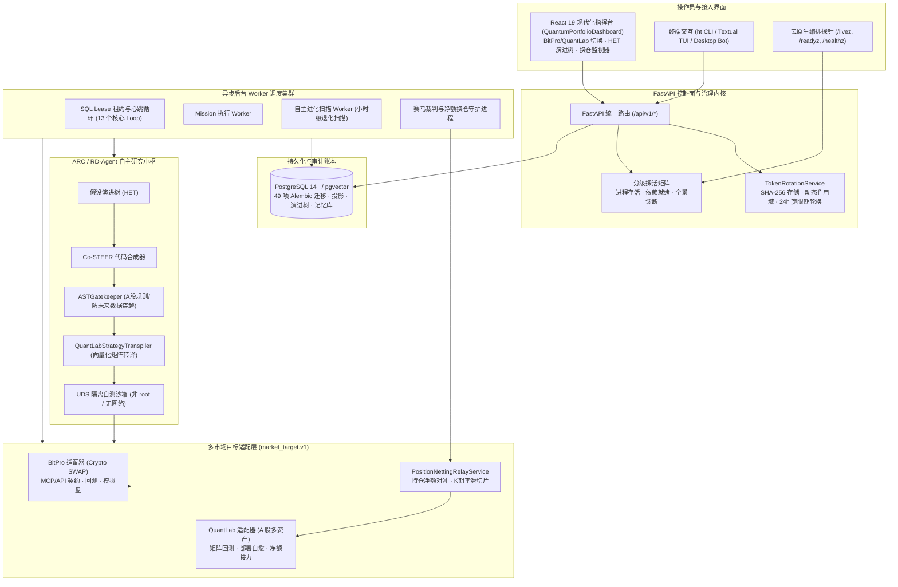

# 33 HyperTrade 系统架构

> 状态：当前实现快照（2026-10-06 全面刷新），不是下一代架构完成声明。本次刷新覆盖多市场目标扩展（BitPro 加密货币合约 + QuantLab A 股多资产）、
> A 股微观结构硬规则注入、Co-STEER 向量化策略转译器、赛马接力阶段持仓净额平滑换仓、容器级分级探活矩阵（`/healthz`, `/readyz`, `/livez`）、
> 零信任安全令牌动态热轮换，以及 RD-Agent 假设演进树（HET）指挥台支持。
> 关联技术规范：[62 可插拔市场目标](62-pluggable-market-targets.md) · [63 进化加固](63-evolution-effectiveness-alerts-and-benchmark.md) ·
> [65 RD-Agent 演进与分层记忆](65-rd-agent-evolution-and-finmem-layered-memory.md) · [66 QuantLab 与 A 股微观结构](66-quantlab-adapter-a-share-microstructure-and-relay-handover.md) ·
> [67 生产级探活与令牌轮换](67-production-observability-probes-and-token-rotation.md) · [34 下一代专业运行时审计](34-next-generation-agent-runtime-audit-and-target-design.md)。

---

## 1. 系统定位

HyperTrade 是一个自托管、受治理的量化策略研究 Agent Runtime。它把开放式自然语言研究目标转化为可审计、可恢复的 **Mission**，在明确的权限、预算、证据和复核边界内，驱动自主研究循环（ARC/AVO）产出候选策略，经隔离沙箱自测、同窗基线对比与对抗审查后进入目标市场模拟盘孵化；并在生产上持续运行默认开启的自主进化引擎，对孵化中的策略进行基准相对退化扫描、自动评审、赛马淘汰与再研究。

系统不承诺盈利、不提供投资建议。策略研究结论必须保留完整证据、数据缺口和适用条件；主网下单不在当前范围内（`live_allowed=false`），外部写操作仅限于已授权的目标平台模拟盘（Paper Trading）。

| 系统 / 模块 | 拥有的事实与职责 | 明确不拥有的职责 |
| --- | --- | --- |
| **HyperTrade 核心** | Agent Mission、计划、工具治理、证据投影、自主研究与进化编排、安全令牌生命周期、审计、复核与交付 | 复制外部交易平台底层撮合业务逻辑、绕过风控、私自执行主网真钱交易 |
| **BitPro 目标适配** | 加密货币衍生品行情、合约回测、BitPro 模拟盘实例与持仓状态（经 MCP/API 契约） | HyperTrade 内部的任务规划、假设系谱或跨市场风控规则 |
| **QuantLab 目标适配** | A 股多资产标的池、矩阵式向量化回测、A 股微观规则注入、QuantLab 模拟盘部署与接力 | 加密货币永续合约规则；适配层专注于契约翻译与能力映射 |
| **市场目标适配层** | `market_target.v1` 档案与 `market-evolution.v1` MCP 契约标准工具集 | 交易平台内部专有逻辑；适配层实现标准协议解耦 |
| **外部数据与行情源** | OKX、Alpha Vantage、新闻舆情流及原始时间戳事实 | HyperTrade 内部的研究结论、策略指纹或权限决策 |
| **人类操作员** | 核心目标输入、预算上限、审批授权、人工复核、最终风险承担 | 代替程序逐笔手工撮合或人工编写冗长回测管道 |

HyperTrade 只能通过稳定的 MCP/API 契约使用外部平台，不直接读取交易平台私有数据库，也不在自身代码中硬编码任何平台的私有撮合规则。

---

## 2. 架构原则

1. **Mission 是研究任务的目标真相源，Thread 是交互真相源。** Remote `ht ask/chat` 与 Web 由服务端拥有的 Thread/Turn/Item、版本化 Event 和确定性 Reducer 驱动，并显式关联只读 Mission。
2. **模型不能扩大权限。** 模型只可提出受 Schema 约束的计划或输入；Capability Catalog、Tool Policy、Approval 与风险门禁在调用前后独立验证。
3. **结论必须可追溯，缺口绝不掩盖。** 默认操作员答案仅展示结论、置信度、证据、未知项和安全下一步。数据不可用、回退口径（如基准序列缺失回退绝对口径）与无效对比必须显式标注并单独计数，绝不由模型脑补造假。
4. **自主进化默认开启，始终受治理。** 进化引擎在预算（`research_budget.v1` 准入）、证据（预检与延续记录）与评审（human/agent 政策）门禁内行动；它不能扩大自身权限、不能绕过审批发起未经授权的写操作。
5. **市场目标完全可插拔。** 进化核心不绑定具体交易平台；新市场通过实现 `market-evolution.v1` MCP 契约与 `market_target.v1` 档案接入，自测、账本、告警与效果评估体系全量继承。
6. **组合是一等公民。** 篮子（Basket）策略从扫描、研究、自测、基准到模拟盘全程保持声明标的集合的完整性，进化过程严禁把组合静默缩成单标的。
7. **市场微观结构与制度硬约束内嵌。** 针对 A 股等特定市场，系统在 LLM Prompt 上下文与 ASTGatekeeper 语法解析端双向内嵌 T+1 状态机、现货单向多头（禁止做空）、涨跌停截断、一手 100 股向下取整以及精准印花税/佣金模型。
8. **赛马接力阶段净额平滑换仓最小化摩擦。** 世代更迭（Champion vs. Challenger）不采用粗暴的“全平全开”，而是通过持仓交集对冲原地保留共有份额 $\min(P_i, C_i)$，仅对净额差量 $\Delta = C - P$ 分批平滑切片执行，节约换手摩擦超 80%。
9. **零信任凭据治理与平滑热轮换。** 服务令牌采用 SHA-256 单向哈希存储，支持基于 Grace Period 的零停机无缝热轮换与 7 天临期主动审计预警。
10. **架构演进与设计文档强一致性。** 整体架构一旦发生模块、数据流、适配层或模型演进，必须立即同步更新所有架构设计文档与 README，保持系统设计与代码落地严格同步。

---

## 3. 系统全景拓扑

---

## 4. 运行时分层规范

| 图层 | 核心模块 / 文件 | 职责与生产边界 |
| --- | --- | --- |
| **Operator Surfaces** | `frontend/src/` (React 19, TypeScript 5.9, Vite 7), `ht` CLI, TUI | 呈现多目标量化看板、HET 演进树、赛马换仓监视器，下发带理由与幂等键的控制动作 |
| **Control Plane** | `hypertrade/main.py`, `hypertrade/security/token_manager.py` | 暴露 REST/SSE 控制端点，分级探活（`/livez`, `/readyz`, `/healthz`），零信任令牌签发/轮换/鉴权 |
| **Domain Core** | `hypertrade/runtime/domain/`, `hypertrade/arc/contracts.py` | 严格定义 Mission、Plan、Step、Capability、HET 假设、NettingPlan 等不可变 Pydantic 模型 |
| **Research Engine** | `hypertrade/arc/`, `hypertrade/research/` | RD-Agent 假设演进、Co-STEER 代码生成、`ASTGatekeeper` 语法守卫、`QuantLabStrategyTranspiler` 转译 |
| **Paper & Evolution** | `hypertrade/arc/evolution.py`, `hypertrade/paper/relay_netting.py` | 小时级基准相对退化扫描、预算准入、延续账本、赛马裁判对决、两腿持仓净额平滑换仓 |
| **Target Adapters** | `hypertrade/targets/bitpro.py`, `hypertrade/targets/quantlab.py` | 实现 `market_target.v1` 档案与 `market-evolution.v1` 契约，提供标准化行情、回测、部署与心跳探测 |
| **Data & Storage** | PostgreSQL 14+, pgvector, 49 项 Alembic 迁移 | 保存规范 Mission 投影、策略资产卡片、实验记录、认知记忆表及飞书告警台账 |
| **Safety & Ops** | UDS 沙箱, GitHub Actions, Docker Compose, `./scripts/check.sh` | 进程资源限制、网络隔离、静态代码检查（Ruff/Mypy）与 2100+ 项全量自动化测试 |

---

## 5. 多市场目标适配架构 (BitPro + QuantLab)

### 5.1 市场档案与标准 MCP 契约
每个接入市场通过实现 `market_target.v1` 档案与 `market-evolution.v1` 契约完成注册：
- **`bitpro`**：7x24 全天候数字货币合约，双向多空，基于 MCP 协议调用远端行情与回测；
- **`quantlab`**：交易日 9:30-15:00 A 股现货资产，单向多头，矩阵式批量回测引擎。

### 5.2 策略转译与 A 股制度守卫
1. **代码转译与解耦脚手架**：`QuantLabStrategyTranspiler` 将三段式 `BaseEvolutionStrategy` 自动转译为注入 `META`、`ENTRY_SIGNALS`、`EXIT_SIGNALS` 与 `MATRIX_STRATEGY` 的 QuantLab 向量化模块。内置独立脚手架 `_BASE_EVO_SCAFFOLD`，消除生成的策略代码对 HyperTrade 安装包的运行依赖。
2. **制度硬约束双向注入**：
   - **Prompt 端**：`ASharePromptContext` 向大模型注入 T+1 交易交收、现货禁止做空、单边 0.05% 印花税与涨跌停规则；
   - **AST 门禁端**：`ASTGatekeeper(market="cn")` 静态扫描并直接阻断 `-1` 信号字面量及负数仓位，严防裸空。

### 5.3 赛马平滑换仓对冲引擎
在淘汰落后策略、晋升新策略阶段，`PositionNettingRelayService` 计算两腿持仓交集并原地保留共享份额 $\min(P_i, C_i)$，仅对净额差量 $\Delta = C - P$ 进行 $K$ 期平滑切片执行。买入指令严格遵循 100 股一手向下取整规则，重合资产换手节约率超 80%，显著降低交易摩擦。

---

## 6. 生产级运维探活与安全令牌管理

### 6.1 分级探活矩阵
- **`/livez`**：微秒级响应 `{"status": "alive"}`，专供 K8s 存活探针；
- **`/readyz`**：执行真实 `SELECT 1` 探测数据库连通性，依赖异常时返回 HTTP 503 并摘除流量；
- **`/healthz`**：全景健康诊断，集成数据库延迟、QuantLab 与 BitPro 适配器心跳、Paper 会话与令牌临期统计。

### 6.2 动态令牌热轮换 (`TokenRotationService`)
- 凭据仅存储 SHA-256 散列，严禁持久化明文；
- 支持细粒度权限作用域（如 `arc:read`, `arc:start`, `quantlab:mcp`）；
- 热轮换提供 24 小时过渡宽限期，新旧凭据无缝衔接；
- 支持主动吊销黑名单与 7 天临期预警，杜绝调用雪崩。

---

## 7. 部署模型与质量门禁

1. **部署拓扑**：Docker Compose / K8s + Nginx + PostgreSQL (pgvector)。所有服务启动前自动执行 49 项 Alembic 迁移。
2. **质量门禁**：通过 `./scripts/check.sh` 实行一票否决制：
   - 前端代码检查与 Vitest 测试全绿；
   - 前端 Vite 生产构建成功；
   - 后端 Ruff 静态检查与格式规范通过；
   - 后端 Mypy 严格类型检查（316 文件 0 错误）；
   - 后端 Pytest 测试套件全量通过（当前 2100+ 项测试 100% 绿灯）。
3. **自动化闭环准则**：代码与文档修改严格遵循原子提交、全量校验通过后通过 PR 自动合并至 `origin/main` 并推送到远端。

---

## 8. 相关设计文档

- [00 架构总览](00-overview.md)：文档入口与维护强规则。
- [66 QuantLab 适配器、A 股微观结构与平滑换仓](66-quantlab-adapter-a-share-microstructure-and-relay-handover.md)：Spec 028-031 核心规范。
- [67 生产级探活、令牌轮换与指挥台设计](67-production-observability-probes-and-token-rotation.md)：Spec 031-032 核心规范。
- [65 RD-Agent 演进与 FinMem 分层认知记忆](65-rd-agent-evolution-and-finmem-layered-memory.md)：HET 与分层记忆设计。
- [64 全自主量化交易 Agent 架构设计](64-autonomous-trading-agent-system-architecture.md)：三速感知与决策闭环。
- [62 可插拔市场目标](62-pluggable-market-targets.md) / [63 进化加固](63-evolution-effectiveness-alerts-and-benchmark.md)：市场解耦与效果账本。
- [34 下一代专业运行时审计](34-next-generation-agent-runtime-audit-and-target-design.md)：Thread/Turn 状态机设计。
