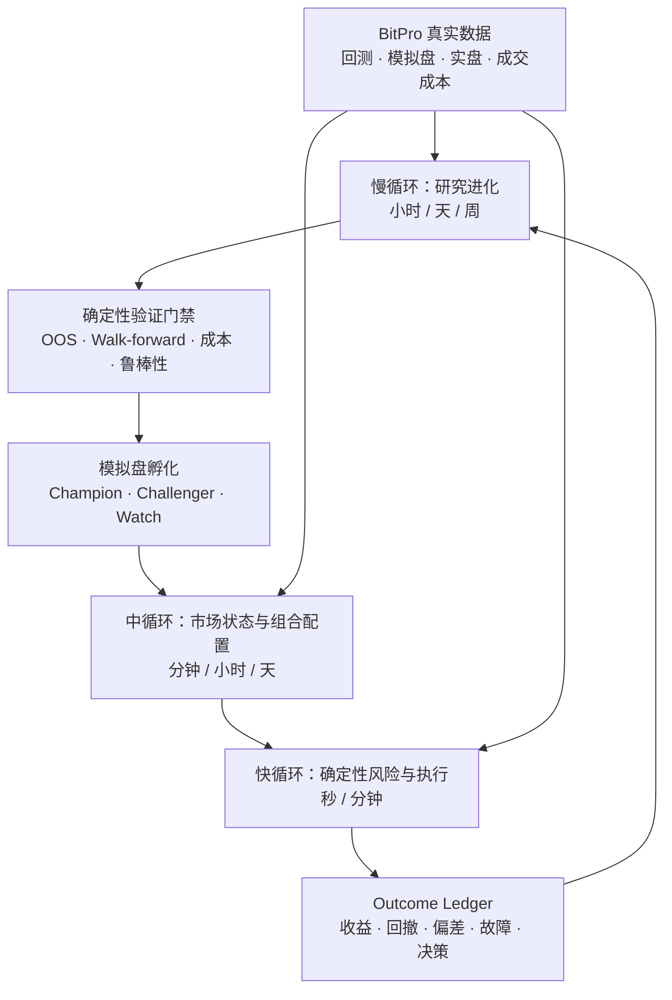

# HyperTrade 自主量化交易员北极星目标

> 文档性质：长期产品与架构目标。
>
> 本文描述 HyperTrade 最终要成为的系统，不代表当前版本已经具备自动实盘、自动资金配置或盈利保证。
> 当前可用能力、开发顺序和权限边界仍以 `docs/progress.md`、当前 Sprint 合同和部署配置为准。

## 最终目的

HyperTrade 的最终目的，是成为一个在预先授权的资本与风险边界内，能够持续自主研究、验证、组合、执行、
复盘和迭代的量化交易员。

系统不依赖某一条永久有效的策略。它持续观察策略在不同市场状态下的回测、模拟盘和实盘结果，识别策略
何时有效、何时衰退、何时应当降权或退出；同时从真实市场现象、未覆盖 regime 和已有策略共同失效中提出
全新的可证伪 Alpha 假设，而不只优化已有参数。系统随后自动生成新旧候选，完成真实数据回测、样本外验证、
模拟盘孵化和组合评估，并让满足全部门禁的策略在授权范围内进入实盘，让不再适合当前行情或触发风险条件
的策略退出实盘。

最终业务目标不是追求单次回测、单个策略或短期收益最大，而是：

> 在资本、回撤、尾部风险、流动性、杠杆、交易成本和操作授权约束下，提高长期样本外风险调整收益与复利
> 能力，并在证据不足或系统状态不确定时优先保护资本。

任何回测、模型判断或历史盈利都不能构成未来收益保证。系统必须能够选择不交易、降低风险或进入人工接管。

## 自主量化交易员的定义

当 HyperTrade 达到本目标时，它应具备以下闭环能力：

1. **理解市场**：持续识别趋势、震荡、波动、流动性、相关性、资金费和压力状态，并输出概率、置信度、
   数据时点和未知项，而不是只给出一个不可审计的市场标签。
2. **理解策略**：维护每个不可变策略版本的适用状态、失效条件、参数边界、成本敏感性、容量、回撤、
   样本外表现和模拟/实盘偏差。
3. **自主研究**：同时运行已有策略进化与全新策略发现。从策略衰减、市场切换、组合冲突、未覆盖状态和失败
   实验中提出可证伪假设，生成有限候选，自动完成新颖性、数据预检、代码校验、回测矩阵、走步验证和
   鲁棒性检查。
4. **自主组合**：根据当前市场状态、策略条件表现、相关性、尾部风险、容量和交易成本，计算有约束的目标
   权重；避免只按收益率排名，也避免频繁追涨杀跌式切换。
5. **自主孵化**：让通过研究门禁的 Challenger 进入模拟盘，与现有 Champion 在相同口径和观察窗口下比较，
   保留所有失败、退化和数据缺口。
6. **授权内执行**：只有在有效实盘授权、风险预算、策略资格和执行健康全部满足时，才允许进入实盘、调整
   权重或退出；任何动作都必须幂等、可对账、可暂停、可撤销并可追溯。
7. **持续进化**：把已经结算的结果转化为带证据、有效期、适用状态和谱系的候选经验，推动下一轮研究；
   不把模型自评、未结算收益或偶然盈利直接写成知识。

## 三个不同速度的闭环

自主系统必须把研究、组合决策和执行拆开。LLM 可以参与研究与解释，但不能位于逐笔交易的实时关键路径。



### 慢循环：策略研究进化

慢循环负责发现和验证变化，不直接下单：

- 汇总固定版本策略在滚动窗口、不同标的、周期、费用和市场状态下的表现。
- 检测收益衰减、回撤扩大、信号稀疏、滑点恶化、参数敏感和模拟/实盘偏离。
- 区分策略失效、市场状态切换、数据质量问题、执行异常和随机波动。
- 生成有预算上限的参数邻域、逻辑变体或组合假设，不进行无界搜索。
- 使用真实 OHLCV 和真实 BitPro artifacts 运行锁定样本外、walk-forward、费用/滑点/资金费压力、
  regime 分段和参数稳定性验证。
- 对多次尝试进行选择偏差与过拟合校正，保存失败候选及原因。
- 通过门禁后只创建新的不可变候选版本，不原地修改正在模拟或实盘运行的策略。

### 中循环：市场状态与组合配置

中循环把当前市场状态映射为策略资格和组合目标：

- 输出多个 regime 的概率、置信度、来源、数据新鲜度和转换证据。
- 读取每个策略在对应 regime 下的条件收益、风险、成本、容量和未知项。
- 先判断策略是否有资格运行，再计算目标权重；资格判断与收益优化不能混成一个黑盒分数。
- 组合目标同时约束最大回撤、CVaR、相关性、单策略集中度、单标的暴露、杠杆、容量、流动性、换手和成本。
- 使用进入/退出双阈值、最小驻留时间、冷却期、连续窗口确认和最大单次权重变化，防止频繁启停。
- regime 置信度不足、未覆盖或数据过期时降风险；无法确定外部状态时禁止增加暴露。

### 快循环：风险、信号与执行

快循环由确定性服务和 BitPro 承担，不依赖 LLM 临场生成交易指令：

- BitPro 计算已批准策略版本的交易信号，并拥有市场数据、策略运行、订单、持仓和成交真相。
- Risk Engine 在每次动作前检查授权、账户、环境、仓位、杠杆、损失、回撤、流动性、价格偏差和 kill switch。
- 执行层使用幂等键、外部 operation id、write-ahead intent 和成交对账处理重复、超时与未知副作用。
- HyperTrade 决定策略生命周期和目标组合，但只能通过经过审查的 BitPro 合同执行，不能直连数据库或复制
  BitPro 交易业务逻辑。
- 连接器、账户或持仓状态未知时停止新增风险，并进入 reconciliation 或人工接管。

## 策略版本与生命周期

每个策略版本都是不可变研究对象。参数、代码、数据窗口、成本模型或依赖合同任一变化，都产生新版本和
新的证据链，不能覆盖旧版本。

```text
idea
  -> candidate
  -> backtesting
  -> rejected | validated
  -> paper_challenger
  -> paper_champion | paper_degraded | paper_retired
  -> shadow_approved
  -> live_canary
  -> live_active
  -> live_degraded
  -> live_paused | live_retired
```

关键规则：

- `validated` 只代表固定验证合同通过，不代表未来盈利。
- Paper、Shadow 和 Live 的证据分层保存，后一个阶段不能改写前一阶段结果。
- Challenger 必须与 Champion 使用可比较的数据口径、成本、窗口和市场范围。
- 实盘版本不能原地自动调参。新参数先作为新 candidate 完成完整生命周期。
- 退役不删除历史；已退役版本继续参与失败模式、regime 和研究谱系分析。

## 优化目标与硬约束

组合与参数优化必须是多目标、有约束且面向样本外结果的。一个示意目标是：

```text
maximize:
  expected_out_of_sample_net_return
  - drawdown_penalty
  - tail_risk_penalty
  - turnover_and_cost_penalty
  - instability_penalty
  - concentration_penalty
  - regime_uncertainty_penalty
```

以下条件是硬约束，不能通过提高预期收益抵消：

- 账户、环境、标的、策略版本和资本上限必须在有效授权内。
- 最大总暴露、单策略暴露、单标的暴露、杠杆、日亏损和组合回撤不得越界。
- 数据覆盖、时序、来源、新鲜度、交易成本和资金费必须满足验证合同。
- 必须具备锁定样本外证据、最小交易数、最小观察期和参数稳定区间。
- 不允许未来函数、合成行情替代真实数据、未声明成本或跨口径强行比较。
- 任何关键输入为 unknown 时不得晋级或增加实盘风险。

## 市场状态与策略资格

市场状态是带不确定性的可观测假设，不是绝对真相。每个状态快照至少包括：

- 趋势、震荡、高波动、压力、流动性和相关性状态的概率。
- 使用的数据、事件时间、as-of 时间、新鲜度和缺口。
- 状态切换证据、持续时间、置信度和模型版本。
- 与上一快照的差异以及是否达到切换确认条件。

每个策略版本的资格判断至少包括：

- 当前 regime 是否属于已经验证的适用范围。
- 当前条件下的样本外净收益、回撤、尾部损失和成本敏感性。
- Paper/Live 最近表现是否与研究证据一致。
- 相对组合中其他策略的相关性、风险贡献、容量和集中度。
- 策略健康、数据健康、执行健康和授权是否同时有效。

资格输出只能是结构化状态，例如 `eligible`、`observe`、`reduce`、`pause`、`retire` 或 `unknown`，并且
包含 reason code、证据引用、有效期和下一次复核时间。

## 自主进化的学习单元

系统学习的最小单位不是自由文本反思，而是可审核的 `Outcome → Lesson → Proposal`：

1. `Outcome` 记录已经结算的研究、模拟或实盘结果，以及当时可见的数据、策略版本、市场状态、成本和决策。
2. `LessonCandidate` 从多个 Outcome 中提取可复现模式，绑定支持、反对、未知证据、置信度计算方法、有效期
   和适用 regime。
3. `MemoryProposal`、`SkillProposal`、`StrategyProposal` 或 `PortfolioPolicyProposal` 只能由候选经验产生。
4. 提案经过 schema、静态策略、安全、回归、领域评测、历史事件重放和 Shadow/Canary 验证。
5. 发布形成不可变版本和 active pointer；指标退化时自动撤回 active pointer，历史不删除。

模型可以提出假设、参数、流程和解释，但不能验证自己的证据、扩大权限、批准自己的发布、把未结算收益
写成经验，或用多数 Agent 投票代替交易风险门禁。

## 多策略组合的演进顺序

组合能力按可解释性和风险从低到高演进：

1. 资金在多个独立策略之间分配，每个策略仍独立生成信号和管理仓位。
2. 基于波动率、风险贡献、相关性、容量和 regime 适配进行有上限的动态权重配置。
3. 通过 Shadow Portfolio 比较组合方案，计入成本、换手和压力情景。
4. 在 Live Canary 中使用小额、有限标的和有限时间验证真实执行偏差。
5. 只有在数据和执行证据充分时，才研究信号级融合、meta-labeling 或更复杂组合模型。

首选资金分配层组合，而不是一开始把多个信号混合成不可解释的黑盒。

## 实盘授权模型

最终系统允许自动进入、退出和调整实盘策略，但只能在操作员预先批准、可撤销且有有效期的
`LiveTradingMandate` 内运行。授权至少冻结：

- 账户、环境、市场、标的和允许的策略版本集合。
- 总资本、单策略资本、单标的暴露、最大杠杆和订单类型。
- 日亏损、策略回撤、组合回撤、尾部风险、滑点和流动性阈值。
- 允许的动作：进入、退出、降权、加权、暂停、撤单或仅减仓。
- 每次最大权重变化、最小驻留时间、冷却期和最大换手。
- 生效时间、过期时间、审批人、策略/政策 hash、撤销状态和 kill switch。

授权不是让 Agent 获得无限交易权限。Agent 不能扩大授权、自动续期、切换账户、提高杠杆或绕过 deny。
紧急退出和降低风险可以有独立的 fail-safe 权限；增加风险必须满足更严格条件。

## 自动进入和退出实盘

### 进入门禁

策略进入 Live Canary 前必须同时满足：

- 不可变策略版本和完整 lineage。
- 锁定样本外、walk-forward、成本、滑点、资金费和 regime 压力验证通过。
- Paper 最小观察期、样本数、数据新鲜度和执行偏差门槛通过。
- Shadow 组合证明加入该策略不会违反组合风险、相关性、容量和换手约束。
- 当前 regime 属于策略验证覆盖，状态置信度达到门槛并持续足够时间。
- LiveTradingMandate、Risk Engine、BitPro、账户、行情和对账服务全部健康。

### 退出与降权门禁

以下情况可以触发自动降权、暂停或退役：

- 策略或组合达到预先定义的损失、回撤、尾部风险或风险贡献门槛。
- 当前 regime 离开已验证适用范围，或状态置信度持续低于门槛。
- 实盘与回测/模拟的滑点、成交、收益分布或信号行为持续偏离。
- 策略间相关性突升，组合失去预期分散效果。
- 数据、连接器、账户、持仓、订单或外部副作用状态未知。
- 授权过期、被撤销，或全局/账户/策略 kill switch 生效。

退出优先保护资本，并由确定性 Risk Engine 执行。LLM 可以解释退出原因，但不能阻止硬风险门禁。

## 责任边界

| 组件 | 最终责任 | 永远不能做的事 |
| --- | --- | --- |
| HyperTrade Agent | 研究、归因、候选生成、市场状态、策略资格、组合提案和生命周期协调 | 自行扩大权限、伪造证据、直连 BitPro 数据库 |
| Validation/Verifier | 确定性检查数据、OOS、成本、稳定性、风险和完成条件 | 接受模型文字替代缺失指标 |
| Portfolio Controller | 在授权内计算资格、目标权重和启停意图 | 无约束收益最大化、忽略 unknown |
| Risk Engine | 执行资本、仓位、损失、回撤、流动性和 kill switch 硬门禁 | 被收益预测或人工普通批准覆盖 deny |
| BitPro | 数据、策略代码、回测、模拟盘、信号、订单、持仓、成交和账户真相 | 把未授权意图当作订单执行 |
| Operator | 定义资本与风险边界、批准高风险权限、处理异常和撤销授权 | 被系统收益承诺诱导放弃风险责任 |

## 必须具备的数据与证据合同

为了支持真正的组合优化，BitPro 需要通过稳定 MCP/API 合同提供，而不是让 HyperTrade 直连数据库：

- 带版本、时点和成本口径的策略收益序列或对齐收益矩阵。
- 回测、Paper 和 Live 分层的成交、权益、回撤、暴露、换手和成本摘要。
- 策略版本、参数、代码 digest、数据窗口、标的、周期和结果 artifact lineage。
- regime 分段指标、容量/流动性、资金费、滑点和执行偏差。
- 当前订单、持仓、余额和外部 operation id 的可对账状态。

HyperTrade 保存研究元数据、不可变摘要、hash 和来源引用。大规模行情、订单和策略运行真相继续由 BitPro
拥有。

## 成功指标

系统成熟度不能用“最近盈利”单独判断。长期指标至少覆盖：

- 样本外净收益、Deflated Sharpe、Sortino、最大回撤、CVaR 和恢复时间。
- Paper 到 Live 的表现保持度、实盘滑点、成交质量和信号偏差。
- 组合风险贡献、相关性、集中度、换手、容量和 regime 覆盖。
- 候选通过率、失败复用率、重复实验率和每单位研究成本带来的有效发现。
- 错误进入、错误退出、频繁切换、越权动作、重复订单和未知副作用数量。
- 回放一致性、证据完整率、数据新鲜度、自动回滚时间和人工接管次数。

安全类指标必须为硬门禁：越权交易、绕过风险、重复副作用、无证据晋级和 false completion 均要求为零。

## 分阶段达到最终目标

### Gate 1：可信研究闭环

- 统一 Thread/Turn/Mission 事件真相源和可重放 Outcome Ledger。
- 自动优化已有策略，并从没有 parent strategy 的全新 Alpha 假设生成新策略候选。
- 对新旧候选完成真实数据回测、OOS、walk-forward、成本、选择偏差和鲁棒性验证。
- 所有失败、尝试次数、数据窗口和 artifacts 可追溯。

### Gate 2：自动模拟盘进化

- Research Trigger 根据计划、regime、策略衰减和数据质量启动有预算研究。
- 通过验证的候选在审批或明确预授权下进入 Paper。
- Champion/Challenger 使用完整可比窗口自动评估、降级和退役。

### Gate 3：自动 Shadow 组合

- 构建对齐收益矩阵和条件风险模型。
- 自动生成有约束组合方案，并用滚动历史、压力场景和 Paper 实际结果验证。
- 使用迟滞、冷却期和成本约束证明不会因噪声频繁切换。

### Gate 4：实盘 Canary

- 引入 LiveTradingMandate、独立执行身份、资本硬上限、write-ahead intent、对账和 kill switch。
- 仅允许小额、有限策略、有限标的、有限时间和可快速撤销的 Canary。
- 证明不存在重复订单、授权外动作、未知状态加仓和风险门禁绕过。

### Gate 5：授权内自主实盘组合

- 系统可以根据市场状态和已验证证据自动进入、退出、降权和加权策略。
- 所有动作均在有效授权与 Risk Engine 内执行，状态未知时自动降低风险。
- 连续多个市场状态和故障场景证明风险、回滚、恢复和审计成立。

任何 Gate 未通过时，不能通过配置开关跳到下一阶段。

## 交付合同序列

北极星按依赖顺序拆为以下 Proposed Sprint；前一合同未通过时，后一合同不能通过配置跳级：

1. [Sprint 121](../contracts/sprint-121-canonical-thread-turn-protocol.md)：Remote CLI canonical Thread/Turn。
2. [Sprint 122](../contracts/sprint-122-canonical-thread-turn-web-cutover.md)：Web canonical 协议切换。
3. [Sprint 123](../contracts/sprint-123-canonical-mission-event-reducer.md)：Mission event reducer 与完成证明。
4. [Sprint 124](../contracts/sprint-124-approval-effect-reconciliation.md)：Approval 与外部副作用对账。
5. [Sprint 125](../contracts/sprint-125-reviewed-strategy-outcome-ledger.md)：Strategy Outcome/Lesson 账本。
6. [Sprint 126](../contracts/sprint-126-bitpro-strategy-timeseries-contract.md)：BitPro 策略时序与执行证据合同。
7. [Sprint 127](../contracts/sprint-127-existing-strategy-evolution-engine.md)：已有策略有界进化。
8. [Sprint 128](../contracts/sprint-128-autonomous-strategy-discovery-lab.md)：全新策略自主发现。
9. [Sprint 129](../contracts/sprint-129-unified-strategy-validation-funnel.md)：新旧候选统一验证漏斗。
10. [Sprint 130](../contracts/sprint-130-autonomous-paper-incubation.md)：授权内自动模拟盘孵化。
11. [Sprint 131](../contracts/sprint-131-regime-aware-shadow-allocator.md)：regime 感知 Shadow 组合。
12. [Sprint 132](../contracts/sprint-132-live-trading-mandate-risk-engine.md)：实盘授权与确定性 Risk Engine。
13. [Sprint 133](../contracts/sprint-133-live-canary-execution-reconciliation.md)：小额 Live Canary 与对账。
14. [Sprint 134](../contracts/sprint-134-authorized-autonomous-portfolio-pilot.md)：授权内自主组合 Pilot。

## 非目标

- 不承诺稳定盈利、无回撤或找到永久有效策略。
- 不以训练集最高收益、单一 Sharpe 或短期实盘盈利自动晋级。
- 不让 LLM 直接生成并发送交易所订单。
- 不允许 Agent 自批权限、自增资本、自升杠杆或关闭风控。
- 不使用未声明的未来数据、合成行情或 Memory 替代真实证据。
- 不复制 BitPro 的数据、回测、策略运行和交易业务逻辑。
- 不在状态未知、证据不足或授权失效时继续增加风险。

## 与当前系统的关系

HyperTrade 已经拥有研究章程、实验账本、鲁棒性验证、后台研究触发器、Memory/Skill 治理、StrategyCard、
Portfolio Observation、Champion/Challenger、Shadow Portfolio 和 Mission Runtime 等基础资产。

当前实现仍以受治理研究和只读决策为主，生产 mainnet 自动交易不是已交付能力。尤其是现有 Research、
Paper Cohort 和 Shadow Portfolio 合同刻意禁止自动资金分配、策略实盘晋级和订单写入。本文将这些能力定义为
最终方向，但不修改任何现有权限、部署或 Sprint 验收结论。

近期工程顺序仍应先完成 canonical Thread/Turn/Item、完整事件重放、独立完成验证、Approval、外部副作用
对账和统一 Context。只有可靠记录“当时知道什么、为什么行动、产生什么结果”，自主进化才有可信学习样本。

## 北极星验收语句

当且仅当下面这句话可以由真实、长期、可重放证据支持时，HyperTrade 才实现了最终目的：

> 操作员定义资本、风险、市场和授权期限；HyperTrade 在该边界内持续发现与验证策略，根据实时市场状态和
> 组合风险自动选择、配置、进入、退出和执行策略，并从已结算结果中继续迭代；系统在证据不足、状态未知或
> 风险越界时自动保护资本，且每个判断、版本、订单、结果和回滚都可审计、可复现、可撤销。
