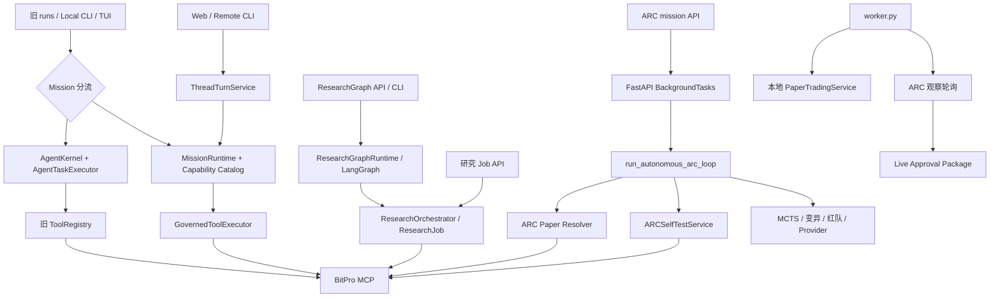
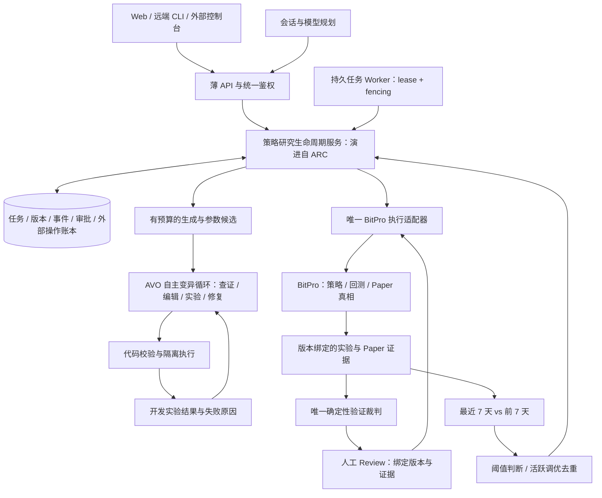

# 61 策略研究闭环：架构梳理与删减建议

> 日期：2026-09-09。状态：**产品所有者已批准，按统一研究闭环合同分批实施**。
> 本文记录产品边界与迁移方案；用户已授权删除无用实现，仍有调用的路径先迁移再删除。第一批四个实验模块及其专属测试已退役，其他条目未据此宣告完成。
> 代码基线：`origin/main@1d9c8636ab9b69ae40a6bafd8a451765da7d59d1`。工作目录中的 5 个未提交代码/测试文件不纳入交付基线。
> 当前代码与基线的业务差异已核对；本次不启动真实回测、Paper、模型调用或实盘动作。

## 1. 结论与建议

**保留现有可用基础，收敛控制权，不重写一套新框架。**

补充产品要求：引入 **AVO（Agentic Variation Operators）式自主研究与进化**，使 Agent 能根据版本历史、知识与实验反馈自主提出、修复和验证候选，而非仅执行固定参数扫描。这里演化的是策略候选和可审计的研究经验，不是运行时权限或审批规则。AVO 在现有 ARC 领域服务内部运行，不新增一套独立持久化控制器；详见第 5.1 节。

目前混乱的根源不是用了哪家模型，而是不同阶段留下的控制循环、业务真相、审批与验收口径同时存在，旧设计没有退出机制。加入 MCTS、角色委员会或通用 Agent 抽象，不能补上人工审批和模拟盘反馈缺口。

建议选择下面这条主线：

**用户目标 → 候选策略版本 → BitPro 真实回测 → 确定性验证 → 人工 Review → BitPro 模拟盘 → 7 日衰减检测 → 新版本调参回测 → 再次 Review → 新旧并行模拟。**

建议分四类处理：

- **保留并强化**：BitPro 适配器、Provider 抽象、代码验证与隔离、版本/证据账本、任务持久化、审批与副作用对账、可观测性。
- **合并后删除旧实现**：多套研究调度、多个回测裁判、多个 Paper 创建口、多套上下文/工具治理。
- **从第一阶段主线移除，保留历史**：Live、组合配置、World Model 情景决策、多角色研究机构、多个本地客户端执行内核。
- **第一批删除候选**：未接入运行链路、仅被测试引用的 ARC 组合共进化、实验 Canary Vault、向量筛选和微观结构函数。删除前仍需验证动态加载与外部引用。

**不建议整目录删除 `runtime/`、`research/`、`agent/` 或 `arc/`。** 这些目录混合了有用基础、当前主链路和历史兼容实现，按目录切容易误删。

## 2. 已确认的产品边界

以下由本轮产品讨论确认，优先于早期“自动上 Paper 后等待 Live 审批”的路线：

| 项目 | 第一阶段规则 |
| --- | --- |
| 验收目标 | 真实、可恢复地完成闭环；是否找到有效策略留到后续研究质量阶段 |
| 首次 Paper | 候选通过真实回测后，必须人工 review 批准，才允许启动 |
| 自动调优触发 | 同一策略最近 7 天对比前 7 天的模拟盘表现 |
| 触发条件 | 收益率下降 ≥10 个百分点，或最大回撤扩大 ≥10 个百分点；任意一项成立 |
| 阈值 | 默认 10 个百分点，可配置；不是相对变化 10% |
| 调优期间 | 原策略继续运行，不修改、不暂停、不重置原策略及其历史 |
| 调优后的候选 | 自动重新回测，通过后再次人工 review |
| 批准后的运行 | 新版本另开模拟盘，与原版本并行对比 |
| 重复任务 | 同一原策略已有调优任务或候选待 review 时，不重复触发 |
| 验证门槛 | 系统提供可配置默认值；一轮实验开始时冻结，不由模型看结果后改门槛 |
| Live | 不属于本阶段；不能因为已有实盘设计而把它塞进闭环 |

前轮提出的默认回测方案为：180 天窗口、最后 60 天保留样本外；样本外净收益 >0、最大回撤 ≤20%、完成交易 ≥30 笔，成本/数据完整、数值有效。调优候选须同窗口同成本比较，至少改善收益或回撤之一且另一项不恶化。这是**待实施的默认配置，不是现有能力或策略有效性证明**。历史太短、样本不足应明确失败，不自动降门槛；样本外一旦揭示，不得继续拿同一窗口调参并宣称新的独立验证。

## 3. 当前真实架构：有五类执行路径

这张图表达代码里的可达路径，不表示所有功能在生产同时启用。启用状态由环境配置决定，本轮没有现场审计生产环境。

| 路径 | 当前职责与事实 | 建议 |
| --- | --- | --- |
| Thread / Mission | `runtime/application/thread_service.py` 管会话，`service.py` 管计划/步骤/完成；`worker.py:mission_worker_once` 有 SQL lease、heartbeat、fencing | 保留服务端会话与治理基础；聊天只能调用研究服务，不能另建交易生命周期 |
| AgentKernel / AgentTask | `main.py:create_run` 仍按 canary 分流；worker、CLI 仍导入旧内核 | 迁移有效能力后退役旧执行路径，历史只读 |
| ResearchGraph | 固定角色 DAG；API、worker、CLI 仍有入口，且可创建后续验证 Job | 停止新功能，迁移必要节点，移除第二套调度 |
| ResearchOrchestrator | 独立 ResearchJob 状态机，执行 BitPro 预检、策略创建、窗口矩阵与稳健性验证 | 保留窗口/证据/回测执行能力，改为主线步骤服务，不再独立拥有同一研究的状态 |
| ARC | 自己的 goal、budget、candidate、event、store；API 后台任务跑搜索，worker 单独轮询 Paper | 作为现有领域主线演进；从 HTTP router 提取服务、统一执行治理、补持久任务领取 |

还有本地 `paper/` 与 `backtest/engine.py`，以及 World Model、组合、Shadow 等旁路。它们不是 BitPro 同一事实的另一种展示，而包含独立模型或执行逻辑，必须明确退出主线或限定用途。

## 4. 关键断点：优先处理，而非先换模型

### 4.1 审批位置与目标冲突

`arc/router.py:create_arc_mission` 将 `paper_preauth_approved` 转成授权；`run_autonomous_arc_loop` 在回测通过后直接调用 Paper resolver。`arc/observation.py:observe_mission` 在观察窗完成后生成 `live_approval_ready`。

这条链路应改为“**具体候选和回测证据绑定的 Paper 审批 → Paper 长期观察 → 参数研究触发**”。不能把旧 Live 按钮改名为 Paper 就算完成：审批绑定对象、动作权限、状态迁移和外部调用都不同。

### 4.2 持久化不等于研究任务能自动恢复

`arc/store.py` 已实现持久投影、revision 检查与行级串行提交，这些应保留。但是 ARC 研究由 `BackgroundTasks.add_task` 启动；当前 worker 的 ARC 工作是观察 `paper_observing`，没有在该调度入口看到领取中断研究任务的机制。

因此可以说“状态可加载”，不能据此承诺“进程崩溃后研究自动续跑”。迁移要复用现有 lease/fencing 的设计，并验证已派发外部操作的对账；不可仅在启动时把所有非终态任务重新跑一遍。

### 4.3 多个验证裁判口径不一致

- `arc/self_test.py:apply_success_criteria` 接受普通汇总回测指标作为 `min_oos_*` 判断；`run` 固定最近 90 天。
- ARC router 的本地预筛检查 `ranking_basis=out_of_sample`，但这不能证明后续 BitPro 结果同样来自冻结的样本外窗口。
- `research/validation.py:ValidationGate` 是另一套门禁。
- `research/validation_v2.py` 有锁定 OOS、试验次数、purge/embargo、成本、资金费、压力等更完整规则，但不能因它存在就声称当前 ARC 全部强制执行。

**建议保留一个版本化 ValidationPolicy 和 Decision，所有入 Paper 路径只接受该裁决。** 保留 V2 的规则实现，复杂研究质量规则可按明确 policy 分阶段启用；数据来源、代码版本、成本、数值有效性、审批绑定不能成为可随意关闭的选项。

前轮本地已复现：四项指标均为 `"NaN"` 时 ARC 裁判返回 `(True, [])`。这是输入有效性缺陷，不能因第一阶段不考核收益而保留。需要补有限数值检查和反例测试。

### 4.4 多个 Paper 执行口不能直接拼接

同时存在 `arc/incubation.py`、`research/paper_promotion.py`、`research/paper_incubation.py` 和本地 `paper/service.py`。

其中 `PaperPromotionService.approve` 虽已有人工审批，但 `paper_instance_id` 缺失时会回退到 `strategy_id`，随后启动；不能原样作为新主线。应复用审批审计与幂等思路，执行统一走一个严格适配器：只承认实际返回且对账一致的实例 ID，未知结果进入对账状态，不推测成功。

`AutonomousPaperIncubationService` 有 mandate/effect/reconcile 能力值得提取，但自动动作与多观察窗设计不能覆盖本轮“每个版本人工批准、原实例继续运行”的规则。

### 4.5 优化反馈尚未接上

当前 `evolution_readiness.py` 会全库读取 StrategyVersion，并统计这些版本的 Outcome，版本链归属不够严格。活动 Handoff 合同也仍记录 legacy 证据与 lineage 前置缺口。

此外 worker 在 `full_mission_cutover` 时不启动旧 `research_trigger_loop`；仅有一个 ResearchTriggerService 不能证明 ARC 的自动优化已启动。需要显式接入“BitPro Paper 序列 → 7+7 窗口 → 防重复调优任务 → Challenger 回测 → 人工 Review”。

## 5. 建议的目标架构：一个领域生命周期，复用基础设施

### 控制权必须写清楚

- **Thread/Turn** 只拥有交互记录；“对话回答完成”不等于“策略研究完成”。
- **领域生命周期服务** 拥有策略研究状态与候选晋级规则，优先从 ARC 抽取，避免新建第三套控制器。
- **Mission/runtime 基础** 提供任务领取、预算、工具治理、上下文与审计等可复用能力。若通过 Mission 触发 ARC，Mission 只记录启动/查询结果和关联 ID，不能同时推进相同候选的审批/Paper 状态。
- **Worker** 执行持久任务，不拥有第二份业务状态；运行租约和业务聚合可以是不同记录，但状态职责不重叠。
- **BitPro** 拥有策略运行、回测和 Paper 订单/成交/权益；HyperTrade 保留带版本与来源引用的研究证据，不维护另一份交易真相。
- **LLM** 提出假设、代码/参数和解释；阈值、权限、状态迁移、比较与去重由确定性代码执行。

**为什么不直接全迁到 MissionRuntime？** 它已经有治理和 lease 优势，但当前领域研究主要在 ARC，强行整体迁移会同时改候选、历史事件、审批和前端。先让 ARC 变成清晰的领域服务，再复用 runtime 基础设施，范围更可控。目标是一个业务状态机，而不是强迫每张表都叫 Mission。

### 5.1 AVO：自主研究内循环，而非另一套框架

依据 [AVO 原论文](https://arxiv.org/abs/2603.24517)，其核心是用自主 coding agent 承担变异算子，结合 lineage、领域知识与执行反馈完成提出、修复、批判与验证。论文实验针对 GPU kernel 优化，不能据此推断它能发现盈利策略。HyperTrade 的以下映射是本项目设计，不是论文对交易任务的验证。

| AVO 概念 | HyperTrade 映射 | 权威来源 |
| --- | --- | --- |
| Population / lineage | 不可变策略版本、父版本、参数差异、失败与淘汰候选 | StrategyVersion、实验与 Outcome 账本 |
| Knowledge | 策略接口、因子/成本知识、历史失败证据及适用市场条件 | 有来源、版本与有效期的知识条目 |
| Agentic variation | Agent 选择调查步骤、参数假设、代码编辑、开发回测和修复顺序 | 受限工具目录与可恢复子步骤 |
| Fitness / evaluation | 同数据窗口、同成本下的开发评价与独立最终验证 | 确定性验证服务及 BitPro 真实结果 |
| Selection / archive | 保留、淘汰、待数据，保存所有尝试与谱系；入 Paper 另经人审 | 版本化裁决和审批记录 |

**内循环**：读取目标与父版本 → 核对新鲜运行证据 → 提出可证伪解释 → 选择参数变更 → 沙箱校验 → 开发回测 → 分析结果/修复 → 保留或淘汰 → 在预算内继续。它可以多次调用工具，不能仅把固定模板参数填充包装成“AVO”。

**外循环**：生成新候选或 Paper 衰减触发 → 启动一次有预算的内循环 → 冻结候选 → 独立最终验证 → 人工 Review → 新实例并行 Paper → 继续积累运行证据。原版本持续运行；每一轮优化是新任务，不能覆盖旧任务/版本。

两个循环复用同一套事件、预算、外部操作账本与取消机制。AVO 的开发实验经统一 BitPro 实验端口执行，不能新建另一份成本模型或直接操作 BitPro 数据库。

实施边界：

1. 第一阶段由 Agent 自主选择研究步骤，针对已有策略的变更限于声明的参数范围；结构变异、规则重组与新因子演化保留接口、后续单独激活。首次策略生成仍可从目标形成新候选。这既保留 AVO 的自主试验能力，也不把“参数调优”扩成无限改策略。
2. 模型不能修改成功门槛、独立验证代码、Paper 审批、资本配置、工具权限或 HyperTrade 自身源码；不能直接替换原模拟盘版本。
3. 开发数据反馈可用于反复迭代；冻结样本外只能用于最终裁决。读取后记录污染边界，不能将其详细反馈输入下一轮再声称同一窗口是独立 OOS。
4. 参数、数据/成本哈希、Provider/model、工具调用、预算消耗、失败原因和父子版本关系全部入账。工具返回须绑定本次请求/版本，超时后不能读旧结果当新反馈。
5. 预算耗尽、重复候选、长期无进展、缺数据或副作用未知时明确终止/等待；不能为维持“自主进化”无限重试。停滞策略与预算值在实施合同中配置。
6. 研究知识可以追加为“待验证经验”，附支持和反例；晋级为可复用知识须独立验证，不把一次回测的解释自动变成稳定规律。

与既有模块的关系：`provider_hypothesis.py` 负责单次结构化提案，尚不等于 AVO；`mutation.py`、`reflexion.py`、codegen、sandbox、版本账本和工具治理作为实现材料保留。MCTS 是外层候选选择的一种可选方法，不是 AVO 必需条件；不因引入 AVO 重新激活 Live、组合或所有历史高级模块。

**AVO 接入验收**：至少展示一次真实模型驱动的“读反馈 → 改候选 → 再实验”轨迹，所有调用和结果可追溯；固定模板或 deterministic fallback 明确标记，不计为自主模型试验。并验证中断恢复不重复外部操作、无改门槛/越权行为、候选进入 Paper 前必经人审。是否优于简单搜索作为后续同预算对照实验，不与第一阶段接线验收混为一谈。

这修正初稿中只强调清理旧模块的倾向：**先把策略版本、AVO 研究、独立验证、审批、运行反馈接成主线，再退役被替代的调度路径。** 四个孤立实验模块仍可独立清理，但不是闭环的核心交付。

### 生命周期建议

一轮研究任务：`queued → generating → backtesting → validating → awaiting_review → provisioning_paper → completed`；失败、拒绝、取消、预算耗尽与 `effect_unknown` 独立记录。

Paper 实例：长期 `observing`，不因研究任务完成而结束。表现恶化创建新的优化任务，引用 `parent_strategy_version_id` 和触发窗口；不得把原任务反复重置到 generating。

批准必须绑定策略内容哈希、参数版本、回测/验证引用和 Paper 配置；任何变更使旧批准失效。审批后创建新实例，不原地更新旧策略。执行成功后关闭本轮活跃调优标记；拒绝/失败后何时允许新一轮，使用已消费窗口标记或冷却策略，避免每天用同一原因反复创建任务。这是待实施建议，不是用户已确定的冷却数值。

### 7+7 比较口径建议

使用固定时区、完整日、半开窗口：`[T-7d,T)` 对比 `[T-14d,T-7d)`，建议每天在完整数据到齐后计算。每个 Paper 实例分别计算，不把运行时间不足 14 天的新版本与原版拼接。

收益采用剔除充值/提现影响、包含费用和未实现盈亏的权益收益；回撤采用各窗口内权益曲线重新计算的正数回撤幅度，不能相减两个“自启动以来最大回撤”。原始金额 `pnl` 不能当作收益率。

若前后收益为 `R_prev/R_now`，回撤为 `D_prev/D_now`，触发条件为：`R_prev - R_now >= 0.10 OR D_now - D_prev >= 0.10`。样本/权益覆盖不足、断流、重置或异常现金流未解释时输出 `needs_data`，不触发调优；真实“有覆盖但没有成交”与“没有数据”必须区分。

## 6. 保留 / 合并 / 删除矩阵

“删除候选”意味着可以优先立项移除，不表示本次已删；“冻结”意味着本阶段不增加能力，也不接入主线。

| 模块或设计 | 建议 | 理由及退出条件 |
| --- | --- | --- |
| `bitpro/mcp.py` 与稳定平台合同 | 保留、统一入口 | 真实数据/回测/Paper 依赖；执行结果不能伪造，生产契约需另行核验 |
| `providers/` | 保留 | 模型可切换是合理边界，不为不同模型各留一套调度器；第一版验收一个真实 Provider |
| `arc/controller.py` / `store.py` / 证据视图 | 保留、演进 | 已有候选、状态和持久性资产；补租约与恢复，不清历史 |
| `runtime/` 的 Thread、lease、catalog、effect、context、completion | 保留、按职责复用 | 不能因目录大而丢掉安全和持久基础；审批不再多头拥有 |
| `research/` 的 codegen、版本/实验/Outcome 账本 | 保留、修复关联 | 闭环审计与新旧版本比较必须依赖；先修目标策略 join |
| `research/validation*.py` + ARC self-test 裁判 | 合并 | 一个 policy/decision；self-test 只负责实验请求和结果规范化 |
| 三个外部 Paper 编排实现 | 合并 | 提取审批、幂等和对账，只有一个创建/启动路径；不要照搬实例 ID 回退 |
| `AgentKernel` / `AgentTaskExecutor` | 迁移后删除执行分支 | API、worker、CLI、TUI 仍引用；先搬唯一能力、停止新建旧 Task，再保留历史只读 |
| `ResearchGraphRuntime`、固定角色 DAG | 迁移后删除 | 与领域主线重复；保留需要的工具和验证步骤，再退出 graph API/CLI/worker |
| `ResearchOrchestrator` 的独立 Job 调度 | 降级为步骤服务后合并 | 回测窗口/证据逻辑有用，独立生命周期重复 |
| `agent/harness_v2.py`、多套工具/上下文治理 | 合并 | 内存锁不能承担跨进程写幂等；保留有价值的限流/输出裁剪，权威治理归一 |
| `arc/mcts.py` | 保留实现，第一阶段简化调用并冻结扩张 | 已被 router 真实引用，不能称死代码。建议有界候选队列先完成闭环；若替换，先证明预算/候选/失败事件语义不变 |
| `arc/adversarial.py` / `mutation.py` / `reflexion.py` | 保留基础检查、参数变异和失败原因 | 不把红蓝角色数量、因果命名当效果证明；高级搜索/结构变异后置 |
| `arc/skills.py` 与自动技能蒸馏 | 从关键路径降为可选，冻结新增 | router 已使用；技能提取不应阻塞审批，生成片段不可绕过校验 |
| `arc/portfolio.py` | 优先删除候选 | 文件已标 FROZEN，静态扫描只有对应测试导入；单策略闭环不需要组合共进化 |
| `arc/canary_vault.py` | 优先删除候选 | 已标 FROZEN，只有测试导入；与 `risk/canary.py` 不是同一实现，禁止顺手一起删 |
| `arc/vector_screening.py` / `microstructure.py` | 优先删除或移到独立实验区 | 本次静态扫描仅测试导入；没有第一阶段调用需求，不为“未来可能用”维护产品承诺 |
| `arc/live_approval.py` / `live_promote.py` | 从主线解绑，之后评估删除 | 与 observation/router 实际相连，不是死代码；保留禁止 Live 的权限/测试，移除业务动作须检查外部控制台 |
| `risk/`、`execution/` 的 Live/Testnet 能力 | 冻结非必要执行面 | 风控与鉴权不可一起删；拒绝主网工具的边界必须保留 |
| 本地 `paper/`、`backtest/engine.py` | 从产品主线退出，再按依赖删除 | 与 BitPro 职责重叠；本地 Paper worker 默认开关为 true，应先核对生产启用和既有记录 |
| `backtest/candidate.py` | 暂留为可选预筛 | ARC 当前依赖；永远标 `prefilter_only`，不得作为晋级真相；没有性能收益证据时可后续移除 |
| World Model / Shadow / Regime / 组合调度 | 从第一阶段 UI/任务目录冻结或隐藏 | 有实际 endpoint/工具，不应标死代码；不参与 7+7 参数反馈的部分后置 |
| RAG / Memory | 保留一个可审计接口，冻结多级智能记忆扩张 | 研究结果权威在结构化账本；摘要、向量检索不能决定批准或取代原始证据 |
| Supervisor / 多角色研究机构 / 通用程序合成路线 | 冻结 | 不属于当前闭环验收；不因为设计文档存在而要求实现 |
| Web / Remote CLI | 保留为主入口 | 投影同一服务端任务；外部 ARC API 合同需保持兼容或明确版本化 |
| 本地 CLI / TUI / Desktop 的独立执行分支 | 先停功能扩张，再收敛为远端客户端 | 不同时重写多个 UI；确认用户是否仍用，先迁移命令再删依赖 |
| Flight Recorder / 真实端到端与故障测试 | 保留 | 可减少花哨可视化，不能删源引用、调用结果、失败与恢复证据 |

## 7. 依赖分析与“可删”的证据边界

本轮使用 GitNexus 并用当前源码交叉核对：

| 对象 | 工具结果 | 当前源码补充 | 结论 |
| --- | --- | --- | --- |
| AgentKernel | upstream：5 个直接影响项，6 个总影响项，MEDIUM | API、worker、CLI 等仍引用；当前目录还有用户未提交修改 | 不能直接删，待迁移 |
| ResearchGraphRuntime | upstream：3 个直接导入、4 个总影响项，LOW | main、worker、CLI 直接，TUI 间接；不是零调用 | 工具 LOW 不代表业务低风险，先退出入口 |
| ARC MCTS / Canary 类 | 工具返回 not found / UNKNOWN | 源码实际存在；MCTS 被 router 导入，Canary 只见测试引用 | 索引覆盖不足，不以零结果证明无依赖 |
| 4 个实验文件 | Python AST 对 backend/tests 的导入扫描 | portfolio 1 个测试文件；canary 2 个；microstructure/vector 各 1 个 | 是删除候选，尚未证明外部 import 或动态加载不存在 |

GitNexus 返回的 execution-flow 数为 0 不能理解为没有影响；索引对 ARC 覆盖有缺口。正式删除前须在实施基线刷新索引，并补充字符串注册、CLI、部署、外部 API 消费方与序列化历史检查。本次未为了文档改动重建整个索引。

基线存在三个集中过大的装配点：`main.py` 3455 行、`arc/router.py` 863 行、`frontend/src/App.tsx` 4420 行。它们说明职责集中，但不是单独的删代码理由。优先把研究循环从 router 移出、按业务拆 API 装配；暂不为了整洁全量重写 UI。

## 8. 分批实施建议

| 批次 | 做什么 | 完成证据 | 不可越过的边界 |
| --- | --- | --- | --- |
| 0：本次 | 文档、现状、取舍与新目标对齐 | 审阅清单可定位代码；提案和现状分开 | 不删业务代码、不改变生产流程 |
| 1：移除实验与错误承诺 | 确认后移除 4 个仅测试引用的实验模块；保留 Git 历史；撤掉 SOTA/通用进化已完成的声明 | 无运行引用；相关测试调整后完整检查通过 | 保留禁止 Live 的安全回归，不把删除测试当修复 |
| 2：统一主流程 | ARC loop 提取为服务，持久 worker 接手；统一外部操作账本；回测后进入 Paper review | 重启续跑、重试不重复创建、未经批准零 Paper 写入 | 保留旧任务/实例，未知操作先对账 |
| 3：统一裁判与首轮 Paper | 合并验证入口；有限数值/成本/OOS 证据；审批绑定版本后真实创建 Paper | 自然语言目标到人工批准、真实实例 ID 与快照完整链 | 不通过放宽门槛、fixture 或伪造 ID 凑通过 |
| 4：反馈与再审批 | 7+7 窗口、OR 阈值、锁/窗口消费标记、参数候选、双侧回测、新旧并行 | A 原实例连续运行；B 独立版本经再审批后启动；重复触发只有一个任务 | 不原地改 A，不重复用揭示样本外优化 |
| 5：退役旧运行时 | 按已迁移能力删除 Kernel/Graph/独立 Job 调度和本地 Paper 产品入口 | 默认 Web/CLI/外部控制台只走统一主线；旧历史可读 | 不做全库数据清理、表级删除或客户端突然断约 |

每批是独立、可回退的逻辑变更，执行项目要求的影响分析、测试、提交及部署验证。删除代码后的回滚优先回退版本与路由，不重建或清空 Paper 账本。数据表删除另行立项，不能夹带在架构删减中。

## 9. 验收：闭环成功与研究成功分开

第一阶段至少需要一条真实正向闭环：真实 Provider → 策略版本 → 真实 BitPro 回测 → 人工批准 → Paper 真实实例 → 真实历史窗口 → 调优回测 → 再批准 → 新旧实例并行。受控阈值可以在任务开始前配置并记录，但不能看完结果再调低以宣告成功。

另需证明这些失败分支正确：没有候选达标、样本不足、用户拒绝、预算耗尽、模型不可用、回测超时且结果未知、worker 重启、重复审批、策略版本变化使审批失效、已有调优时再触发。失败诚实结束也属于闭环能力，但**只有拒绝分支不能替代正向验收**。

功能回归可使用固定数据和替身；生产验收必须标明真实调用及来源，不能把测试中构造的恶化窗口当真实模拟盘积累。策略有效性、稳定盈利、MCTS 优于简单搜索和多模型优劣属于后续评测。

预算上限、每天比较时刻、任务失败后的冷却期、最小 Paper 样本和人审超时尚需实施合同确定；本文不擅自把具体值写成用户已批准规则。没有这些配置时应显示待配置或采用显式、版本化默认，不能无限搜索。

## 10. 建议用户审阅的四个取舍

1. **建议同意**：保留 ARC 领域主线，复用 runtime 基础；不另造控制器，不一口气重写全部到 MissionRuntime。
   ARC 内部以 AVO 自主变异循环承接研究；策略版本及其证据链是长期业务主线，Mission 只承载一轮工作。
2. **建议同意**：第一批移除 4 个实验模块；Live、组合、World Model 高级决策和多角色研究暂时退出本阶段。
3. **建议同意但分批做**：旧 Kernel/Graph、本地 Paper、重复审批与裁判，在功能迁移和历史兼容完成后删除。
4. **建议暂缓**：MCTS、预筛引擎、技能库和 RAG/Memory 整体删除。它们部分已被调用；先从强制关键路径解耦，再按真实收益决定去留。

## 11. 证据导航与历史设计关系

- [现有系统架构](33-system-architecture.md)：历史运行时地图，日期较早，不能替代本文代码快照。
- [下一代运行时审计](34-next-generation-agent-runtime-audit-and-target-design.md)：多协议问题的历史来源。
- [M0 研究闭环](36-goal-driven-autonomous-research-loop-m0.md)：保留真实证据与预算原则；Paper 预授权自动启动的优先级被本轮逐版本人审取代。
- [当前演化 Handoff 合同](../contracts/user-directed-strategy-evolution-handoff.md)：保留同口径与版本原则；实施前需按本轮 Paper 来源、7+7 触发和双审批规则重定范围。
- [ARC 外部控制台合同](60-arc-external-console-integration.md)：正式移除 API 或改状态前必须检查消费方。
- 源码主入口：[main.py](../../backend/src/hypertrade/main.py)、[worker.py](../../backend/src/hypertrade/worker.py)、[ARC router](../../backend/src/hypertrade/arc/router.py)。
- 关键服务：[ARC self-test](../../backend/src/hypertrade/arc/self_test.py)、[V2 验证](../../backend/src/hypertrade/research/validation_v2.py)、[Paper 审批](../../backend/src/hypertrade/research/paper_promotion.py)、[Paper 观察](../../backend/src/hypertrade/arc/observation.py)、[版本就绪](../../backend/src/hypertrade/research/evolution_readiness.py)。

历史架构 21–60 中的“Active”“SOTA”“Production”不能自动作为本阶段要求。文档不要全部物理删除：保留来源与设计原因，逐步标记已取代/冻结，并让 README/spec 只指向一份当前主线。此次仅新增审阅入口，不宣称全部历史文档已清理。
