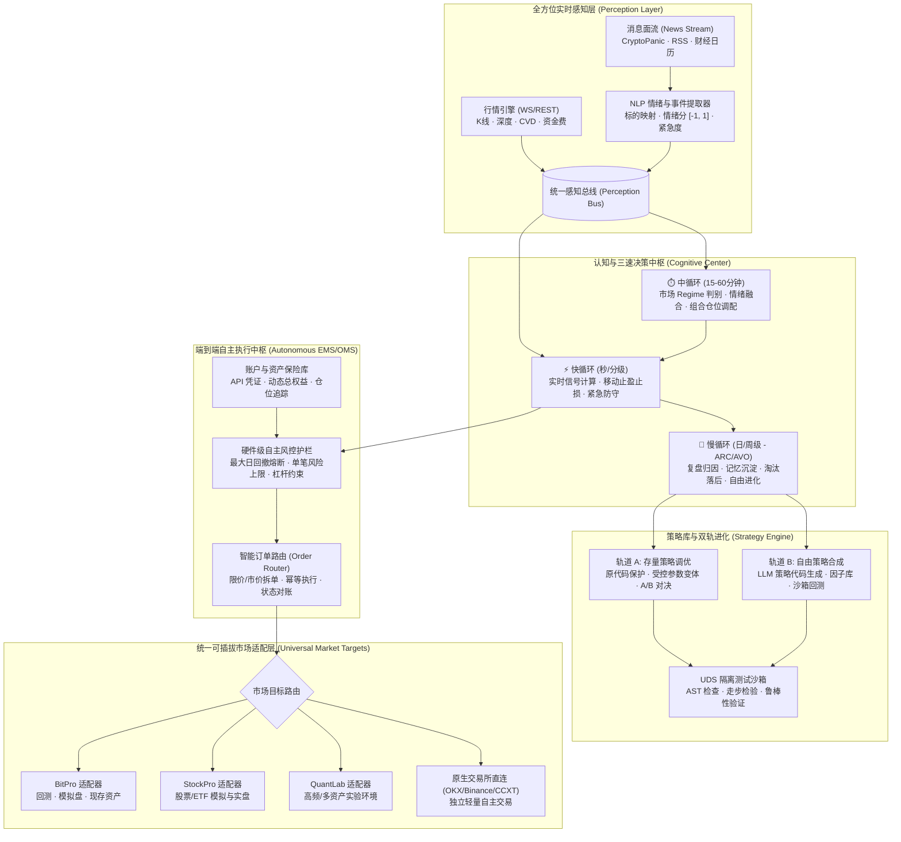

# 64 全自主量化交易 Agent 架构设计：端到端感知、自进化与受控实盘中枢

> 状态：设计与实施标准（2026-09-30）。
> 目标：将 HyperTrade 从“离线策略参数微调与过度防卫的审计系统”，升级为“具备实时全方位感知、支持自由策略代码进化、拥有自主下单执行力、极少或无需人工干预的真正自主交易智能体（Autonomous Trading Agent）”。

---

## 1. 战略定位与范式转移 (Paradigm Shift)

### 1.1 现状诊断与核心矛盾
HyperTrade 既有架构在工程治理、幂等性、审计溯源（Provenance）和沙箱隔离方面达到了企业银行级水平。但由于前期的过度防御性设计，系统产生了三大硬伤：
1. **执行层硬闭锁**：`RiskEngine` 与 `live` 模块硬编码了对非测试网的拦截（`mainnet execution is forbidden`），且所有订单必须等待人类点击 Approve，无法做到“给它一个账户就能自己交易”。
2. **感知层虚设**：市场情报仅能读取离线资金费与本地静态 Markdown 文件，完全缺乏实时新闻流、宏观财经日历、社交舆情与即时 NLP 结构化分析。
3. **进化层局限**：策略代码生成被死死锁在 7 个预设的技术指标模板内，所谓的“自进化”仅是每小时对比 14 天收益并在沙箱中对 1~2 个均线数字进行微调，缺乏真正的 Alpha 自由创造能力。

### 1.2 核心愿景与演进原则
新架构的目标是打造一个**受控自主（Bounded Autonomous）的全能型交易智能体**：
* **账户自驱**：提供交易账户与凭证后，Agent 能自主接入交易环境，执行生命周期完整的交易闭环。
* **真感知**：自己获取实时 K 线行情、实时微观订单流，并自动抓取消息面（新闻、公告、舆情），通过结构化打分器提炼交易信号。
* **自由代码与双轨进化**：
  * **轨道 A（存量保护与调优）**：100% 兼容保留生产运行策略（Spec 008 / `source_variant_policy`）的原逻辑、原代码与受控参数调优。
  * **轨道 B（自由创造 True Alpha）**：允许 LLM 摆脱 7 个指标模板的束缚，利用标准因子库与抽象层自由编写并合成 Python 策略代码，经 AST 静态门禁与沙箱动态压力测试后自主上线。
* **三速协同闭环**：分离秒级快循环（执行与止损）、小时级中循环（Regime 识别与仓位自适应）和天级慢循环（复盘与自进化）。
* **多市场统一适配**：解耦对单一平台的强依赖，通过统一端口无缝接入 BitPro、StockPro、QuantLab 或原生交易所 API（OKX/Binance 等）。

---

## 2. 总体架构拓扑 (Overall Architecture)



---

## 3. 核心分层详细设计

### 3.1 支柱一：全方位实时信息感知层（Perception Layer）
传统的策略仅依赖滞后的闭合 K 线，无法对突发黑天鹅或宏观利好作出敏捷反应。感知层建立在统一的 `PerceptionBus` 之上：

1. **多源消息流摄入 (`NewsIngestionService`)**：
   - 接入结构化与半结构化新闻源（CryptoPanic API、Bloomberg/Reuters RSS、Twitter/X 重点舆情、宏观经济事件日历）。
   - 实现去重（MD5/SHA256 签名）、时效性衰减过滤（超过 2 小时的新闻降权）。
2. **结构化情绪分析器 (`NewsSentimentAnalyzer`)**：
   - 输入：新闻标题、正文摘要、发布时间戳、来源等级。
   - 处理：由快速轻量大模型或本地 NLP 规则引擎进行秒级分析，输出严格 JSON Schema：
     * `affected_symbols`: 关联标的列表（如 `["BTC-USDT", "ETH-USDT"]`，支持全局宏观识别 `["*"]`）。
     * `sentiment_score`: 连续数值 `[-1.0, 1.0]`，负为利空，正为利好。
     * `event_category`: 事件分类（`regulatory`, `exploit_hack`, `macro_rates`, `partnership_listing`, `whale_movement`, `general_market`）。
     * `urgency`: 紧急程度（`breaking`, `high`, `normal`, `low`）。
     * `confidence`: 置信度 `[0.0, 1.0]`。
3. **技术面与订单流聚合**：
   - 聚合多周期 K 线趋势（1m, 5m, 15m, 1h, 4h, 1d）。
   - 聚合衍生品指标（实时资金费率预测、未平仓合约 OI 变动率、主动买卖盘 CVD 差值）。
4. **工具化暴露**：
   - 为 Agent 运行时注册标准工具：`perception_snapshot`（全局感知全景）、`news_stream_query`（查最新新闻与情绪）、`market_microstructure`（查资金费与微观结构）。

### 3.2 支柱二：端到端自主执行中枢（Autonomous Execution Engine）
彻底打破“每笔下单必须人工 Approve”的死穴，引入**受限授权模式（Bounded Autonomy）**：

1. **运行模式双轨制**：
   - `SUPERVISED`（监督模式）：保留现有逻辑，写操作全部生成 `pending_approval` 凭证，等待人工确认。
   - `AUTONOMOUS`（全自主模式）：在预先审批的操作员授权契约（Mandate）内，Agent 拥有绝对下单权力，无需人工介入。
2. **硬件级风控熔断器 (`AutonomousRiskGuard`)**：
   - 在自主模式下，Agent 并不是无拘无束的脱缰野马，而是被严密的数学硬边界包围：
     * **账户资金硬隔离**：Agent 只能操作分配给它的子账户或受限资金池（例如 1,000 USDT）。
     * **单笔最大风险约束**：单笔名义价值不得超过账户总权益的 $X\%$，单笔预估止损不得超过总资产的 $Y\%$。
     * **日内最大亏损熔断（Daily Loss Circuit Breaker）**：如果日内净亏损达到阈值（如 $3\%$），触发硬件熔断：立即撤销全部活动挂单、按预设逻辑市价平仓或对冲锁仓、将系统状态强制置为 `CIRCUIT_BROKEN`，并向飞书/钉钉等紧急通道推送信令。
     * **流动性与滑点防护**：大额订单强制分批挂单（TWAP/VWAP），禁止在买一卖一价差过大时强行吃单。
3. **原生订单执行管理器 (`AutonomousExecutionManager`)**：
   - 提供标准化的 `submit_order`、`cancel_order`、`update_stops` 接口，支持原生对接交易平台或直连交易所，具备幂等哈希验证与写前意图锁（Write-ahead Intent）。

### 3.3 支柱三：双轨制策略引擎与真实代码进化（Dual-Track Strategy Hub）
策略的生命力在于 Alpha 的推陈出新与优胜劣汰：

1. **轨道 A：存量策略的原逻辑参数调优与 A/B 对决（100% 保持现有能力）**：
   - 严格继承现有 `source_variant_policy`、`StrategyResearchVariantPolicy` 与 Spec 008/011 规范。
   - 保留 Native 类与 DB 完整脚本的不可变来源哈希。
   - 通过 7+7 同窗对比判定退化，生成受控参数变体，并在模拟盘与母策略进行实时 A/B 对决（Twin Family Card / Fork Relay）。
2. **轨道 B：超越 7 个模板的自由代码生成与演化（True Alpha Synthesis）**：
   - **解绑限制**：废除“模型只能在 7 个写死技术指标模板中二选一”的硬编码，引入通用策略合成器 `FreeformStrategySynthesizer`。
   - **基础构件与因子库注入**：为模型提供丰富的经过沙箱安全检验的标准量化算子库（趋势、通道、均值回归、微观动量、波动率套利、网格做市、情绪驱动等）。
   - **AST 语法与安全扫描**：允许 LLM 编写继承自 `BaseStrategy` 的自由 Python 策略代码。代码必须通过严格的 AST 白名单扫描（禁止网络、文件、动态执行和凭据读取）。
   - **动态沙箱自测与压力检验**：通过 UDS 隔离沙箱进行快速历史数据回测（Backtrader 驱动），检验过拟合指标（样本外收益比、最大回撤、交易笔数充沛度）。检验合格的策略被编译为不可变策略卡（StrategyCard）存入策略池。

### 3.4 支柱四：三速自主闭环架构（Three-Speed Continuous Loop）
真正的自主交易员不能只靠每小时跑一次的离线脚本，必须具备层次分明的反应速度：

| 循环层级 | 运行频率 | 核心职责 | 输入与依赖 |
| :--- | :--- | :--- | :--- |
| **快循环 (Fast Loop)** | 500ms ~ 5s | **微观信号计算与指令执行**：实时监控即时行情与突发新闻打分，驱动运行中策略计算买卖信号；执行开仓、平仓、移动止盈止损与紧急滑点防守。 | 实时 WS 行情、感知总线突发事件、本地激活策略实例。 |
| **中循环 (Medium Loop)** | 15m ~ 1h | **市场状态判别与动态仓位再平衡**：识别当前宏观环境（强趋势/震荡整理/高波恐慌/流动性枯竭）；动态分配各策略权重与最大允许杠杆；对冲多策略敞口。 | 多周期 K 线网格、衍生品持仓资金费、宏观情绪综合指数。 |
| **慢循环 (Slow Loop)** | 1d ~ 1w | **离线复盘、归因与自进化 (ARC/AVO)**：核对已结算交易的盈亏原因（Trade Attribution）；沉淀经验教训到长期记忆；淘汰长期衰减的策略；驱动 LLM 合成新策略。 | 历史执行账本、成交对账单、策略效果账本（Effectiveness Ledger）。 |

### 3.5 支柱五：通用多市场写端口与目标解耦（Universal Market Targets）
消除硬编码：
1. **重构市场目标写接口 (`MarketWritePort`)**：
   - 规定标准的写能力协议：
     * `validate_strategy(code, config) -> ValidationResult`
     * `deploy_strategy(strategy_spec) -> DeploymentReceipt`
     * `start_instance(strategy_id, capital, mode) -> InstanceHandle`
     * `stop_instance(instance_id) -> TerminationReceipt`
     * `place_order(account_id, order_intent) -> ExecutionReceipt`
2. **实现多目标适配器**：
   - `BitProAdapter`：实现现有模拟盘和回测能力的无缝封装。
   - `NativeExchangeAdapter`（以 OKX / Binance 为代表）：实现直接利用 API Key 接入交易所，支持无需三方平台的纯独立自主交易。
   - `StockProAdapter` / `QuantLabAdapter`：实现多市场接入的标准插槽。
3. **解除进化循环的单目标硬拦截**：
   - 改造 `EvolutionService.tick()`，根据配置的目标 ID 动态加载对应的 `MarketWritePort` 适配器，支持任何市场目标的自动化变体部署与再孵化。

---

## 4. 实施阶段与演进路径 (Milestones & Roadmap)

```
[Phase 1: 感知层构建] ──► [Phase 2: 自主执行引擎] ──► [Phase 3: 策略自由合成] ──► [Phase 4: 多目标与闭环跑通]
  * NewsIngestion        * AutonomousRiskGuard     * FreeformSynthesizer     * Universal MarketWritePort
  * SentimentAnalyzer    * ExecutionManager        * Enhanced Sandbox Gate   * Three-Speed Loop Orchestrator
  * PerceptionBus        * Bounded Live Mandate    * Dual-Track Evolution    * Full Pipeline Verification
```

### Phase 1: 实时消息面感知引擎（Perception Layer）
- 新建 `hypertrade.market.news` 模块，支持标准新闻源摄入与结构化缓存。
- 新建 `hypertrade.market.sentiment` 模块，提供结构化情绪分析器与事件分类模型。
- 升级 `MarketIntelligenceService`，将其从静态文件读取器改版为融合“技术指标 + 衍生品微观流 + 实时消息面情绪”的统一情报中枢。

### Phase 2: 端到端自主执行中枢（Autonomous Execution Engine）
- 扩展 `hypertrade.risk.service`，支持 `RiskExecutionMode.AUTONOMOUS`，提供日亏损熔断、单笔风险上限校验等硬防线。
- 新建 `hypertrade.live.autonomous` 模块，提供具备幂等重试、状态对账、免逐单审批的自主执行管理器。
- 扩展 Agent Kernel 工具集，注入 `autonomous_trade_execute`、`autonomous_trade_cancel` 等受治理的自主交易能力。

### Phase 3: 策略自由合成与双轨进化（True Alpha Synthesis）
- 扩展 `hypertrade.research.codegen`，在完全保留原 7 个家族与 Spec 008 原参数调优的前提下，引入自由代码合成器 `FreeformStrategySynthesizer`。
- 完善 UDS 沙箱的动态加载与 AST 语法自检能力，支持复杂指标组合、网格与事件驱动逻辑。
- 升级 AVO 进化循环，支持在参数微调之外，提出结构性代码变异假说。

### Phase 4: 多市场写端口打通与端到端闭环验证
- 完善 `hypertrade.targets.ports`，落地通用的 `MarketWritePort`。
- 移除 `evolution.py` 中对非 BitPro 目标的跳过限制，接入通用写端口。
- 编写端到端多场景集成测试（涵盖感知摄入、自主决策、自主执行、参数微调与自由代码生成）。
- 运行 `./scripts/check.sh` 确保 100% 测试通过，无 lint/mypy 错误。

---

## 5. 验收标准与治理红线

1. **零功能回退原则**：
   - 现有的 BitPro 回测、模拟盘孵化、原策略参数调优（Spec 008）、孪生变体 A/B 对决（Spec 011）必须 100% 保持兼容，原测试集不得被破坏。
2. **安全风控不可突破**：
   - 在自主交易模式下，日亏损硬熔断（Daily Loss Circuit Breaker）必须具备毫秒级反应与单向闭锁，任何异常情况下优先平仓降风险。
3. **真实性与不伪造事实**：
   - 新闻数据不可用时明确标为 `news_unavailable`，绝不可通过 LLM 伪造新闻内容；情绪打分置信度低时降级为中性，不触发激进交易。
