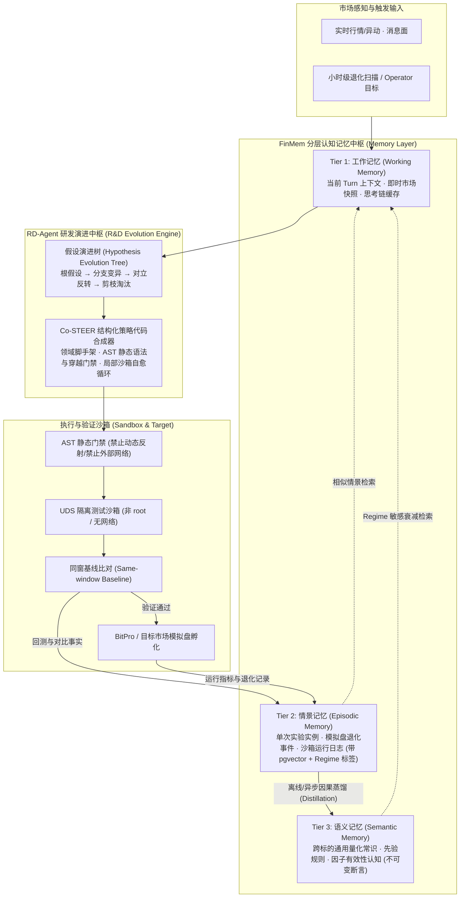
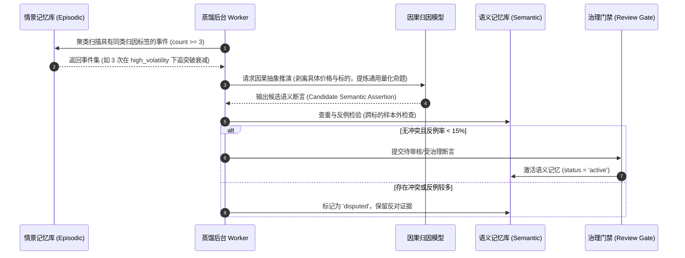

# 65 基于 RD-Agent 假设驱动演进与 FinMem 分层认知记忆的技术设计规范

> 状态：设计规范（Approved Design Specification）
> 日期：2026-10-04
> 目标：深度抽取 Microsoft **RD-Agent** 的“假设驱动演进树（Hypothesis Evolution Tree）与 Co-STEER 结构化代码自愈机制”，以及 **FinMem** 的“工作记忆-情景记忆-语义记忆三层认知记忆与经验蒸馏算法”，赋能 HyperTrade 的 ARC 自主研究循环、自由策略合成与自主进化引擎。

---

## 1. 设计背景与问题诊断

在 HyperTrade 现有架构中：
1. **ARC 研究循环（AVO）的假设生成缺乏结构化拓扑**：当前策略候选生成主要依赖单轮提示词抽样，缺乏对历史假设的“分支演进、血缘追踪与显式剪枝（Pruning）”，容易在相邻轮次中重复探索同质化的因子假说。
2. **代码生成缺少编译期前置约束与局部自愈**：大模型生成的策略代码偶发语法缺陷、维度不匹配或潜在的数据穿越（Lookahead Bias），只能等到进入重型沙箱回测报错后才被动感知，浪费了候选预算。
3. **长期记忆缺乏层级认知抽象**：虽然系统具备 `MemoryItem` 与 `MemoryAssertion` 治理体系，但未明确区分“即时运行上下文（工作记忆）”、“具体回测/退化事件（情景记忆）”与“通用量化规律（语义记忆）”，导致经验的沉淀与复用效率不足。

为此，本规范引入 **RD-Agent 的假设演进与 Co-STEER 代码合成机制**，以及 **FinMem 的分层认知记忆与记忆升华模型**，构建生产级闭环。

---

## 2. 总体系统拓扑



---

## 3. RD-Agent 核心机制抽取与实现

### 3.1 假设演进树 (Hypothesis Evolution Tree - HET)

在量化研究中，一个优秀的策略往往来自对基础假说的递进演化，而非孤立抽样。我们将假设形式化为有向无环图（DAG）/ 演进树。

#### 3.1.1 数据结构契约 (`HypothesisNodeV1`)

```python
class MutationType(StrEnum):
    INIT = "init"                      # 初始根假设
    FEATURE_ADD = "feature_add"        # 增加正交特征/因子
    REGIME_ADAPT = "regime_adapt"      # 市场周期自适应改进
    LOGIC_INVERT = "logic_invert"      # 多空逻辑反转/对立假设
    PARAM_REFINE = "param_refine"      # 参数空间精细化
    DEFENSIVE_ADD = "defensive_add"    # 叠加风控防护条件

class NodeStatus(StrEnum):
    PROPOSED = "proposed"              # 已提出
    IMPLEMENTING = "implementing"      # 代码生成中
    TESTED = "tested"                  # 回测完成
    PRUNED = "pruned"                  # 剪枝淘汰（因同窗基线未达标或逻辑缺陷）
    PROMOTED = "promoted"              # 晋级孵化

class HypothesisNodeV1(BaseModel):
    id: str                            # 节点唯一 UUID
    tree_id: str                       # 所属演进树 ID
    parent_id: str | None = None       # 父假设节点 ID
    depth: int = 0                     # 树深度 (限制 <= 5)
    
    # 假设核心陈述
    claim: str                         # 核心逻辑陈述（因果假设）
    rationale: str                     # 经济学/量化逻辑推演
    target_regimes: list[str]          # 适用的市场状态 (如 ["high_volatility", "bear_trend"])
    mutation_type: MutationType
    
    # 实验与代码绑定
    strategy_digest: str | None = None # 绑定的策略代码哈希
    experiment_id: str | None = None   # 绑定的回测实验 ID
    
    # 效果量化指标
    benchmark_relative_pnl: Decimal | None = None
    sharpe_ratio: Decimal | None = None
    max_drawdown: Decimal | None = None
    ic_mean: Decimal | None = None     # 因子均值信息系数 (若为纯因子假设)
    
    status: NodeStatus = NodeStatus.PROPOSED
    prune_reason: str | None = None
    created_at: datetime
```

#### 3.1.2 假设调度与剪枝算法
1. **防止无效分支膨胀（Pruning Rules）**：
   * 若子节点在同窗基线下的相对夏普比率低于父节点且超额收益为负，该分支立即触发 `PRUNED`，禁止继续在此节点上派生；
   * 单一演进树的最大深度不超过 5 层，叶子并发分支数不超过 3 个。
2. **同构去重（Deduplication via Semantic Embedding）**：
   * 新生成的假设在进入树之前，与当前树中已有节点的 `claim` 计算向量余弦相似度。若相似度 $> 0.88$，强制拒绝并要求重新生成，防止 LLM 在同质表述上空转。

---

### 3.2 Co-STEER 策略代码合成与自愈协议

参考 RD-Agent 的 Co-STEER (Code-generation with Structural Constraints and AST Evaluation)，策略代码生成分为三个不可逾越的关卡：

#### 3.2.1 第一关：脚手架模板与接口约束 (Domain Scaffolding)
LLM 严禁自由定义任意全局结构，必须继承统一的抽象基类：
```python
class BaseEvolutionStrategy(ABC):
    """强制约束的统一策略规范，保证接口确定性"""
    
    @abstractmethod
    def compute_features(self, df: pd.DataFrame) -> pd.DataFrame:
        """纯函数特征计算，输入 K 线与衍生数据，输出带因子的特征矩阵"""
        pass

    @abstractmethod
    def generate_signals(self, features: pd.DataFrame) -> pd.Series:
        """输出交易信号: 1 (做多), -1 (做空), 0 (空仓/平仓)"""
        pass

    @abstractmethod
    def position_sizing(self, signal: int, features: pd.DataFrame) -> Decimal:
        """风险控制与仓位动态缩放，返回目标仓位比例 (0.0 ~ 1.0)"""
        pass
```

#### 3.2.2 第二关：AST 静态代码安全与时序穿越门禁 (`ASTGatekeeper`)
在代码进入测试沙箱前，由 AST 分析器完成静态审查：
1. **安全边界审查**：
   * 严禁 `eval`, `exec`, `__import__`, `open`, `socket`, `subprocess`, `os.system` 等危险调用；
   * 仅允许导入预置受信库：`numpy`, `pandas`, `scipy`, `talib`, `math`, `decimal`。
2. **时序穿越（Lookahead Bias）检测**：
   * 禁止在特征计算中出现对未来的切片（如 `df['close'].shift(-k)` 其中 $k > 0$）；
   * 禁止使用未来全局统计量进行归一化（如未做滚动窗口直接使用 `df['close'].mean()`）。
3. **输出维度与类型检查**：
   * 检查 `generate_signals` 返回值的索引是否与输入时间序列严格对齐，禁止生成改变长度的过滤操作导致时间错位。

#### 3.2.3 第三关：沙箱局部自愈循环 (Local Self-Healing Loop)
当代码在沙箱初测阶段抛出编译错误或运行时异常（如 `KeyError`, `DimensionMismatchError`）时：
* **隔离自愈**：不污染外层 Mission 的会话历史，由局部 `SelfHealController` 捕获准确的 `traceback`、异常代码切片和输入输出契约要求；
* **迭代重试**：向专用自愈 Prompt 通道发起局部修正，最多允许 2 次尝试；
* **硬性熔断**：若 2 次自愈仍未通过 AST 或初测，直接将该 `HypothesisNode` 标记为 `PRUNED (code_generation_failed)`，释放计算配额。

---

## 4. FinMem 分层认知记忆体系的落地

参考 FinMem 的层级记忆认知机制，将 HyperTrade 的记忆管理规范化为三层体系，并定义记忆的向上沉淀（Distillation）与向下检索规则。

```
+-----------------------------------------------------------------------------------------+
|                                    FinMem 分层认知记忆中枢                              |
+--------------------------+------------------------------+-------------------------------+
| Tier 1: 工作记忆 (WM)     | Tier 2: 情景记忆 (EM)         | Tier 3: 语义记忆 (SM)          |
| - 生命周期：当前 Turn     | - 生命周期：中长期保留       | - 生命周期：永久/版本化       |
| - 介质：内存会话状态      | - 介质：PostgreSQL + pgvector | - 介质：不可变治理断言表      |
| - 内容：即时上下文、思考链| - 内容：单次实验、退化事件   | - 内容：通用量化规律、因果规则|
+--------------------------+------------------------------+-------------------------------+
```

### 4.1 三层认知记忆定义与模型

#### 4.1.1 Tier 1: 工作记忆 (Working Memory - WM)
* **定位**：当前正在执行的 Agent Turn / 研究单步运行的工作区。
* **内容**：
  * 当前目标及可用预算配额；
  * 当前被评估标的的即时特征摘要（Regime、波动率、当前资金费率）；
  * 检索自下层记忆的 Top-K 相关上下文（经过 Token 预算紧缩）；
  * 当前思考链（CoT）中间状态。
* **生命周期**：任务完成或 Turn 终结时释放，重要信息触发抽取并持久化至情景记忆。

#### 4.1.2 Tier 2: 情景记忆 (Episodic Memory - EM)
* **定位**：对“特定时间、特定标的、特定市场环境下发生的单个事件”的客观记录。
* **数据契约 (`EpisodicMemoryItemV1`)**：
```python
class EpisodicMemoryItemV1(BaseModel):
    id: str                            # 唯一 ID
    mission_id: str                    # 关联的 Mission ID
    experiment_id: str | None          # 关联的回测或实盘实例 ID
    timestamp: datetime                # 事件发生时间
    
    # 时空环境特征
    symbols: list[str]                 # 涉及标的
    timeframe: str                     # 周期
    market_regime: str                 # 发生时的行情 Regime (如 high_volatility_bear)
    
    # 事件客体与事实
    event_type: Literal[
        "backtest_success",            # 沙箱回测优异
        "backtest_overfit",            # 样本外崩塌/过拟合
        "paper_decay",                 # 模拟盘发生基准相对退化
        "redteam_falsified"            # 红队对抗审查击穿
    ]
    metrics_delta: dict[str, float]    # 核心指标变化 (PnL, Sharpe, DD)
    raw_evidence_ref: str              # 证据哈希引用 (不可伪造)
    reflection_summary: str            # 事件即时复盘摘要
```
* **存储实现**：映射到 PostgreSQL 存储，通过 `pgvector` 存储其语义向量，支持复合过滤 `(symbols && :syms) AND market_regime = :regime`。

#### 4.1.3 Tier 3: 语义记忆 (Semantic Memory - SM)
* **定位**：脱离具体时间点和单一标的、经过统计检验与逻辑归纳的**通用量化知识与红线规则**。
* **数据契约 (`SemanticMemoryAssertionV1`)**：
```python
class SemanticMemoryAssertionV1(BaseModel):
    id: str
    assertion_type: Literal[
        "causal_heuristic",            # 因果启发式规则 (如: "资金费率持续大于0.05%时动量追高假突破率超65%")
        "structural_constraint",       # 结构性硬约束 (如: "在震荡市禁用无保护马丁类加仓")
        "factor_affinity"              # 因子亲和性规律 (如: "波动率反转因子在流动性前10主流币种表现显著优于山寨币")
    ]
    claim: str                         # 结构化断言内容
    applicable_regimes: list[str]      # 适用状态，支持空代表全天候
    confidence: Decimal = Field(ge=0, le=1) # 经验置信度 (基于验证次数动态更新)
    
    # 溯源与证明
    derived_from_episodes: list[str]   # 支撑该断言的情景记忆 ID 列表 (>= 3 条)
    counter_evidence_count: int = 0    # 反例计数
    
    status: Literal["active", "disputed", "deprecated"]
    version: int = 1
    created_at: datetime
    updated_at: datetime
```

---

### 4.2 记忆蒸馏管道 (Episodic-to-Semantic Distillation)

不能直接将每一次错误简单当成真理，否则会导致过度拟合历史噪音。HyperTrade 采用**基于证据积累的异步蒸馏机制**：



#### 4.2.1 蒸馏触发条件
1. **频次门槛**：同一类型归因（例如同类止损模式失效）在不同时间或不同标的上累计达到 3 次以上；
2. **重大单点事故**：单一策略在模拟盘中出现超过阈值的超额收益暴跌（基准相对回撤 $> 15\%$），由 `AutoReflexionMemoryFlusher` 生成高权重情景后直接触发单点因果复盘。

#### 4.2.2 冲突检测与版本更迭（Contradiction & Deprecation）
* 当新提炼的候选断言与已有 Active 语义断言向量相似度 $> 0.75$ 但结论对立时：
  * 计算双方绑定的情景记忆证据新鲜度（时间半衰期衰减）与回测样本量；
  * 如果新证据优势显著，将老断言打上 `status = 'deprecated'` 并设置 `replaced_by = new_id`；
  * 若双方证据接近，标记为 `status = 'disputed'`，同时在注入 Working Memory 时标注争议提示，提醒模型保持审慎。

---

### 4.3 Regime 敏感的动态检索与衰减算法

当 ARC 开始一项新研究或进行参数演化时，系统从情景与语义记忆库向 Working Memory 注入先验知识。

#### 4.3.1 检索评分函数
对库中候选记忆项 $i$，其最终注入排序得分 $S(i)$ 计算如下：

$$S(i) = \alpha \cdot \text{CosineSim}(E_{\text{task}}, E_i) + \beta \cdot \text{RegimeMatch}(R_{\text{current}}, R_i) + \gamma \cdot \text{Confidence}(i) \cdot e^{-\lambda \Delta t}$$

其中：
* $\text{CosineSim}(E_{\text{task}}, E_i)$ 为任务目标与记忆文本的语义相似度；
* $\text{RegimeMatch}(R_{\text{current}}, R_i)$ 为行情状态匹配度：
  * 完全一致：$1.0$；
  * 相邻状态（如 `bull_trend` 与 `high_volatility`）：$0.5$；
  * 截然相反（如 `bull_trend` 与 `bear_crash`）：$-0.8$（严重惩罚跨牛熊错位经验）；
* $e^{-\lambda \Delta t}$ 为时间衰减因子（语义记忆 $\lambda \approx 0$，情景记忆 $\lambda > 0$）；
* $\alpha, \beta, \gamma$ 为加权系数（默认推荐 $\alpha=0.4, \beta=0.4, \gamma=0.2$）。

---

## 5. 存储架构与数据库模型设计

为落地上述规范，在原有 `backend/src/hypertrade/db/` 基础上，扩充如下存储实体（通过 Alembic 迁移脚本受控引入）：

### 5.1 数据表 DDL 规格

```sql
-- 1. 假设演进树节点表
CREATE TABLE arc_hypothesis_nodes (
    id VARCHAR(64) PRIMARY KEY,
    tree_id VARCHAR(64) NOT NULL,
    parent_id VARCHAR(64) REFERENCES arc_hypothesis_nodes(id) ON DELETE SET NULL,
    depth INT NOT NULL DEFAULT 0,
    claim TEXT NOT NULL,
    rationale TEXT NOT NULL,
    target_regimes JSONB NOT NULL DEFAULT '[]',
    mutation_type VARCHAR(32) NOT NULL,
    strategy_digest VARCHAR(64),
    experiment_id VARCHAR(64),
    benchmark_relative_pnl NUMERIC(10, 4),
    sharpe_ratio NUMERIC(8, 4),
    max_drawdown NUMERIC(8, 4),
    ic_mean NUMERIC(8, 4),
    status VARCHAR(32) NOT NULL DEFAULT 'proposed',
    prune_reason TEXT,
    created_at TIMESTAMPTZ NOT NULL DEFAULT NOW()
);

CREATE INDEX idx_hypo_tree_parent ON arc_hypothesis_nodes(tree_id, parent_id);
CREATE INDEX idx_hypo_status ON arc_hypothesis_nodes(status);

-- 2. 情景记忆表 (Episodic Memory)
CREATE TABLE arc_episodic_memories (
    id VARCHAR(64) PRIMARY KEY,
    mission_id VARCHAR(64) NOT NULL,
    experiment_id VARCHAR(64),
    symbols JSONB NOT NULL DEFAULT '[]',
    timeframe VARCHAR(16) NOT NULL,
    market_regime VARCHAR(32) NOT NULL,
    event_type VARCHAR(32) NOT NULL,
    metrics_delta JSONB NOT NULL DEFAULT '{}',
    raw_evidence_ref VARCHAR(128) NOT NULL,
    reflection_summary TEXT NOT NULL,
    embedding vector(1536), -- 适配 pgvector
    created_at TIMESTAMPTZ NOT NULL DEFAULT NOW()
);

CREATE INDEX idx_episodic_regime ON arc_episodic_memories(market_regime, event_type);

-- 3. 语义记忆与因果规则表 (Semantic Memory)
CREATE TABLE arc_semantic_assertions (
    id VARCHAR(64) PRIMARY KEY,
    assertion_type VARCHAR(32) NOT NULL,
    claim TEXT NOT NULL,
    applicable_regimes JSONB NOT NULL DEFAULT '[]',
    confidence NUMERIC(5, 4) NOT NULL DEFAULT 0.5000,
    derived_from_episodes JSONB NOT NULL DEFAULT '[]',
    counter_evidence_count INT NOT NULL DEFAULT 0,
    status VARCHAR(32) NOT NULL DEFAULT 'active',
    replaced_by VARCHAR(64) REFERENCES arc_semantic_assertions(id) ON DELETE SET NULL,
    embedding vector(1536),
    version INT NOT NULL DEFAULT 1,
    created_at TIMESTAMPTZ NOT NULL DEFAULT NOW(),
    updated_at TIMESTAMPTZ NOT NULL DEFAULT NOW()
);

CREATE INDEX idx_semantic_status ON arc_semantic_assertions(status);
```

---

## 6. 与现有 HyperTrade 组件的装配与集成

### 6.1 与 ARC `CandidateGenerator` 的集成
* **改造前**：`CandidateGenerator` 调用大模型，随机生成 3~5 个策略候选参数。
* **改造后**：
  1. 调用 `HypothesisTreeService.get_next_branch(tree_id)`，获取未剪枝的最佳父节点；
  2. 调用 `LayeredMemoryService.query_for_task(...)` 获取匹配当前标的与当前 Regime 的语义约束与情景教训；
  3. 执行 `CoSTEER.synthesize(node, memories)`，通过 AST 门禁与局部自愈生成代码；
  4. 提交给隔离沙箱执行，回测结果写回 `HypothesisNodeV1` 与 `EpisodicMemory`。

### 6.2 与自主进化引擎 (`evolution.py`) 的集成
* 小时级退化扫描检测到某策略发生基准相对退化时：
  1. 不仅记录 `evolution_effectiveness.v1` 账本，同时自动创建一条 `paper_decay` 类型的 `EpisodicMemory`；
  2. 当该策略发起自动再研究时，对应的再研究 Mission 直接加载该退化情景，并基于演进树创建 `MUTATION_TYPE = REGIME_ADAPT` 或 `DEFENSIVE_ADD` 的子假设节点，针对性改进。

---

## 7. 实施路线图与质量验收

### 7.1 分期落地计划

* **阶段 1：数据契约与分层记忆基础设施**
  * 增加数据表与 SQLAlchemy 模型映射；
  * 实现 `LayeredMemoryService`（WM 内存管理、EM 写入、SM 基础查询与 Regime 过滤）。
* **阶段 2：Co-STEER 代码生成与 AST 门禁**
  * 实现 `BaseEvolutionStrategy` 领域脚手架；
  * 实现 `ASTGatekeeper` 语法分析器与时序穿越规则校验；
  * 编写沙箱自愈局部重试循环与单元测试。
* **阶段 3：假设演进树（HET）与离线蒸馏 Worker**
  * 实现 `HypothesisTreeService` 树结构调度与剪枝算法；
  * 实现异步蒸馏 Worker，将聚集的 `EpisodicMemory` 归纳为 `SemanticMemoryAssertion`；
  * 全流程打通 ARC AVO 循环，接入 `./scripts/check.sh` 质量门禁。

### 7.2 质量门禁与验收指标

1. **确定性与安全性**：所有生成的策略代码必须 100% 通过 `ASTGatekeeper` 验证，严禁任何未授权模块导入；
2. **记忆有效性**：跨 Regime 检索惩罚机制生效，高波动经验不会误用在横盘低波动策略研究中；
3. **测试覆盖**：新增核心服务单测覆盖率 $\ge 90\%$，代码检查与既有全部 1592+ 项测试完整通过。
