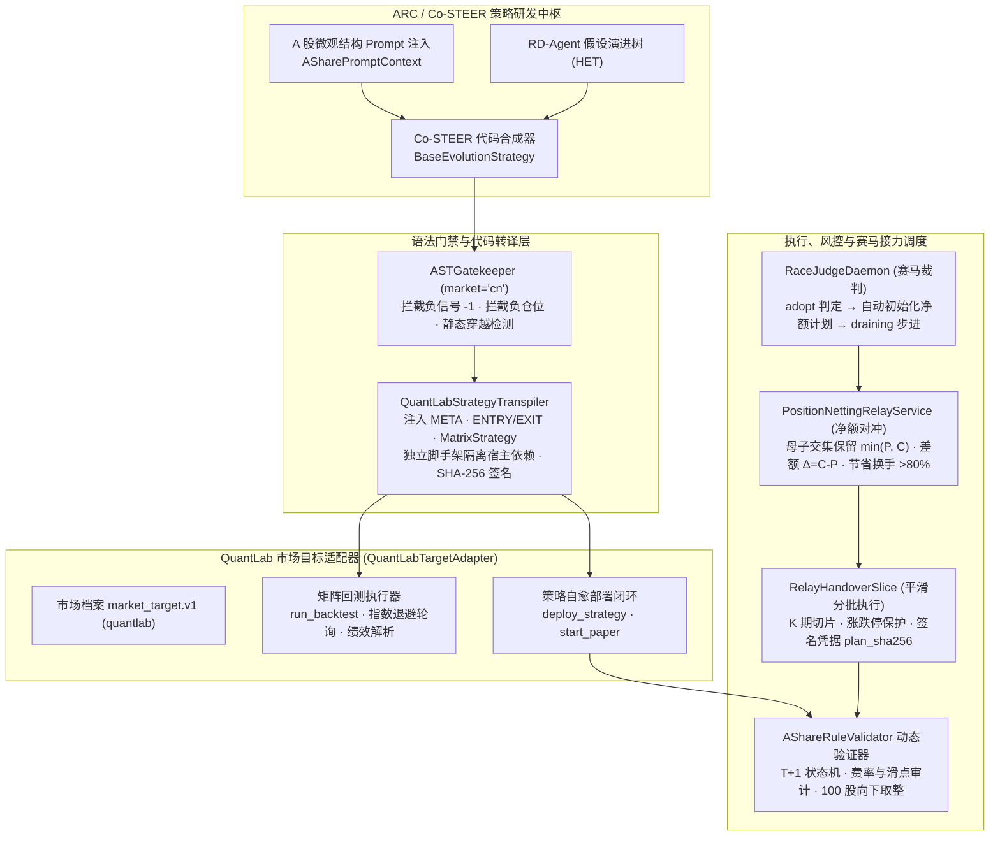

# 66 QuantLab 市场目标适配器、A 股微观结构硬规则与赛马平滑换仓技术架构设计

> 状态：设计规范与实施快照（Approved Technical Specification）  
> 日期：2026-10-06  
> 关联规范：Spec 028 (QuantLab 转译器与部署闭环), Spec 029 (A 股微观结构与硬规则注入), Spec 030 (赛马接力阶段净额平滑换仓), Spec 031 (QuantLab 看板与 HET 演进树)

---

## 1. 架构背景与多市场扩张驱动

HyperTrade 的初版架构主要面向加密货币永续合约（以 BitPro 为首个集成目标），支持 7x24 小时连续交易、双向多空持仓与相对单一的费率模型。为了支持多市场目标（Pluggable Market Targets, 见 [62](62-pluggable-market-targets.md)），系统引入了 **QuantLab** 作为首个股票市场（A 股 / 权益类资产）全功能适配目标。

股票现货市场（尤其中国 A 股市场）与衍生品合约市场在制度、交易规则和微观结构上存在本质差异：
1. **严格的 T+1 交易交收制度**：当日买入的现货资产在 T 日不可卖出，日内不可发生高频平仓反转。
2. **现货单向多头限制**：禁止裸做空，策略输出的仓位必须约束在 $[0.0, 1.0]$，交易信号不能出现做空负数。
3. **涨跌停流动性截断**：主板（±10%）、创业板/科创板（±20%）、ST/北交所（±5%/±30%）存在价格硬边界，触及涨跌停板时流动性中断。
4. **非对称交易成本与一手整倍数规则**：卖方单边 0.05% 印花税、双边 0.01‰ 过户费、最低 5 元券商佣金以及按 100 股一手（Lot Size）整数倍买入的约束。
5. **策略交接换手摩擦**：在世代迭代与赛马晋升（Gen N 到 Gen N+1）中，粗暴的“全平母策略、全开子策略”会导致巨大的双向手续费与滑点摩擦。

为此，系统构建了涵盖策略转译器、A 股微观结构校验引擎与持仓净额平滑换仓接力调度器的完整架构闭环。

---

## 2. 总体架构拓扑

---

## 3. QuantLab 策略格式转译器 (QuantLabStrategyTranspiler)

### 3.1 三段式策略到矩阵式向量化策略转译
HyperTrade Co-STEER 生成的标准化三段式策略遵循 `BaseEvolutionStrategy` 接口：
- `compute_features(df)`：特征计算与指标衍生；
- `generate_signals(df)`：交易信号生成（多头买入、平仓）；
- `position_sizing(df, signals)`：目标仓位权重分配。

QuantLab 则运行原生高性能向量化矩阵引擎（`MatrixStrategy`）。`QuantLabStrategyTranspiler` 实现了从三段式代码到 QuantLab 模块的确定性转译：
1. **模块级字面量注入**：
   - 自动注入 `META = {"execution_backend": "matrix_native", "symbols": [...], "params": {...}}`；
   - 注入 `ENTRY_SIGNALS = ["buy_signal"]`、`EXIT_SIGNALS = ["exit_signal"]`；
   - 注入 `EXECUTION_BACKEND = "matrix_native"`、`STOP_LOSS`、`MAX_HOLD_DAYS` 及全局实例 `MATRIX_STRATEGY`。
2. **消除反向包依赖**：
   - 内置纯净的解耦脚手架 `_BASE_EVO_SCAFFOLD`，使得生成的策略源码在脱离 HyperTrade 宿主环境独立分发至 QuantLab Worker 时，无需安装 `hypertrade` 包即可原生执行。
3. **确定性数字指纹与原生兼容**：
   - 每次转译后基于规范化源码计算不可篡改的 `code_sha256` 摘要；
   - 支持对已经是原生 QuantLab 语法的策略进行直通包装（Passthrough），并提供 `generate_default_evolution_code` 默认合规基线模板。

---

## 4. A 股市场微观结构与硬规则引擎

### 4.1 静态与动态双重约束体系
A 股微观规则的实现贯彻“前置 Prompt 引导 + 静态 AST 拦截 + 运行时状态机防御”三道防线：

| 约束维度 | 规则定义 | 实现层级 | 违规处理 |
| --- | --- | --- | --- |
| **交易方向** | 现货单向多头，严禁裸做空 | ASTGatekeeper + AShareRuleValidator | 静态拦截 `-1` 信号或负数仓位；动态截断为 0 |
| **交收制度** | T+1 交收，当日买入股票当日禁止卖出 | AShareRuleValidator 时序状态机 | `validate_t_plus_one_sequence` 抛出验证失败阻断 |
| **价格涨跌停** | 主板 ±10%，双创板 ±20%，ST/北交所 ±5%/±30% | AShareMarketRules | 静态与动态限制单日价格偏离与交易有效性 |
| **交易单位** | 买入必须为 100 股（1 手）整数倍 | AShareRuleValidator | `shares // 100 * 100` 向下取整 |
| **摩擦成本** | 卖出印花税 0.05%，过户费 0.01‰，佣金万2.5（保底5元），滑点 1.5 bps | `calculate_frictional_costs` | 精确扣减现金与资产，拒绝无摩擦回测造假 |

### 4.2 ASTGatekeeper 强化
在 `backend/src/hypertrade/research/co_steer.py` 中：
- 当 `market="cn"` 时，解析 AST 树中所有 `Return` 节点的字面量或表达式；
- 若检测到 `Return(Constant(value=-1))` 或返回值为负数的仓位系数（如 `Decimal("-0.5")`），直接阻断编译并向 Co-STEER 报告语法反思错误，要求模型在局部自愈循环中修正。

---

## 5. 赛马接力阶段净额平滑换仓 (Position Netting & Smooth Relay)

### 5.1 换手对冲与摩擦节约原理
在自主进化闭环中，母策略（Champion, Gen N）与挑战者策略（Challenger, Gen N+1）在评估交接时通常持有大量相同的成分股。
若采取传统串行切仓（母策略全部卖出 $\to$ 子策略全部买入），将产生双倍的印花税、过户费与冲击滑点。

`PositionNettingRelayService` 引入重合期两腿持仓交集对冲算法：
$$\text{SharedPosition}_i = \min(P_{i, \text{parent}}, C_{i, \text{challenger}})$$
$$\Delta_i = C_{i, \text{challenger}} - P_{i, \text{parent}}$$

- **重合持仓原地保留**：对 $\text{SharedPosition}_i$ 部分不做任何撮合操作，零换手；
- **差额执行**：仅对差额 $\Delta_i$ 发出交易指令（$\Delta_i > 0$ 买入补仓，$\Delta_i < 0$ 卖出减仓）；
- **换手节省率**：
  $$\text{TurnoverReductionRatio} = 1 - \frac{\sum |\Delta_i|}{\sum P_i + \sum C_i}$$
  在典型指数增强或风格轮动策略中，重合资产的换手节省率高达 **80% 以上**。

### 5.2 多期平滑切片执行与状态流转
换仓计划由状态机严格管控：
1. `pending`：赛马裁判确认采纳，生成计划并签名 `plan_sha256`；
2. `slicing`：切分为 $K$ 期执行（默认 3-5 周期），每期执行量受 100 股一手和涨跌停边界约束；
3. `completed`：全部切片执行完毕，资产完整交接给 Gen N+1，旧策略正式归档。

`RaceJudgeDaemon` 与 `QuantLabTargetAdapter` 深度协同：当赛马前向指标确认达标（Sharpe/超额超标）后，自动下发净额接力计划，并将进度、节省换手百分比和节省金额实时推送到前端与飞书卡片。

---

## 6. 验证、审计与安全边界

1. **确定性指纹**：策略源码、AST 签名、转译脚手架与换仓计划均生成独立的 SHA-256 凭证，审计全流程可重放。
2. **硬风控拦截**：非白名单的动态反射（`eval`, `exec`, `__import__`）在 AST 阶段无条件封杀；生产模拟盘不具备裸空可能。
3. **测试覆盖**：
   - `tests/test_quantlab_transpiler_and_deployment.py`（7 项转译与自愈测试）；
   - `tests/test_a_share_microstructure_rules.py`（9 项微观规则与 T+1 状态机测试）；
   - `tests/test_position_netting_relay.py`（6 项净额换仓与赛马联动测试）；
   - `tests/test_quantlab_console_endpoints.py`（控制台接口全闭环测试）。
