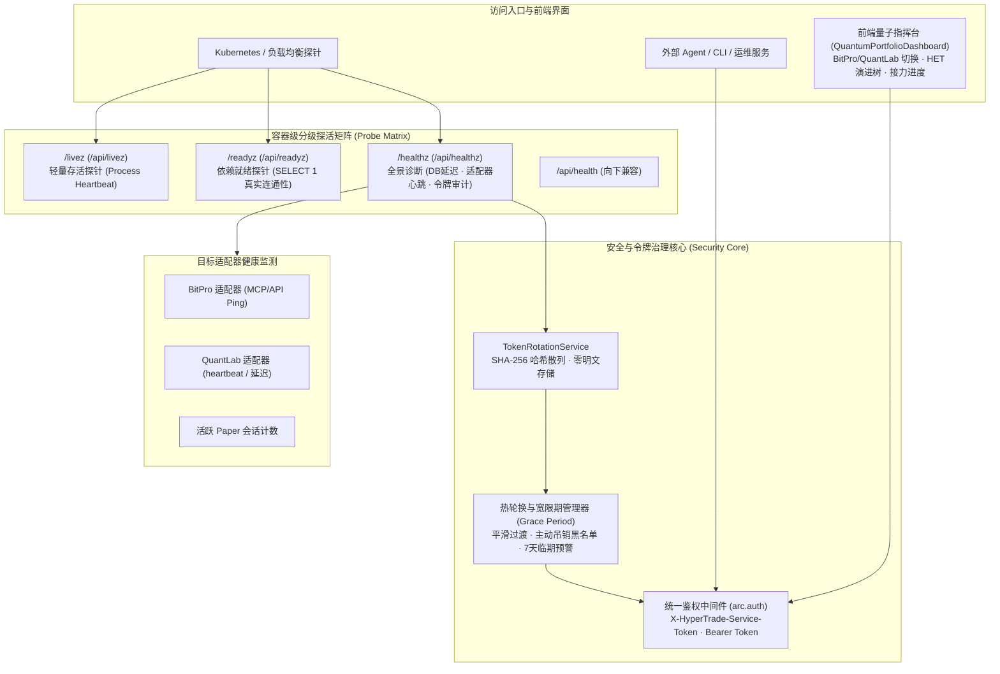

# 67 生产级可观测性探活、安全令牌动态轮换与量化多目标指挥台架构设计

> 状态：设计规范与实施快照（Approved Technical Specification）  
> 日期：2026-10-06  
> 关联规范：Spec 031 (QuantLab 看板与 HET 假设演进树), Spec 032 (运维探活与安全令牌管理)

---

## 1. 架构演进背景

随着 HyperTrade 从单体研究原型走向多目标（Crypto + A 股）企业级部署，系统面临高可用运维与高等级安全的两大核心挑战：
1. **容器云就绪度与细粒度故障诊断**：传统的单一 `/api/health` 端点无法区分“容器存活（Liveness）”、“数据库及依赖就绪（Readiness）”与“包含外部适配器连通性的全景健康度（Comprehensive Diagnostics）”。在 Kubernetes / Docker Swarm 或云原生负载均衡下，缺乏标准化的分级探针会导致容器误杀或流量过早打入未就绪实例。
2. **凭据安全与零停机轮换（Zero-Downtime Secret Rotation）**：Agent 平台与外部消费方（外部 Agent、TUI、监控、CI/CD）通信需高权限服务令牌。传统静态硬编码或明文存储存在泄漏与单点风险；急迫吊销会导致调用方瞬间雪崩中断。
3. **多市场混合统一指挥**：操作员需要在一个控制台统一管理 BitPro（加密货币合约）与 QuantLab（A 股多资产），直观掌控 RD-Agent 假设演进树（HET）系谱分化与赛马接力换仓进度。

为此，系统确立了生产级分级探活矩阵、动态安全令牌轮换引擎与多市场量化指挥台体系。

---

## 2. 总体架构拓扑

---

## 3. 容器级分级探活矩阵

为了满足云原生编排要求，系统在 `backend/src/hypertrade/main.py` 实现了分级探针，并同时挂载于根路径（如 `/healthz`）与 API 路径（如 `/api/healthz`）：

### 3.1 探活探针规约

| 探针路径 | 检查目标 | 判定逻辑 | 正常返回 | 故障返回 | 适用编排场景 |
| --- | --- | --- | --- | --- | --- |
| `/livez` | 进程存活 | FastAPI 事件循环健康响应 | 200 `{"status": "alive"}` | 500 / 超时 | K8s `livenessProbe`（失败则重启容器） |
| `/readyz` | 依赖就绪 | 数据库真实执行 `SELECT 1` | 200 `{"status": "ready"}` | 503 `{"status": "not_ready", "database": "error"}` | K8s `readinessProbe`（失败则摘除流量） |
| `/healthz` | 全景诊断 | DB 延迟、适配器心跳、Paper 会话与令牌状态 | 200 全息 JSON 诊断树 | 503 全景诊断失败树 | 监控系统采集、灰度检查、巡检报警 |

### 3.2 适配器心跳与外部连通性探测
在 `QuantLabTargetAdapter` 与 `BitProTargetAdapter` 注入统一的 `heartbeat()` 探测方法：
- **QuantLab**：探测远端 MCP 或仿真进程连通性，上报毫秒级延迟；
- **BitPro**：调用健康检查端口上报服务连通状态；
- 全景健康报告实时输出 `adapters: {"quantlab": {"status": "ok", "latency_ms": 12.4}, "bitpro": {"status": "ok"}}`，一旦主数据库或核心适配器发生严重断联，健康探针即时返回 HTTP 503 并携带精准错误堆栈。

---

## 4. 零信任动态安全令牌管理 (`TokenRotationService`)

### 4.1 核心设计原则
1. **零明文持久化**：系统仅在签发时一次性向操作员展示明文令牌，数据库仅持久化其 SHA-256 单向散列、前缀指纹、颁发时间与权限 Scope。
2. **细粒度权限作用域 (Capability Scopes)**：支持按最小权限原则配置作用域（如 `arc:read`、`arc:start`、`quantlab:mcp`、`bitpro:sync`、`admin`）。
3. **零停机热轮换 (Grace Period Rotation)**：
   - 轮换后生成新令牌；
   - 旧令牌被标记为 `rotating` 并赋予指定的过渡宽限期（默认 24 小时）；
   - 在宽限期内，持有新旧令牌的请求均可成功鉴权；宽限期结束后旧令牌自动失效；
   - 从而实现无中断滚动更新各客户端（外部 Agent、工作流、定时任务）配置。
4. **紧急主动吊销与临期审计**：
   - 支持立即吊销（`revoked`），吊销令牌毫秒级进入拦截列表；
   - 审计后台自动扫描 `expiring_soon` 令牌（默认 7 天内到期），输出告警清单。

### 4.2 鉴权打通与 API 面板
`TokenRotationService` 深度集成至 `backend/src/hypertrade/arc/auth.py`，请求携带 `Authorization: Bearer <token>` 或 `X-HyperTrade-Service-Token: <token>` 即可通过统一验签通道进入 ARC 与交易路由。

暴露的 RESTful 管理端点矩阵：
- `GET /api/security/tokens`：查询活跃凭据清单与作用域；
- `POST /api/security/tokens/issue`：签发新凭据；
- `POST /api/security/tokens/{token_id}/rotate`：热轮换凭据；
- `POST /api/security/tokens/{token_id}/revoke`：紧急吊销凭据；
- `GET /api/security/tokens/expiring`：扫描临期凭据。

---

## 5. 多目标量化指挥台与 HET 假设演进树架构

前端 `QuantumPortfolioDashboard.tsx` 升级为多市场统一指挥中枢：

### 5.1 市场目标快速切换 (Target Switcher)
- 顶部支持在 `bitpro`（Crypto 永续合约）与 `quantlab`（A 股多资产）间实时切换；
- 切换至 QuantLab 时，动态呈现 A 股微观结构硬规则警示条（T+1、现货单向多头、涨跌停、万2.5/5bps 印花税）；
- 通过 `GET /api/portfolio/targets` 动态拉取注册的市场档案与能力清单。

### 5.2 QuantLab 专属看板
- 通过 `GET /api/portfolio/targets/quantlab/strategies` 获取策略标的池、代码指纹、模拟权益与持仓；
- 支持调用 `POST /api/portfolio/targets/quantlab/strategies/{strategy_id}/backtest` 触发异步矩阵回测，即时渲染年化收益、Sharpe 与最大回撤。

### 5.3 HET 假设演进树与净额平滑换仓监视器
- 接口 `GET /api/research/hypothesis-tree` 层次化输出 RD-Agent 假设演进树（Root 与变异分支），直观显示假设陈述、变异类型与剪枝原因；
- 换仓监视器通过 `GET /api/portfolio/relay/handovers` 渲染换仓计划，可视化展现换手节省率（>80%）、节省金额与切片执行进度条，支持手动步进切片（`POST /api/portfolio/relay/handovers/{plan_id}/step`）。

---

## 6. 验证、门禁与生产运行手册

- **测试套件**：
  - `tests/test_healthz_and_token_rotation.py`：全流程覆盖探针响应、热轮换宽限期、动态验签与临期审计；
  - `tests/test_quantlab_console_endpoints.py`：覆盖所有指挥台端点。
- **质量门禁**：通过 `./scripts/check.sh`（Ruff、Mypy 316 文件 0 错误、Pytest 100% 通过）。
